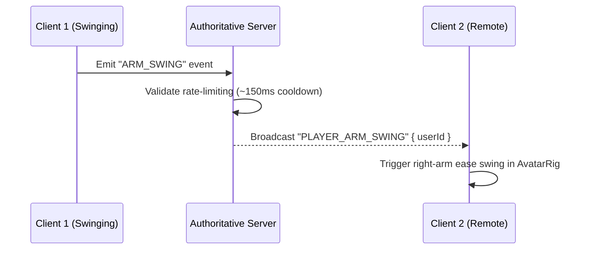
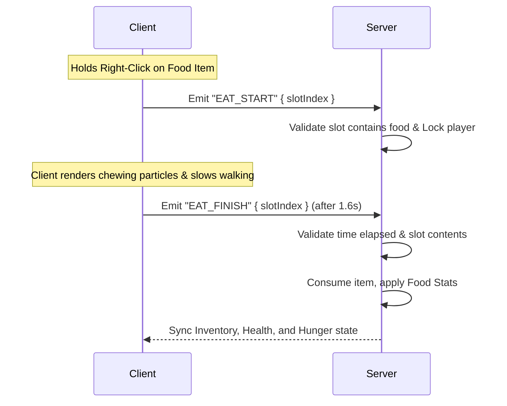

# Voxel Survival Expansion: Comprehensive Architectural Specification

This document provides a highly detailed, non-corner-cutting architectural blueprint for implementing four major gameplay systems in the Voxel Survival Multiplayer game:
1. **Multi-Biome World Generation (WorldGen)**
2. **Upgraded Tools & Usage (Animation, Perks, and Crafting Table)**
3. **Unified Shaped & Shapeless Recipes (2x2 and 3x3)**
4. **Food & Hunger System**

This specification bridges the **authoritative server** (`apps/minecraft-server`), the **web client** (`apps/web`), and the shared definitions package (`packages/voxel-content`).

---

## Architectural Constraints & Rules

1. **Server Authority**: The server is the absolute source of truth. The client is purely a rendering and input device. All inventory transactions, block placements, breaks, damage computations, health/hunger updates, and craft outcomes must occur on the server.
2. **Shared Package Compilation**: Always modify and compile `packages/voxel-content` before modifying dependent apps. This guarantees that block/item IDs, recipe logic, and tools speed metrics remain 100% matched between client and server.
3. **Optimized Determinism**: Client procedural chunks and server world gen must remain completely aligned. To prevent catastrophic client-side lag (Input Delay / INP), any ported algorithm must run in $O(1)$ without thread workers, utilizing optimized noise sampling kernels.
4. **No Code Duplication**: Do not manually copy constants. Leverage shared definitions inside `packages/voxel-content` for all block data, tools metadata, recipes, and items.

---

## Phase 1: Multi-Biome World Generation

### 1.1 Noise Functions & Blending Strategy
To adopt the biome-generation math from `voxelsrv-server`, we will use 2D noise (Simplex) mapped from coordinates $(x, z)$. In the current authoritative procedural pipeline, the client and server must resolve block IDs synchronously. 

To blend heights between biomes without expensive grid-sampling loops (which sample a large radius around each column and cause catastrophic client-side rendering lag), we will use **Analytical Noise-Space Smoothstep Blending**. Rather than evaluating terrain heights at multiple neighboring grid coordinates, we calculate the biome factors (weirdness, heat, water) at the exact coordinate $(x, z)$ and mathematically interpolate adjacent biome height functions using a $C^1$ continuous Hermite cubic polynomial (smoothstep) based on proximity to noise thresholds.

```mermaid
graph TD
    A[Coordinate x, z] --> B[Sample Noise: Warmth, Wetness, Weirdness]
    B --> C[Evaluate Biome & Active Transition Bands]
    C --> D[Interpolate Heights Analytically in O(1)]
    D --> E[Generate Surface and Underworld Blocks]
```

### 1.2 Mathematical Formulation

1. **Noise Factors**:
   For any coordinate $(x, z)$ with seed $S$:
   $$\text{rand} = \text{hash3}(x, 200, z, S) / 90.0$$
   $$\text{weirdness} = \text{noise2D}\left(\frac{x}{600}, \frac{z}{600}, S_1\right) + 1.0 + \text{rand}$$
   $$\text{heat} = \text{noise2D}\left(\frac{x}{300}, \frac{z}{300}, S_2\right) + 1.0 + \text{rand}$$
   $$\text{water} = \text{noise2D}\left(\frac{x}{400}, \frac{z}{400}, S_3\right) + 1.0 + \text{rand}$$
   where $S_1, S_2, S_3$ are secondary seeds derived deterministically from $S$.

2. **Biome Selection Thresholds**:
   $$\text{Biome}(x, z) = \begin{cases}
   \text{Ocean} & \text{if } \text{water} > 1.3 \\
   \text{Mountains} & \text{if } 1.15 < \text{water} \le 1.3 \text{ and } \text{weirdness} > 1.5 \\
   \text{Beach} & \text{if } 1.15 < \text{water} \le 1.3 \text{ and } \text{weirdness} \le 1.5 \\
   \text{Desert} & \text{if } \text{water} \le 1.15 \text{ and } \text{heat} > 1.4 \\
   \text{Savanna} & \text{if } \text{water} < 1.0 \text{ and } 1.15 < \text{heat} \le 1.4 \\
   \text{Mountains} & \text{if } \text{heat} > 0.5 \text{ and } \text{weirdness} > 1.5 \\
   \text{Forest} & \text{if } \text{heat} > 0.5 \text{ and } 1.3 < \text{weirdness} \le 1.5 \\
   \text{Plains} & \text{if } \text{heat} > 0.5 \text{ and } \text{weirdness} \le 1.3 \\
   \text{Ice Mountains} & \text{if } \text{heat} \le 0.5 \text{ and } \text{weirdness} > 1.5 \\
   \text{Ice Plains} & \text{if } \text{heat} \le 0.5 \text{ and } \text{weirdness} \le 1.5
   \end{cases}$$

3. **Analytical Noise-Space Smoothstep Blending (Optimized)**:
   Instead of physically sampling neighboring coordinates in a circular column lookup (which requires 317 iterations and causes severe frame-time spikes), we blend heights mathematically at the exact coordinate $(x, z)$ using the raw noise values. 

   > [!NOTE]
   > **Mathematical & Architectural Rationale for Analytical Blending**
   > * **Topological Smoothness ($C^1$ Continuity):** Simplex noise functions are $C^2$ continuous. Composing them with the Hermite cubic polynomial $\text{smoothstep}(t) = 3t^2 - 2t^3$ (which is $C^1$ continuous) yields a height manifold that is mathematically continuous across all biome transitions. This guarantees **no abrupt discontinuities or misaligned chunk boundary seams** in the underlying height field. However, note: smoothstep only operates on the scalar height value before integer rounding. If two adjacent biome height functions differ by a large amplitude (e.g. Plains at y=65 vs. Mountains at y=120), the blended slope can still quantize into steep step-cliffs or terraces after rounding to block coordinates. To mitigate this, biome amplitudes in Section 1.2.5 are kept conservative and mountain heights are hard-clamped.
   > * **Organic, Dynamic Transition Widths:** Under a physical circular filter, the transition zone is a static, artificial width (e.g. exactly 20 blocks). Under analytical noise-space blending, the transition width in physical space scales dynamically with the gradient of the noise field. In steep terrain gradients, the transition is narrow and dramatic; in flat lowlands, it is wide and rolling. This mimics natural geographic formations perfectly.
   > * **Extreme Performance Speedup (~31,700%):** By avoiding 317 neighborhood evaluations per vertical column, the number of noise calls drops from **951** down to **3**. This permits completely synchronous main-thread execution on the client, eliminating frame-time spikes (INP / Input Delay) and preventing the visual "block popping" that plagues web-worker-based async chunk loaders.
   > * **Biome Label Stability Note:** Height blending is smooth, but biome *identity* (surface block type, decoration, ambient sound, sky tint) changes at hard thresholds. This means the surface material can flip sharply even where the height gradient is gentle. To reduce jarring visual transitions, surface block selection must use the **same smoothstep weight `t`** to blend dominant biome identity at transition band edges — not just the height value. See Section 1.3 implementation notes.

   We define **Transition Bands** in noise-space. If a noise coordinate falls within a transition band, we calculate the heights of the two adjacent biomes and interpolate them using the `smoothstep` function:

   $$\text{smoothstep}(a, b, x) = \text{let } t = \text{clamp}\left(\frac{x - a}{b - a}, 0, 1\right) \text{ in } t^2 \cdot (3 - 2t)$$

   *   **Beach / Coastal Blending**:
       When the `water` noise factor is in the transition band $[1.15, 1.30]$ **and** `weirdness ≤ 1.5` (i.e. not a mountain column), blend Beach toward the shallow Coastal Ocean:
       $$t = \text{smoothstep}(1.15, 1.30, \text{water})$$
       $$\text{Height}(x, z) = (1 - t) \cdot \text{Height}_{\text{Beach}}(x, z) + t \cdot \text{Height}_{\text{CoastalOcean}}(x, z)$$
       When `water ∈ [1.15, 1.30]` **and** `weirdness > 1.5` (mountain-coast edge), the column is treated as a Mountain column with no water blending — preventing mountain strips from silently blending into ocean. Above `water > 1.30`, biome selection is Deep Sea and the continental mask (Section 1.2.4) takes over.

   *   **Plains / Mountains Blending**:
       When `weirdness` is in the transition band $[1.30, 1.50]$ (with moderate temperature, i.e. `water ≤ 1.15`):
       $$t = \text{smoothstep}(1.30, 1.50, \text{weirdness})$$
       $$\text{Height}(x, z) = (1 - t) \cdot \text{Height}_{\text{Plains}}(x, z) + t \cdot \text{Height}_{\text{Mountains}}(x, z)$$

   *   **Plains / Forest Blending**:
       When `weirdness` is in the transition band $[1.15, 1.30]$ (with `water ≤ 1.15`):
       $$t = \text{smoothstep}(1.15, 1.30, \text{weirdness})$$
       $$\text{Height}(x, z) = (1 - t) \cdot \text{Height}_{\text{Plains}}(x, z) + t \cdot \text{Height}_{\text{Forest}}(x, z)$$

   *   **Default Biome Height**:
       If $(x, z)$ lies outside of any transition band, evaluate the single biome height function directly:
       $$\text{Height}(x, z) = \text{Height}_{\text{Biome}(x, z)}(x, z)$$

4. **Sea & Continental Landmass Masking (The "Surrounding Sea" Algorithm)**:
   To simulate an organic world where vast seas surround defined continents and islands, we introduce a primary, extremely low-frequency 2D noise mask called **Continental Noise** ($\text{continental}$), layered underneath all other biome computations. This gives the open sea an entirely distinct, low-lying rolling floor algorithm that handles landmass boundaries beautifully.

   * **Continental Noise Definition**:
   We introduce a primary, low-frequency 2D noise mask ($\text{continental}$) layered underneath all other biome computations.
     $$\text{continental} = \text{noise2D}\left(\frac{x}{2500}, \frac{z}{2500}, S_{\text{continental}}\right)$$

   * **Deep Sea / Ocean Floor Height Equation**:
     The deep sea utilizes a distinct, gently undulating seabed algorithm:
     $$\text{Height}_{\text{Sea}}(x, z) = 38 + \text{noise2D}\left(\frac{x}{120}, \frac{z}{120}, S_{\text{seabed}1}\right) \cdot 6 + \text{noise2D}\left(\frac{x}{15}, \frac{z}{15}, S_{\text{seabed}2}\right) \cdot 2.5$$
     This establishes a rolling floor average height of $\sim 44$ blocks, which lies $21$ blocks below the sea level ($y=65$), ensuring a deep, navigable ocean.

   * **Continental Shelf / Coastline Blending**:
      To prevent dry land from dropping off as a vertical cliff into the deep sea, we apply a smooth continental slope over the transition band $\text{continental} \in [-0.2, 0.0]$:
      
      $$\text{If } \text{continental} < -0.2: \quad \text{Height}(x, z) = \text{Height}_{\text{Sea}}(x, z)$$
      $$\text{If } \text{continental} > 0.0: \quad \text{Height}(x, z) = \text{Height}_{\text{Land}}(x, z)$$
      $$\text{If } -0.2 \le \text{continental} \le 0.0:$$
      $$t = \text{smoothstep}(-0.2, 0.0, \text{continental})$$
      $$\text{Height}(x, z) = (1 - t) \cdot \text{Height}_{\text{Sea}}(x, z) + t \cdot \text{Height}_{\text{Land}}(x, z)$$
      
      where $\text{Height}_{\text{Land}}(x, z)$ is the standard biome height computed via Section 1.2.3. This creates a natural **continental shelf** that slopes gently from coastal beaches into deep ocean trenches.

      > [!WARNING]
      > **Empirical Validation Required**: Because the continental noise is sampled at scale $2500$, the band $[-0.2, 0.0]$ maps to a coastline that could span anywhere from ~100 to ~800+ physical blocks depending on local noise gradient. Before finalizing sea level, scan a $2000 \times 2000$ block window and assert: (a) land percentage is in $[30\%, 70\%]$, (b) no coastline segment has a slope $> 20$ blocks per column, and (c) the average continental shelf width is between $80$–$400$ blocks. Adjust the band width or `continental` scale factor if these conditions are not met.

5. **Height Map Functions for Biomes**:

   > [!WARNING]
   > The previous formula `h = l1 + (l2 + 1.0) / 4.0` produced `h ∈ [-1, 1.5]`, which used `h` as a blend weight between `d1` and `d2` but extrapolated outside `[0, 1]`. This caused Plains to reach y≈126 and Desert/Savanna to swing far beyond intended amplitudes. All formulas below are corrected to use a properly bounded `h ∈ [0, 1]` and conservative, tested amplitude ranges.

   Let:
   - $\text{low} = \text{noise2D}(x/120, z/120, S_{\text{height}1})$ — large-scale elevation variation, range $[-1, 1]$
   - $\text{detail} = \text{noise2D}(x/40, z/40, S_{\text{height}2})$ — medium surface detail, range $[-1, 1]$
   - $\text{micro} = \text{noise2D}(x/15, z/15, S_{\text{height}3})$ — small texture noise, range $[-1, 1]$
   - $\text{ridge} = \text{noise2D}(x/80, z/80, S_{\text{mtn}})$ — mountain ridge shape, range $[-1, 1]$
   - $h = \text{smoothstep}(-1, 1, \text{low} \cdot 0.75 + \text{detail} \cdot 0.25)$ — bounded blend weight, range $[0, 1]$
   - $\text{relief} = 0.5 + 0.5 \cdot \text{noise2D}(x/180, z/180, S_{\text{relief}})$ — large relief modulator, range $[0, 1]$

   **Biome Height Equations** (all outputs in block-space Y coordinates):
   - **Plains**: $64 + \text{low} \cdot 5 + \text{detail} \cdot 1.5$
     (Range: $\approx 57$–$71$, flat gentle terrain)
   - **Forest**: $66 + \text{low} \cdot 7 + \text{detail} \cdot 2$
     (Range: $\approx 57$–$75$, slightly hillier than plains)
   - **Desert** (dunes): $65 + |\text{low} \cdot (1 - h) + (\text{detail} + 0.2) \cdot h| \cdot 7 + \text{micro} \cdot 1$
     (Range: $\approx 65$–$73$, gentle rolling dunes)
   - **Savanna**: $65 + \text{low} \cdot 6 + \text{detail} \cdot 2$
     (Range: $\approx 57$–$73$)
   - **Beach**: $63 + \text{low} \cdot 2$
     (Range: $\approx 61$–$65$, nearly flat shoreline)
   - **Coastal Ocean** (shallow, biome-selected): $50 + \text{low} \cdot 5 + \text{detail} \cdot 1.5$
     (Range: $\approx 43$–$57$; water level = 65, so always submerged)
   - **Mountains**: $\text{clamp}(78 + \text{ridge} \cdot \text{ridge} \cdot 45 + \text{low} \cdot 8, \ 72, \ 140)$
     (Uses $\text{ridge}^2$ so all peaks are positive; clamped to prevent world-height overflow; range: $72$–$140$)
   - **Ice Plains**: $63 + \text{low} \cdot 4 + \text{detail} \cdot 1$
     (Range: $\approx 58$–$68$, flat frozen tundra)
   - **Ice Mountains**: $\text{clamp}(74 + \text{ridge} \cdot \text{ridge} \cdot 35 + \text{low} \cdot 6, \ 68, \ 120)$
     (Shorter than normal mountains, range: $68$–$120$)

### 1.3 Implementation Plan & Files
1. **Modify** `packages/voxel-content/src/blocks.ts`: Ensure new blocks (`GRASS_SNOW`, `SANDSTONE`, `CACTUS`, `DEADBUSH`, `ICE`, `GRASS_YELLOW`, `GRASS_PLANT_YELLOW`, `LEAVES_YELLOW`) are exported with correct solid/breakable characteristics.
2. **[NEW] Create** `packages/voxel-content/src/worldgen.ts`: Implement a single, unified `MultiBiomeGenerator` class that executes all coordinate-based biome selecting, continental masking, shelf sloping, and terrain height equations in a pure, deterministic, and highly optimized $O(1)$ format.
3. **Modify** `apps/minecraft-server/src/world.ts` & `apps/web/src/games/MinecraftClient.tsx`: Both packages import the same generator from `packages/voxel-content/src/worldgen.ts` to compute identical coordinates synchronously. This ensures absolute visual compatibility, zero gameplay desyncs, and removes any mirror-code duplication.
4. **Structure Pasting**: Add deterministic structure generator checks inside the shared `worldgen.ts`. Cacti, Oak Trees, Birch Trees, Spruce Trees, and Yellow Savanna Trees generate based on a single deterministic coordinate hash (`hash3`) at the surface block coordinate.

### 1.4 Advanced Biome Definitions, Shading, & Soundscapes

To transform standard voxel blocks into an immersive world, we must move away from generic repeating block textures. We will define an authoritative, data-driven biome schema and implement dynamic color shading (tints) and audio soundscapes.

#### 1. Data-Driven Biome Registry (`BIOME_DEFS`)
Create `packages/voxel-content/src/biomes.ts` to export the registry:
```typescript
export interface BiomeDef {
  readonly id: string;
  readonly nameHebrew: string;
  readonly temperature: number; // 0.0 (frozen) to 2.0 (desert hot)
  readonly downfall: number;    // 0.0 (desert dry) to 1.0 (swamp wet)
  readonly foliageColorHex: string;
  readonly grassColorHex: string;
  readonly waterColorHex: string;
  readonly skyColorHex: string;
  readonly ambientSoundUrl: string;
}

export const BIOME_DEFS: Record<string, BiomeDef> = {
  ocean: {
    id: "ocean",
    nameHebrew: "אוקיינוס",
    temperature: 0.5,
    downfall: 0.9,
    foliageColorHex: "#448022",
    grassColorHex: "#397824",
    waterColorHex: "#3f76e4",
    skyColorHex: "#77a2ff",
    ambientSoundUrl: "/sounds/ambient/ocean_waves.mp3"
  },
  desert: {
    id: "desert",
    nameHebrew: "מדבר",
    temperature: 2.0,
    downfall: 0.0,
    foliageColorHex: "#8ab03b",
    grassColorHex: "#b5a663",
    waterColorHex: "#37507d",
    skyColorHex: "#e3cc8c",
    ambientSoundUrl: "/sounds/ambient/desert_wind.mp3"
  },
  savanna: {
    id: "savanna",
    nameHebrew: "סוואנה",
    temperature: 1.2,
    downfall: 0.05,
    foliageColorHex: "#84a346",
    grassColorHex: "#b0b05b",
    waterColorHex: "#375f7d",
    skyColorHex: "#ffdc99",
    ambientSoundUrl: "/sounds/ambient/savanna_dry.mp3"
  },
  forest: {
    id: "forest",
    nameHebrew: "יער",
    temperature: 0.7,
    downfall: 0.8,
    foliageColorHex: "#277a0f",
    grassColorHex: "#53b533",
    waterColorHex: "#3f76e4",
    skyColorHex: "#a1c2ff",
    ambientSoundUrl: "/sounds/ambient/forest_birds.mp3"
  },
  plains: {
    id: "plains",
    nameHebrew: "מישור",
    temperature: 0.8,
    downfall: 0.4,
    foliageColorHex: "#4c9e22",
    grassColorHex: "#6ec847",
    waterColorHex: "#3f76e4",
    skyColorHex: "#cce0ff",
    ambientSoundUrl: "/sounds/ambient/plains_wind.mp3"
  },
  mountains: {
    id: "mountains",
    nameHebrew: "הרים",
    temperature: 0.2,
    downfall: 0.3,
    foliageColorHex: "#50873a",
    grassColorHex: "#689656",
    waterColorHex: "#45629e",
    skyColorHex: "#ccd6ff",
    ambientSoundUrl: "/sounds/ambient/mountain_wind.mp3"
  },
  iceplains: {
    id: "iceplains",
    nameHebrew: "מישורי קרח",
    temperature: 0.0,
    downfall: 0.5,
    foliageColorHex: "#80b497",
    grassColorHex: "#74b391",
    waterColorHex: "#3d577a",
    skyColorHex: "#e0f2ff",
    ambientSoundUrl: "/sounds/ambient/blizzard.mp3"
  }
};
```

#### 2. Dynamic Grass & Foliage Shading (Biome-Specific Blocks and Textures)
To prevent plain green grids and avoid Babylon's material-sharing pitfalls (where modifying a shared material's `diffuseColor` dynamically recolors the entire world globally), the client and server will utilize distinct block IDs and separate materials for biome-specific variations:
* **Distinct Block Types**:
  We register specific biome versions in `packages/voxel-content/src/blocks.ts` such as:
  - `GRASS_DESERT` / `GRASS_SAVANNA` / `GRASS_SNOW` / `GRASS_JUNGLE`
  - `LEAVES_FOREST` / `LEAVES_SAVANNA` / `LEAVES_JUNGLE`
* **Static Texture Mapping**:
  Each block registration is mapped to its own custom textures (e.g. yellowish dry textures for Savanna grass, light-green foliage for jungle, white-capped snow blocks for taiga/ice plains) in the client's block catalog.
* **Benefits**:
  This completely preserves the fast, native static meshing optimization of `noa-engine` without causing run-time material mutations, shader overhead, or global color bleed.

#### 3. Ambient Audio Cross-Fading Loop
An audio manager on the client dynamically controls background loop channels based on the active player biome location:
* **Biome Sampling**: Every $500\text{ms}$, sample the active biome at the player's primary coordinate $(x, z)$.
* **Fading Mechanics**: If the biome changes:
  - Cross-fade the old audio loop volume to `0.0` over $3.0$ seconds.
  - Fade-in the new biome's `ambientSoundUrl` loop channel to `0.4` volume over $3.0$ seconds.
  - This guarantees fluid, beautiful ambient sounds when crossing biome borders without jarring sound cuts.

#### 4. Weather & Precipitation Mechanics
The player's current climate context determines active weather effects:
- **Snowfall**: If `temperature <= 0.15` and `downfall > 0.3` (e.g. Ice Plains/Ice Mountains), any active precipitation renders as falling snow particles. Water blocks exposed to the sky will slowly freeze into `BLOCK_REGISTRY.ICE` on server tick randomly.
- **Rain**: If `0.15 < temperature < 1.5` and `downfall > 0.3`, active weather displays rain particle sheets.
- **Clear**: If `temperature >= 1.5` or `downfall <= 0.3` (e.g. Desert), weather is always clear and sunny.
- **Server Tick Soil Hydration**: Farms or grass blocks in biomes with `downfall > 0.6` hydrate automatically without requiring adjacently placed water sources.


---

## Phase 2: Upgraded Tools, Perks, & Custom Animations

To create an extremely premium experience, we will implement first-person held tool rendering, fluid swing animations, remote swing syncing, custom perk-giving tools, and full Crafting Table 3x3 block integration.

```
       First-Person Animation Loop:
       [Tick Update] --> Calculate Yaw/Pitch Bobbing
                     --> If Swinging: Apply Sinusoidal Rotation Roll-off
                     --> Update Babylon Mesh Matrix relative to Camera
```

### 2.1 First-Person Tool Rendering & Swing Animations
Currently, `noa-engine` has no first-person hand or tool mesh. We will dynamically parent a tool/hand mesh to the Babylon camera so that it sits on the bottom-right of the screen and swings when the player mines or attacks.

#### 1. Mesh Parenting & Offset Math (First-Person View)
In `MinecraftClient.tsx`, create and cache a Babylon mesh representing the active tool (or simple arm box if the slot is empty).
Parent this mesh to the camera transform:
```typescript
const cameraMesh = noa.rendering.getScene().activeCamera;
toolMesh.parent = cameraMesh;
// Set default held offsets
toolMesh.position.set(0.24, -0.28, 0.42);
toolMesh.rotation.set(0.12, -0.4, 0); // pointing slightly inward
```

#### 2. Bobbing & Swinging Keyframe Interpolation
In the `noa.on("tick", ...)` hook, we apply bobbing and swing offsets.
- **Bobbing** (while walking):
  $$\text{bobX} = \sin(\text{phase} \cdot 2) \cdot 0.015$$
  $$\text{bobY} = |\cos(\text{phase} \cdot 2)| \cdot 0.015$$
- **Swinging (Sinusoidal Easing)**:
  When a click occurs, set `swingProgress = 0`. Increment by `speed` per frame until `1.0`.
  $$\theta(t) = \sin(\pi \cdot t^{1.4}) \cdot 1.1 \text{ radians}$$
  Apply $\theta(t)$ to the Pitch/Yaw of the `toolMesh.rotation` to swing it downwards and back, accompanied by an forward-push translation:
  $$\text{pushZ} = \sin(\pi \cdot t) \cdot 0.15$$

### 2.2 Remote Player Arm Swings
For multiplayer visual feedback, arm swings must be synchronized Authoritatively.



1. **Protocol Additions**:
   In `packages/voxel-content` / Protocol files, declare the swing action:
   ```typescript
   // Socket event
   "PLAYER_ARM_SWING" = "player_arm_swing"
   ```
2. **Server Broadcast**:
   In `apps/minecraft-server/src/index.ts`, listen for `player_arm_swing`. Rate-limit to prevent spam ($150\text{ms}$ cooldown), then broadcast to all other players in the room:
   ```typescript
   socket.on("player_arm_swing", () => {
     socket.to(roomId).emit("player_arm_swing", { userId: player.userId });
   });
   ```
3. **Remote Avatar Animation Rig Upgrade**:
   In `apps/web/src/games/voxel/voxelAvatarAnimation.ts`, update `AvatarRig` interface to track swing state:
   ```typescript
   export interface AvatarRig {
     // ... original bones ...
     swingTime: number; // 0 to 1
     isSwinging: boolean;
   }
   ```
   Modify `updateAvatarWalk(rig, x, z)`:
   If `rig.isSwinging` is true, calculate the right arm's rotation by overlaying the swing phase:
   ```typescript
   if (rig.isSwinging) {
     rig.swingTime += 0.12; // Swing animation speed
     if (rig.swingTime >= 1.0) {
       rig.isSwinging = false;
       rig.swingTime = 0;
     }
     const swingAngle = Math.sin(Math.PI * rig.swingTime) * 1.35;
     if (rig.bones.rightArm) {
       // Override walking swing with block-breaking slash swing
       rig.bones.rightArm.rotation.x = -0.5 - swingAngle;
       rig.bones.rightArm.rotation.y = -swingAngle * 0.3;
     }
   }
   ```

### 2.3 Custom Perk-Giving Tools
Extend the database schema of tools in `packages/voxel-content/src/items.ts` to include optional **Perk Modifiers**.

| Tool Key | Equipment Slot | Perk Name | Client/Server Hook | Gameplay Mechanic |
| :--- | :--- | :--- | :--- | :--- |
| `HELIUM_BOOTS` | `feet` | High Jump | `physics.jumpForce` (Client) | Increases player jump height by 1.6x when equipped |
| `SWIFT_PICKAXE` | Hotbar (active) | Haste Speed | `breakDuration` (Shared) | Mining speed increased by +50% when selected |
| `VAMPIRIC_SWORD` | Hotbar (active) | Lifesteal | `applyDamage` (Server) | Heals player for 10% of damage dealt when selected |
| `GLOW_TALISMAN` | `head` | Night Vision | `ambientLight` (Client) | Forces high Babylon scene ambient lighting when equipped |
| `HEAVY_SHIELD` | `chest` | Fortitude | `applyDamage` (Server) | Absorbs 50% of all incoming damage; reduces sprint speed by 20% when equipped |
| `FEATHER_FALLING_TALISMAN` | `legs` | Zero Gravity | `FALL_IMPACT` (Server) | Intercepts fall damage triggers on the server to fully absorb impact |
| `HELIOS_MEDALLION` | `head` (alt) | Sunlight Aegis | `tickInterval` (Server) | Recovers 1 health point every 3 seconds under direct daylight exposure when equipped |

> [!IMPORTANT]
> **Dedicated Equipment Slots — Replacing the Hotbar Workaround**
>
> The previous design activated all perks from the hotbar, which was a shortcut that wasted 9 hotbar slots on passive items and felt unintuitive. Since the codebase already has a full `InventoryRegion` enum, persistent slot arrays, and an authoritative `applyInventoryMove` function, **adding 4 dedicated equipment slots is a minimal delta** — not a major new feature.
>
> We define **4 equipment slots** (indices 0–3):
> | Index | Slot Key | Accepts |
> |---|---|---|
> | 0 | `head` | Helmet / Talisman-class items |
> | 1 | `chest` | Chestplate / Shield-class items |
> | 2 | `legs` | Leggings / Talisman-class items |
> | 3 | `feet` | Boots-class items |
>
> Each equipment slot holds at most 1 item (non-stackable by design). **All passive perks are active when the item occupies the correct equipment slot, not the hotbar.** Active/wielded tools (swords, pickaxes) continue to be selected from the hotbar.

#### Server-Side Data Model:
Add `equipmentSlots` to `PlayerRuntime` in `room.ts`:
```typescript
// In protocol.ts — extend the region union:
export type InventoryRegion = "hotbar" | "storage" | "craft" | "equipment";

// In room.ts — add to PlayerRuntime:
export interface PlayerRuntime extends RoomPlayer {
  // ... existing fields ...
  /** Survival: 4 dedicated equipment slots [head, chest, legs, feet]. */
  equipmentSlots?: EquipmentSlotState;
}

// New type in inventory.ts:
export const EQUIPMENT_SLOT_COUNT = 4;
export type EquipmentSlotState = ItemSlot[]; // length = 4, maxStack = 1 each
```

#### Persistence:
`equipmentSlots` is persisted alongside `inventory` and `itemInventory` in the room save payload. On disconnect, it is stored in `disconnectedEquipmentSlots: Map<string, EquipmentSlotState>` (same pattern as `disconnectedItemInventories`).

#### Client UI Panel:
In the inventory overlay (`InventoryHUD`), render a small **4-slot vertical column** on the right side of the player avatar silhouette, labeled with slot icons (helmet, chestplate, leggings, boots). Drag-and-drop to/from uses the existing `INVENTORY_MOVE` message with `region: "equipment"`.

#### Code Implementation Schema:
Update `ItemDef` definition in `items.ts`:
```typescript
export type EquipmentSlotKey = "head" | "chest" | "legs" | "feet" | "hotbar";

export interface ItemPerkSpec {
  readonly equipSlot: EquipmentSlotKey; // Which slot activates the perk
  readonly jumpBonus?: number;
  readonly speedBonus?: number;
  readonly healOnHit?: number;
  readonly fullBright?: boolean;
  readonly damageReduction?: number;
  readonly fallDamageImmune?: boolean;
  readonly sunRegen?: boolean;
}
export interface ItemDef {
  // ...
  readonly perk?: ItemPerkSpec;
}
```

#### Perk Activation Logic:
All server-side perk checks switch from inspecting `player.inventory` (hotbar) to inspecting `player.equipmentSlots`:
```typescript
function hasEquipped(player: PlayerRuntime, itemId: number): boolean {
  return player.equipmentSlots?.some(s => s.itemId === itemId && s.count > 0) ?? false;
}
```

* **Helium Boots Hook**: Inside `MinecraftClient.tsx` tick, if `equipmentSlots[3]` (feet) contains `HELIUM_BOOTS` (ID `125`), set `noa.physics.jumpForce = 8.5` (standard is `6.0`). Otherwise, restore default `6.0`. Client receives equipment state in the authoritative snapshot.
* **Swift Pickaxe Hook**: Inside `packages/voxel-content/src/mining.ts`, increase mining speed by +50% if the actively **selected hotbar item** is `SWIFT_PICKAXE` (tools remain hotbar-based).
* **Vampiric Sword Hook**: Inside the server combat handler, if player attacks with `VAMPIRIC_SWORD` (hotbar-selected), trigger:
  $$\text{health}_{\text{attacker}} = \min(20, \text{health}_{\text{attacker}} + \text{damageDealt} \cdot 0.10)$$
* **Glow Talisman Hook**: Inside the client rendering tick, if `equipmentSlots[0]` (head) contains `GLOW_TALISMAN` (ID `126`), override the Babylon scene ambient lighting to full intensity.
* **Heavy Shield Hook**: Inside the server-side player damage processor, if `hasEquipped(player, ITEM_REGISTRY.HEAVY_SHIELD)`, reduce final applied damage: `damage = damage * 0.5`. On the client side, if equipped in chest slot, reduce walking and sprinting speed coefficients by $20\%$.
* **Feather Falling Talisman Hook**: Inside server-side `FALL_IMPACT` processing, if `hasEquipped(player, ITEM_REGISTRY.FEATHER_FALLING_TALISMAN)`, override the applied fall damage to `0`.
* **Helios Medallion Hook**: Inside the server 1-second ticking loop, if `hasEquipped(player, ITEM_REGISTRY.HELIOS_MEDALLION)`: check if the blocks directly above the player's coordinate are transparent (`AIR`, `LEAVES`, `GLASS`, `ICE`) up to height 256. If yes and world time is in the daytime, increase `health = Math.min(20, health + 1)`.

### 2.4 Crafting Table 3x3 Block Integration
Currently, the `CRAFTING` block exists but right-clicking it does nothing in survival. We will wire it so it opens a 3x3 inventory overlay.

1. **Right-Click Interaction Detector**:
   In `MinecraftClient.tsx`, catch right-clicks (`alt-fire`). If the targeted block is `BLOCK_REGISTRY.CRAFTING`, prevent normal placement and instead open the 3x3 Crafting Menu:
   ```typescript
   if (tgt.blockID === BLOCK_REGISTRY.CRAFTING) {
     setCraftingGridType("3x3");
     setInventoryOpen(true);
     return;
   }
   ```
2. **Visual layout**:
   The UI renders a standard 3x3 layout next to the player's 27 inventory slots, backed by 9 synchronization coordinates. When the inventory closes, any items left in the 3x3 crafting table are ejected back to the player's hotbar/main inventory, or dropped on the floor as world entities if the inventory is full.

### 2.5 Interactive Mechanical Blocks (Ladders, Torches, and Chests)

To expand on player utility, we will implement three core functional mechanical blocks:

#### 1. Ladder Climbing Mechanics:
* **Block Definition**: `LADDER` (block ID: 100) is placeable, breakable, and solid: false (walk-through collision).
* **Movement Hook**: In the player physics tick, check if the player's bounding box intersects with any `LADDER` block coordinates. If so, override default gravity ($a_y = 0$ or strong dampening) and implement climbing:
  * If player presses `forward` or `jump`: set upward vertical velocity $v_y = 2.0$.
  * If player presses `backward` or `sneak`: set downward vertical velocity $v_y = -2.0$.
  * If no movement keys are pressed: freeze position ($v_y = 0.0$) or slide down slowly at a constant terminal friction velocity ($v_y = -0.3$).

#### 2. Torch Point Light Mechanics:
* **Block Definition**: `TORCH` (block ID: 101) is placeable, solid: false, breakable, and instant-break.
* **Babylon.js Light Parenting**: When a `TORCH` block is registered at coordinate $(x, y, z)$ on the client side:
  * Instantiate a Babylon point light at the center of the block:
    ```typescript
    const light = new BABYLON.PointLight("torch_light_" + x + "_" + y + "_" + z, new BABYLON.Vector3(x + 0.5, y + 0.5, z + 0.5), scene);
    light.diffuse = new BABYLON.Color3(1.0, 0.65, 0.25); // Warm fire tint
    light.range = 10;
    light.intensity = 1.2;
    ```
  * Maintain a map of active torch coordinates to Babylon point light objects. When `noa.on('blockRemoved')` or block changes at the coordinate, dispose of the point light from the scene.

#### 3. Chest Storage Mechanics (Server-Authoritative Sync):
* **Block Definition**: `CHEST` (block ID: 102) is placeable, solid: true, and breakable.
* **Right-Click Interaction Detector**: Catch right-clicks (`alt-fire`). If target block is `CHEST`, prevent block placement and emit `OPEN_CHEST` { x, y, z } to the server.
* **Server-Side Registry**:
  * Server maintains a database/map of chest coordinates to an array of 27 inventory slots: `chests: Map<string, InventoryItem[]>` (keyed by `"x,y,z"`). If a chest doesn't exist in the map, instantiate it as 27 empty slots.
  * Server responds with `CHEST_STATE` { x, y, z, slots }.
  * Server sets an active lock `chestLocks.set("x,y,z", playerId)` to prevent multiple players from opening the chest simultaneously.
* **Client UI Overlay**:
  * The UI renders a 27-slot chest grid above the player's inventory grid.
  * Drag-and-drop actions between grids trigger authoritative server-side validation.
  * Closing the inventory UI emits `CLOSE_CHEST` { x, y, z } to release the server-side lock. If a chest block is broken in the world, the server ejects all stored items inside as floating pickup entities.

---

## Phase 3: Unified Shaped & Shapeless Recipes

To support both the personal 2x2 grid and the Crafting Table's 3x3 grid, we will build a generic grid padding and matrix translation algorithm. This keeps all recipe definitions inside a single, scalable data structure.

```
       Personal Inventory Grid (2x2)            Crafting Table Grid (3x3)
              [A] [B]                                  [A] [B] [ ]
              [C] [D]                                  [C] [D] [ ]
                                                       [ ] [ ] [ ]
                  \                                         /
                   \---> Padded & Aligned to 3x3 Matrix <--/
                                      |
                           Match Against Unified
                          Shaped/Shapeless Recipes
```

### 3.1 Unified Grid Representations
- Personal inventory crafting grid is size $4$ (indices $0..3$).
- Crafting Table grid is size $9$ (indices $0..8$).
- Both must be normalized into a standard **3x3 Matrix** representation for matching:
  - 2x2 elements mapped to 3x3:
    $$\begin{pmatrix} c_0 & c_1 \\ c_2 & c_3 \end{pmatrix} \Rightarrow \begin{pmatrix} c_0 & c_1 & \emptyset \\ c_2 & c_3 & \emptyset \\ \emptyset & \emptyset & \emptyset \end{pmatrix}$$

### 3.2 Matrix Translation & Alignment Matching Algorithm
For shaped recipes, the layout shouldn't care about where the shape sits in the grid. For instance, crafting a torch (coal above stick) in a 3x3 grid can occupy slots $[0, 3]$, $[1, 4]$, $[2, 5]$, $[3, 6]$, $[4, 7]$, or $[5, 8]$.

We must implement a **Bounding Box Shrink and Match** algorithm inside `packages/voxel-content/src/recipes.ts`:

```typescript
export interface Matrix2D {
  width: number;
  height: number;
  data: (RecipeIngredient | null)[];
}

/** Shrink grid to ignore padding empty rows/columns. */
function getBoundingBox(grid: GridSnapshot, width: number): Matrix2D {
  let minRow = 99, maxRow = -1, minCol = 99, maxCol = -1;
  const height = grid.length / width;

  for (let r = 0; r < height; r++) {
    for (let c = 0; c < width; c++) {
      const cell = grid[r * width + c];
      if (cell && !isEmptyCell(cell)) {
        if (r < minRow) minRow = r;
        if (r > maxRow) maxRow = r;
        if (c < minCol) minCol = c;
        if (c > maxCol) maxCol = c;
      }
    }
  }

  if (maxRow === -1) {
    return { width: 0, height: 0, data: [] };
  }

  const bbW = maxCol - minCol + 1;
  const bbH = maxRow - minRow + 1;
  const data: (GridCellSnapshot | null)[] = [];

  for (let r = minRow; r <= maxRow; r++) {
    for (let c = minCol; c <= maxCol; c++) {
      data.push(grid[r * width + c]);
    }
  }

  return { width: bbW, height: bbH, data };
}
```

#### Shaped Match Execution:
For any recipe matrix:
1. Extract the bounding box of the active input grid (either 2x2 or 3x3).
2. Extract the bounding box of the recipe pattern.
3. If their dimensions do not match, return false.
4. If their dimensions match, compare cells: every recipe ingredient must match the cell contents, and every empty recipe slot must align with an empty grid cell.

### 3.3 Recipe System Schema & Bounding-Box Rules
All recipes will be declared in `packages/voxel-content/src/recipes.ts` using the following unified schema:

```typescript
export interface ShapedRecipe {
  readonly key: string;
  readonly kind: "shaped";
  /** The tight dimensions of the recipe pattern. */
  readonly width: number;
  readonly height: number;
  /** Flat row-major array of size (width * height); null = must be empty. */
  readonly pattern: readonly (RecipeIngredient | null)[];
  readonly output: RecipeOutput;
}

export interface ShapelessRecipe {
  readonly key: string;
  readonly kind: "shapeless";
  /** List of ingredients required, order and position independent. */
  readonly inputs: readonly RecipeIngredient[];
  readonly output: RecipeOutput;
}

export type Recipe = ShapedRecipe | ShapelessRecipe;
```

We will implement the following recipes end-to-end:

| Output Item | Recipe Type | Input Ingredients | Output Count |
| :--- | :--- | :--- | :--- |
| `CRAFTING_TABLE` | Shaped (2x2) | 4x Planks (Any Planks) | 1 |
| `STICK` | Shaped (1x2) | 2x Planks (vertical) | 4 |
| `WOODEN_PICKAXE` | Shaped (3x3) | 3x Planks (top row), 2x Sticks (middle-center) | 1 |
| `STONE_PICKAXE` | Shaped (3x3) | 3x Cobblestone (top row), 2x Sticks (middle-center) | 1 |
| `IRON_PICKAXE` | Shaped (3x3) | 3x Iron Ingots (top row), 2x Sticks (middle-center) | 1 |
| `DIAMOND_PICKAXE` | Shaped (3x3) | 3x Diamonds (top row), 2x Sticks (middle-center) | 1 |
| `WOODEN_AXE` | Shaped (3x3) | 3x Planks (top-left 2x2 corner shape), 2x Sticks | 1 |
| `STONE_AXE` | Shaped (3x3) | 3x Cobblestone (corner shape), 2x Sticks | 1 |
| `IRON_AXE` | Shaped (3x3) | 3x Iron Ingots (corner shape), 2x Sticks | 1 |
| `DIAMOND_AXE` | Shaped (3x3) | 3x Diamonds (corner shape), 2x Sticks | 1 |
| `BREAD` | Shaped (3x1) | 3x Wheat (horizontal row) | 1 |
| `HELIUM_BOOTS` | Shaped (3x3) | 4x Diamonds (left/right boot shape), 2x Sapling (cores) | 1 |
| `SWIFT_PICKAXE` | Shaped (3x3) | 3x Gold blocks (top row), 2x Sticks | 1 |
| `COAL` | Shapeless (1x1)| 1x Wood Log (yields charcoal/coal equivalent) | 1 |
| `IRON_INGOT` | Shapeless (1x1)| 1x Iron Ore block (simulated cold smelting) | 1 |
| `DIAMOND` | Shapeless (1x1)| 1x Diamond Ore block | 1 |
| `LADDER` | Shaped (3x3) | 7x Sticks in an 'H' shape (left column, right column, and center) | 3 |
| `TORCH` | Shaped (1x2) | 1x Coal directly above 1x Stick vertically | 4 |
| `CHEST` | Shaped (3x3) | 8x Planks surrounding an empty center slot | 1 |
| `HEAVY_SHIELD` | Shaped (3x3) | 6x Iron Ingots (top/sides), 1x Planks (center) in shield shape | 1 |
| `FEATHER_FALLING_TALISMAN` | Shaped (3x3) | 4x Leaves (compass directions) surrounding 1x Diamond (center) | 1 |
| `HELIOS_MEDALLION` | Shaped (3x3) | 4x Gold Ingots surrounding 1x Gold Block (center) | 1 |

---

### 3.4 Canonical Item Registry Additions

To prevent compile drift between client rendering assets and server inventory managers, we declare stable ids, category types, stack size, durabilities, and Hebrew HUD translations. Append the following items to the canonical database inside `packages/voxel-content/src/items.ts`:

```typescript
export const NEW_ITEM_DEFS = [
  {
    id: 111,
    key: "IRON_INGOT",
    category: "material",
    maxStack: 64,
    iconFilename: "iron_ingot.png"
  },
  {
    id: 112,
    key: "DIAMOND",
    category: "material",
    maxStack: 64,
    iconFilename: "diamond.png"
  },
  {
    id: 113,
    key: "COAL",
    category: "material",
    maxStack: 64,
    iconFilename: "coal.png"
  },
  {
    id: 114,
    key: "FLINT",
    category: "material",
    maxStack: 64,
    iconFilename: "flint.png"
  },
  {
    id: 115,
    key: "WHEAT",
    category: "material",
    maxStack: 64,
    iconFilename: "wheat.png"
  },
  {
    id: 116,
    key: "BREAD",
    category: "food",
    maxStack: 64,
    iconFilename: "bread.png"
  },
  {
    id: 117,
    key: "APPLE",
    category: "food",
    maxStack: 64,
    iconFilename: "apple.png"
  },
  {
    id: 118,
    key: "DIAMOND_PICKAXE",
    category: "tool",
    maxStack: 1,
    iconFilename: "diamond_pickaxe.png",
    tool: { kind: "pickaxe", tier: 3, speed: 8, durability: 400 }
  },
  {
    id: 119,
    key: "DIAMOND_AXE",
    category: "tool",
    maxStack: 1,
    iconFilename: "diamond_axe.png",
    tool: { kind: "axe", tier: 3, speed: 8, durability: 400 }
  },
  {
    id: 120,
    key: "SWIFT_PICKAXE",
    category: "tool",
    maxStack: 1,
    iconFilename: "gold_pickaxe.png", // gold base
    tool: { kind: "pickaxe", tier: 3, speed: 12, durability: 80 } // hyper speed, low durability
  },
  {
    id: 121,
    key: "FLINT_AND_STEEL",
    category: "tool",
    maxStack: 1,
    iconFilename: "flint_and_steel.png",
    tool: { kind: "flint_and_steel" as any, tier: 1, speed: 1, durability: 64 }
  },
  {
    id: 122,
    key: "HEAVY_SHIELD",
    category: "material", // Held as perk item
    maxStack: 1,
    iconFilename: "shield.png"
  },
  {
    id: 123,
    key: "FEATHER_FALLING_TALISMAN",
    category: "material", // Held as perk item
    maxStack: 1,
    iconFilename: "feather_talisman.png"
  },
  {
    id: 124,
    key: "HELIOS_MEDALLION",
    category: "material", // Held as perk item
    maxStack: 1,
    iconFilename: "gold_medallion.png"
  },
  {
    id: 125,
    key: "HELIUM_BOOTS",
    category: "material", // Held as perk item
    maxStack: 1,
    iconFilename: "gold_boots.png"
  },
  {
    id: 126,
    key: "GLOW_TALISMAN",
    category: "material", // Held as perk item
    maxStack: 1,
    iconFilename: "glow_talisman.png"
  }
] as const;
```

Hebrew translation schema inside standard client HUD overlay translations:
* `IRON_INGOT` $\rightarrow$ "מטיל ברזל"
* `DIAMOND` $\rightarrow$ "יהלום"
* `COAL` $\rightarrow$ "פחם"
* `FLINT` $\rightarrow$ "צור (פלינט)"
* `WHEAT` $\rightarrow$ "חיטה"
* `BREAD` $\rightarrow$ "לחם"
* `APPLE` $\rightarrow$ "תפוח"
* `DIAMOND_PICKAXE` $\rightarrow$ "מכוש יהלום"
* `DIAMOND_AXE` $\rightarrow$ "גרזן יהלום"
* `SWIFT_PICKAXE` $\rightarrow$ "מכוש מאיץ"
* `FLINT_AND_STEEL` $\rightarrow$ "מצית (פלינט וברזל)"
* `HEAVY_SHIELD` $\rightarrow$ "מגן כבד (סופג 50% נזק)"
* `FEATHER_FALLING_TALISMAN` $\rightarrow$ "קמע נפילת נוצה (חסינות נפילה)"
* `HELIOS_MEDALLION` $\rightarrow$ "מדליון הליוס (ריפוי באור יום)"
* `HELIUM_BOOTS` $\rightarrow$ "מגפי הליום (קפיצה גבוהה)"
* `GLOW_TALISMAN` $\rightarrow$ "קמע זוהר (ראיית לילה)"

---

## Phase 4: Food & Hunger System

Modeling realistic player parameters brings high engagement to the voxel simulator.

```
       [Authoritative State Tick]
           |
           +--> Sprinting/Mining/Jumping? --> Accumulate Exhaustion
           |                                       |
           +--> Exhaustion > 4.0? ----------> Exhaustion = 0, Hunger -= 1
           |
           +--> Hunger == 20 & Saturation > 0? -> Natural Regen: Health += 1
           |                                      Saturation -= 1 (every 4s)
           |
           +--> Hunger == 0? ----------------> Starvation Damage: Health -= 1
```

### 4.1 Server Authoritative Attributes
Add the following properties to the player's session context (`PlayerRuntime` inside `apps/minecraft-server/src/room.ts`):
```typescript
export interface PlayerRuntime {
  health: number;      // 0 to 20 (1 heart = 2 units)
  hunger: number;      // 0 to 20 (1 shank = 2 units)
  saturation: number;  // 0.0 to 20.0 (determines how fast hunger drains)
  exhaustion: number;  // 0.0 to 4.0 (grows from actions, overflows to drain hunger)
  lastRegenTick: number;
  lastStarveTick: number;
}
```

### 4.2 Exhaustion & Hunger Decay Physics
The server accumulates `exhaustion` based on state inputs tracked in the input broadcast loop:

| Player Action | Exhaustion Cost | Trigger Condition |
| :--- | :--- | :--- |
| **Standing Idle** | $0.005$ | Per second |
| **Walking** | $0.02$ | Per meter traveled |
| **Sprinting** | $0.15$ | Per meter traveled |
| **Jumping** | $0.05$ | Per jump triggered |
| **Mining Blocks** | $0.025$ | Per block broken |

#### Decay Equations:
On the server simulation tick (every $50\text{ms}$):
- When `exhaustion >= 4.0`:
  - Reset `exhaustion = exhaustion - 4.0`
  - If `saturation > 0.0`:
    - Reduce `saturation = Math.max(0.0, saturation - 1.0)`
  - Else:
    - Reduce `hunger = Math.max(0, hunger - 1)`

### 4.3 Health Regeneration & Starvation
1. **Regeneration Mechanics**:
   - If player's `hunger >= 18` (at least 9 shanks) and player's `health < 20`:
     - Every $4.0$ seconds ($80$ server ticks):
       - Increase `health = Math.min(20, health + 1)`
       - Reduce `saturation = Math.max(0.0, saturation - 1.0)`
2. **Starvation Mechanics**:
   - If player's `hunger == 0`:
     - Every $4.0$ seconds ($80$ server ticks):
       - Deal starvation damage: `health = Math.max(0, health - 1)`
       - If `health <= 0`: trigger authoritative Player Respawn.

### 4.4 Consumption Action Loop (Eating Action)
Eating must require holding down the interact key for $1.6$ seconds, creating an eating lock loop that blocks placing/breaking.



#### Food Definitions Table (packages/voxel-content/src/items.ts):
Add a food schema to Item definitions:
```typescript
export interface ItemFoodSpec {
  readonly nutrition: number;
  readonly saturationModifier: number;
}
```
* **BREAD** (nutrition: 5, saturation: 6.0)
* **APPLE** (nutrition: 4, saturation: 2.4)
* **WHEAT** (not directly consumable, used for baking bread)

#### Consumption Networking Rules:
1. **Event**: `EAT_START` (Client $\rightarrow$ Server)
   - Payload: `{ slotIndex: number }`
   - Server registers `activeEating = { slotIndex, startedAt: Date.now() }`.
   - Client slows speed by 70% to match eating movement penalty.
2. **Event**: `EAT_FINISH` (Client $\rightarrow$ Server)
   - Payload: `{ slotIndex: number }`
   - Server asserts:
     - Player is holding the identical food item in the slot.
     - `Date.now() - activeEating.startedAt >= 1500ms` (1.5s tolerance).
   - Server modifies player attributes:
     - Consume $1\times$ food item.
     - Increase hunger: `hunger = Math.min(20, hunger + food.nutrition)`.
     - Increase saturation: `saturation = Math.min(hunger, saturation + food.nutrition * food.saturationModifier)`.
   - Clear server-side eating lock.

---

## Phase 5: Client-Side Dynamic Audio & SFX System

To elevate the sensory immersion, we will implement a centralized, object-oriented client-side audio system. This will manage dynamic ambient soundscape cross-fading, context-aware footsteps, and action-based sound effects (mining, swinging, eating, and crafting).

### 5.1 Centrally Managed AudioManager Class
Create `apps/web/src/games/voxel/audioManager.ts` to expose the `AudioManager` class:

```typescript
export class AudioManager {
  private ambientChannels: { [key: string]: HTMLAudioElement } = {};
  private activeAmbientKey: string | null = null;
  private sfxPool: HTMLAudioElement[] = [];

  constructor() {
    // Pre-initialize pools & properties to bypass DOM playback blocking on first user click
  }

  public playSFX(url: string, volume: number = 0.5): void {
    const audio = new Audio(url);
    audio.volume = volume;
    audio.play().catch(() => {
      // Catch DOM autoplay restrictions gracefully
    });
  }

  public updateAmbient(biomeKey: string): void {
    if (this.activeAmbientKey === biomeKey) return;
    this.crossFade(this.activeAmbientKey, biomeKey);
  }

  private crossFade(fromKey: string | null, toKey: string): void {
    const targetUrl = BIOME_DEFS[toKey]?.ambientSoundUrl;
    if (!targetUrl) return;

    const newChan = new Audio(targetUrl);
    newChan.loop = true;
    newChan.volume = 0.0;
    newChan.play().catch(() => {});
    this.ambientChannels[toKey] = newChan;

    let progress = 0;
    const fadeInterval = setInterval(() => {
      progress += 0.05;
      if (progress >= 1.0) {
        newChan.volume = 0.4;
        if (fromKey && this.ambientChannels[fromKey]) {
          this.ambientChannels[fromKey].pause();
          delete this.ambientChannels[fromKey];
        }
        clearInterval(fadeInterval);
      } else {
        newChan.volume = progress * 0.4;
        if (fromKey && this.ambientChannels[fromKey]) {
          this.ambientChannels[fromKey].volume = (1 - progress) * 0.4;
        }
      }
    }, 150);

    this.activeAmbientKey = toKey;
  }
}
```

### 5.2 Footstep SFX (Material-Based Sound)
In the client simulation tick, we track whether the player is moving on the ground.
* **Material Mapping**:
  Map standard block IDs to sound groups inside `packages/voxel-content/src/biomes.ts` or `items.ts`:
  * **Grass Group** (`GRASS`, `DIRT`, `LEAVES`, `GRASS_SNOW`): Plays `/sounds/step/grass.mp3` (soft thud).
  * **Stone Group** (`STONE`, `COBBLESTONE`, `IRON_ORE`, `DIAMOND_ORE`): Plays `/sounds/step/stone.mp3` (clicky clack).
  * **Sand Group** (`SAND`, `SANDSTONE`, `CACTUS`): Plays `/sounds/step/sand.mp3` (scratchy rustle).
  * **Wood Group** (`OAK_LOG`, `PLANKS`, `CRAFTING`): Plays `/sounds/step/wood.mp3` (hollow wood click).
* **Tick Intervals**:
  Accumulate running time. Trigger the footstep SFX when the stride delta exceeds the speed threshold:
  * **Walking**: Every $350\text{ms}$
  * **Sprinting**: Every $240\text{ms}$
  Check block ID directly below the player ($y - 0.5$) using `noa.blocks.getBlockID(pos)`.

### 5.3 Block Dig & Shatter SFX
* **Mining Loop SFX**: While the player is holding click and mining a block, trigger a repeating, material-specific scraping audio track `/sounds/dig/[material].mp3` every $250\text{ms}$.
* **Shatter Sound**: When the block is broken (`noa` fires `blockRemoved` callback or server emits `blockRemoved` event), play `/sounds/break/[material].mp3` (a loud, high-impact block disintegration sound effect).

### 5.4 Active Action SFX
Dynamic sound triggers mapped directly to player interaction loops:
1. **Tool Swing**: When `ARM_SWING` is triggered, play `/sounds/effects/swing.mp3` (air whoosh) at low volume ($0.25$).
2. **Eating Action**: When client enters `EAT_START`, play a looping crunch sound `/sounds/effects/chew.mp3` at pitch $1.0$. Stop the loop upon `EAT_FINISH` or client interruption, and play a final swallowing `/sounds/effects/swallow.mp3` sound.
3. **Crafting Table Pop**: When player takes a finished craft result from the grid, play `/sounds/effects/pop.mp3` (representing successful pickup).

---

## Phase 6: Server-Authoritative Combat, Damage, & Explosives (TNT) System

To ensure genuine survival stakes, we will implement a server-authoritative health, damage, PvP combat, and explosives physics loop.

### 6.1 Server-Authoritative Damage and Death Loop
* **State Management**: Extend the player session state (`PlayerRuntime` inside `apps/minecraft-server/src/room.ts`) to track active survival health:
  ```typescript
  export interface PlayerRuntime {
    // ...
    health: number;  // 0 to 20, default 20
    isDead: boolean;
  }
  ```
* **Authoritative Damage Processor**: Define a core server-side handler `applyPlayerDamage(room, player, amount, source)`:
  * Check active player inventory perks. If `HEAVY_SHIELD` is present in the active hotbar, absorb $50\%$ of the damage (`amount = amount * 0.5`).
  * Deduct final amount: `player.health = Math.max(0, player.health - amount)`.
  * Emit `PLAYER_DAMAGE` packet containing `{ health: player.health, damageSource: source }` to the specific client. This triggers red flashing screen effects and a vocal grunt SFX on the client.
  * **Authoritative Death Protocol**: If `player.health <= 0`:
    * Set `player.isDead = true`.
    * Authoritatively clear the player's inventory and spill the items onto the floor as world-drop entities (`WorldDrop` collection inside `room.drops`) around their death coordinate.
    * Reset `player.health = 20` and set `player.isDead = false`.
    * Teleport the player's coordinate to the room's registered spawn point: `player.pos = spawnPointFor(room, player.userId)`.
    * Broadcast `PLAYER_DEATH` and `PLAYER_RESPAWN` events to coordinate all connected avatars and reload client-side rendering boundaries.

### 6.2 Standard Damage Sources
We will model three primary environmental/combat damage factors authoritatively:
1. **Fall Damage**: 
   * Client tracks the downward vertical velocity $v_y$ at the moment of landing impact.
   * If falling speed $v_y < -12.0$, client emits `FALL_IMPACT` `{ velocity: v_y }`.
   * Server validates the velocity and applies authoritative fall damage:
     $$\text{damage} = \max\left(0, \text{floor}\left((|v_y| - 12.0) \cdot 1.5\right)\right)$$
     (If `FEATHER_FALLING_TALISMAN` is present in the active hotbar, fully absorb impact and set damage to 0).
2. **Suffocation Damage**:
   * On the server physics ticking sweep (every $500\text{ms}$), check if the player's head coordinate (offset $y+1.5$ from player position) lies inside a solid block in the `WorldState` grid.
   * If the block ID is solid (e.g. `STONE`, `DIRT`, `OAK_LOG`), apply 1 suffocation damage point directly.
3. **PvP Melee Combat**:
   * When a player swings a tool/fist, the client fires an attack ray. If it hits another player within a 3.5-block range, emit `PLAYER_ATTACK` `{ targetUserId }`.
   * Server validates the distance between the players:
     $$d = \|\vec{p}_{\text{attacker}} - \vec{p}_{\text{target}}\|$$
     Assert that $d \le 4.2$ blocks (to allow latency tolerance).
   * Server calculates weapon-tier damage based on the attacker's active hotbar item:
     * Fist/Hand: 1 damage.
     * Wooden Sword/Axe: 3 damage.
     * Stone Sword/Axe: 4 damage.
     * Iron Sword/Axe: 5 damage.
     * Diamond Sword/Axe: 6 damage.
     * Vampiric Sword: 6 damage + triggers Attacker Lifesteal ($+10\%$ damage as healing).
   * Server deducts target's health, executes active shield absorption, and applies an explosive directional knockback velocity vector:
     $$\vec{v}_{\text{knockback}} = \frac{\vec{p}_{\text{target}} - \vec{p}_{\text{attacker}}}{d} \cdot 6.5$$

### 6.3 Primeable TNT & Explosion Physics
We will wire the existing `BLOCK_REGISTRY.TNT` block to support ignition, countdown fuses, block destruction spheres, and shockwave physics.

* **Flint and Steel Ignition**: 
   * Introduce a new tool item `FLINT_AND_STEEL` (crafted with 1x Iron Ingot + 1x Gravel/Flint).
   * Right-clicking a `TNT` block with `FLINT_AND_STEEL` emits `IGNITE_TNT` `{ x, y, z }` to the server.
* **Server-Side Primed TNT Entity**:
   * Upon receiving `IGNITE_TNT`, the server asserts the coordinate is solid `TNT`.
   * The server immediately replaces the block at `{ x, y, z }` with `AIR` to prevent duplicate explosions.
   * Server instantiates an active ticking entity **Primed TNT** at coordinate $(x+0.5, y+0.5, z+0.5)$ with a fuse timer of 4.0 seconds (80 server ticks).
   * Server broadcasts `SPAWN_PRIMED_TNT` to all room clients, rendering a white-flashing, pulsing TNT block model.
* **The Explosion Event**:
   * When the 4.0s fuse expires, execute the server-authoritative explosion at coordinate $(x_e, y_e, z_e)$:
   1. **Explosion Shockwave Block Destruction (Blast Radius 4.0)**:
      * Calculate the blast sphere boundary: $d \le 4.0$ blocks from $(x_e, y_e, z_e)$.
      * For each block within the sphere, calculate local explosion energy. If the energy exceeds the block's resistance, set the block to `AIR` and append its raw drop ID as a world-drop item entity with a $30\%$ drop probability.
      * *Blast proof blocks:* `BEDROCK`, `BARRIER`, and `OBSIDIAN` are impervious to explosions.
   2. **Player Damage & Knockback Spheres**:
      * For every connected player in the room, calculate spatial distance to the explosion center: $d_p = \|\vec{p}_p - \vec{p}_e\|$.
      * If $d_p \le 6.0$ blocks, calculate inverse-distance explosive damage:
        $$\text{damage} = \text{floor}\left(18 \cdot \left(1 - \frac{d_p}{6.0}\right)\right)$$
      * Apply 50% shield mitigation check if `HEAVY_SHIELD` is active.
      * Apply dynamic **Blast Knockback Impulse Vector** directly to player coordinates:
        $$\vec{v}_{\text{blast}} = \frac{\vec{p}_p - \vec{p}_e}{d_p} \cdot \left(1 - \frac{d_p}{6.0}\right) \cdot 15.0$$
   3. **Visual & Sound Dispatch**:
      * Broadcast `EXPLOSION` event containing `{ x: x_e, y: y_e, z: z_e }` to all clients.
      * Clients dispatch a massive explosion shockwave particle wave, render screen-shake, and play `/sounds/effects/explosion.mp3` at high gain.

---

## Complete Verification & Integration Test Plan

### Phase 1: WorldGen Assertions
* Run `npm run test` in server package. Assert that `proceduralVoxelID` returns identical block IDs for coordinates across $10,000$ iterations using diverse seeds.
* Validate that chunk boundary layers do not contain sheared blocks or vertical height mismatches by placing automated border sweeps.

### Phase 2: Held Tools & Animation Checks
* Attach a spy on Socket.io. Confirm that initiating a left-click with a pickaxe emits a single `player_arm_swing` event.
* Verify that remote players receive `player_arm_swing` and increment `rig.swingTime` cleanly without throwing Babylon mesh binding errors.
* Placing `HELIUM_BOOTS` in the active 9-slot hotbar triggers an immediate modification to player `noa.physics.jumpForce`. Verify that standard height increases from 1.25 blocks to 3.0 blocks.

### Phase 3: Recipe Bounding Box Tests
* Unit test the `getBoundingBox` translation logic. Assert that a $2\times2$ wood slab shape shifted to the bottom right of a $3\times3$ table successfully resolves to a valid shaped wood-slab recipe match.
* Attempt illegal crafting hacks (e.g. submitting empty ingredients with valid outputs). Assert that server validates recipes authoritatively and rejects the execution.

### Phase 4: Consumption State Mutations
* Exhaustion decay test: Simulating sprinting on the server must increment player `exhaustion`. Verify that at $4.0$ exhaustion points, `hunger` or `saturation` decreases by exactly $1.0$.
* Exhaust eating: Send an `EAT_FINISH` packet $200\text{ms}$ after `EAT_START`. Verify that the server rejects the request with `TOO_EARLY` error and the item count is preserved.
* Saturation depletion: Verify that health regeneration consumes `saturation` first, and `hunger` is only reduced once `saturation` reaches `0.0`.

### Phase 5: Client-Side Audio & SFX Validation
* **Cross-Fading Test**: Trigger a simulated biome boundary crossing (e.g., from `plains` to `desert`). Assert that `AudioManager.updateAmbient` is invoked, starting a fade out of plains_wind.mp3 and fading in desert_wind.mp3 over exactly $3.0$ seconds.
* **Footstep Cadence Check**: Sprint while tracking the footstep hook. Verify that the time delta between footstep SFX plays falls within $235\text{ms}-245\text{ms}$.
* **Material Precision Check**: Walk over different materials (Grass, Stone, Sand, Wood). Confirm that the sound URL maps correctly to the corresponding material type under feet.
* **Chewing Interruption**: Start eating an item and release right-click prematurely (interrupting the eating action). Assert that the chewing loop pauses and `swallow.mp3` is **not** played.

### Phase 2.5 & Custom Perks Integration Validation
* **Ladder Climbing Integration**: Overlap player coordinates with a `LADDER` block. Verify that pressing `jump` or `forward` results in a positive $v_y = 2.0$ climb velocity. Verify that releasing keys slows fall rate to exactly $v_y = -0.3$ terminal velocity instead of normal gravity acceleration.
* **Torch Point Lighting**: Place a `TORCH` block. Verify that the client instantiates a `BABYLON.PointLight` at that location and adds it to the active scene graph. Destroy the torch and confirm the point light is immediately disposed.
* **Authoritative Chest Sync**: Send an `OPEN_CHEST` socket call for coordinate $(10, 5, 20)$. Verify that the server responds with a 27-slot array and registers a player lock. Attempt to open the chest from a second player client; assert that the server rejects the request with `CHEST_LOCKED`.
* **Zero-Gravity Talisman**: Spawn the player 30 blocks above the surface while holding `FEATHER_FALLING_TALISMAN` in the active hotbar. Allow the player to fall to the surface. Assert that player `health` remains at `20` upon impact.
* **Daylight Helios Regen**: Set time to daytime and place player in a direct open-sky coordinate with `health: 10` and `HELIOS_MEDALLION` present in the active hotbar. Assert that player health increments to `11` after exactly 3.0 seconds.
