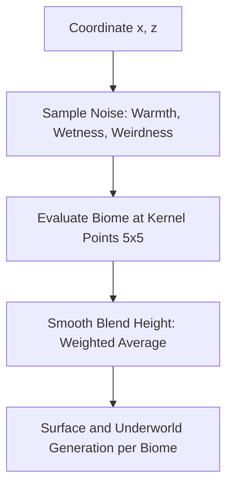
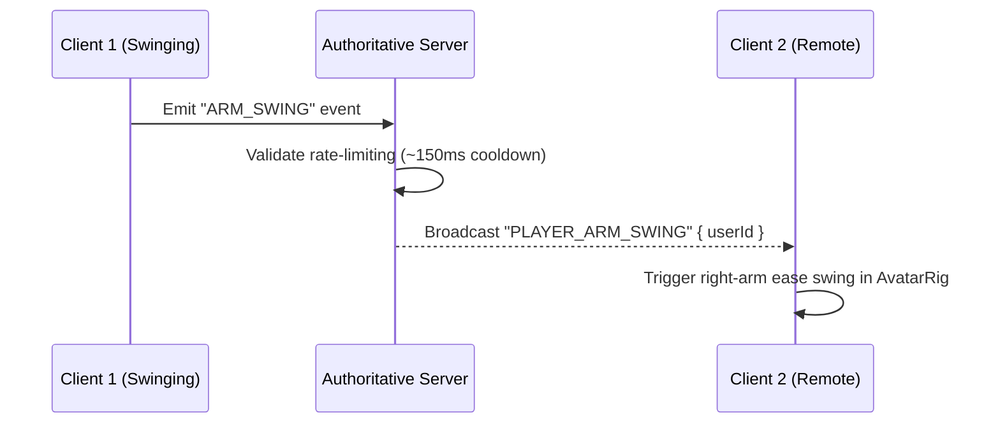
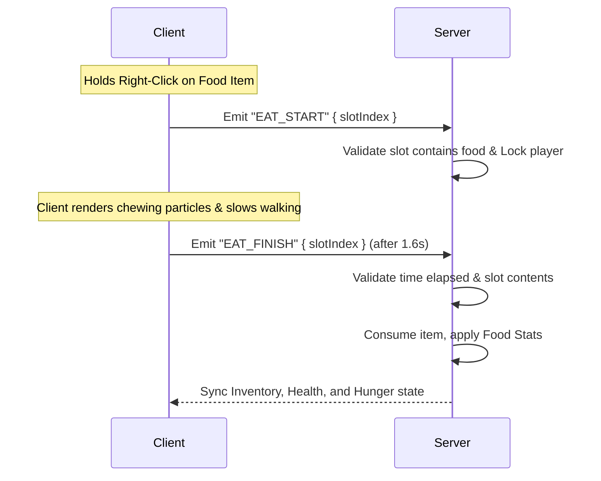

# Voxel Survival Expansion: Comprehensive Architectural Specification

This document provides a highly detailed, non-corner-cutting architectural blueprint for implementing four major gameplay systems in the Voxel Survival Multiplayer game:
1. **Multi-Biome World Generation (WorldGen)**
2. **Upgraded Tools & Usage (Animation, Perks, and Crafting Table)**
3. **Unified Shaped & Shapeless Recipes (2x2 and 3x3)**
4. **Food & Hunger System**

This specification bridges the **authoritative server** (`apps/minecraft-server`), the **web client** (`apps/web`), and the shared definitions package (`packages/voxel-content`).

---

## Architectural Constraints & Rules

1. **Server Authority**: The server is the absolute source of truth. The client is purely a rendering and input device. All inventory transactions, block placements, breaks, damage computations, health/hunger updates, and craft outcomes must occur on the server.
2. **Shared Package Compilation**: Always modify and compile `packages/voxel-content` before modifying dependent apps. This guarantees that block/item IDs, recipe logic, and tools speed metrics remain 100% matched between client and server.
3. **Optimized Determinism**: Client procedural chunks and server world gen must remain completely aligned. To prevent catastrophic client-side lag (Input Delay / INP), any ported algorithm must run in $O(1)$ without thread workers, utilizing optimized noise sampling kernels.
4. **No Code Duplication**: Do not manually copy constants. Leverage shared definitions inside `packages/voxel-content` for all block data, tools metadata, recipes, and items.

---

## Phase 1: Multi-Biome World Generation

### 1.1 Noise Functions & Blending Strategy
To adopt the biome-generation math from `voxelsrv-server`, we will use 2D and 3D noise (Simplex) mapped from coordinates $(x, z)$. In the current authoritative procedural pipeline (`proceduralVoxelID`), the client and server must resolve block IDs synchronously. 
To blend heights between biomes without expensive 21x21 neighborhood loops ($317$ iterations per column, which causes client frame drops), we will use an optimized **5x5 grid sampling kernel** (radius 2, 21 samples) for height blending.



### 1.2 Mathematical Formulation

1. **Noise Factors**:
   For any coordinate $(x, z)$ with seed $S$:
   $$\text{rand} = \text{hash3}(x, 200, z, S) / 90.0$$
   $$\text{weirdness} = \text{noise2D}\left(\frac{x}{600}, \frac{z}{600}, S_1\right) + 1.0 + \text{rand}$$
   $$\text{heat} = \text{noise2D}\left(\frac{x}{300}, \frac{z}{300}, S_2\right) + 1.0 + \text{rand}$$
   $$\text{water} = \text{noise2D}\left(\frac{x}{400}, \frac{z}{400}, S_3\right) + 1.0 + \text{rand}$$
   where $S_1, S_2, S_3$ are secondary seeds derived deterministically from $S$.

2. **Biome Selection Thresholds**:
   $$\text{Biome}(x, z) = \begin{cases}
   \text{Ocean} & \text{if } \text{water} > 1.3 \\
   \text{Mountains} & \text{if } 1.15 < \text{water} \le 1.3 \text{ and } \text{weirdness} > 1.5 \\
   \text{Beach} & \text{if } 1.15 < \text{water} \le 1.3 \text{ and } \text{weirdness} \le 1.5 \\
   \text{Desert} & \text{if } \text{water} \le 1.15 \text{ and } \text{heat} > 1.4 \\
   \text{Savanna} & \text{if } \text{water} < 1.0 \text{ and } 1.15 < \text{heat} \le 1.4 \\
   \text{Mountains} & \text{if } \text{heat} > 0.5 \text{ and } \text{weirdness} > 1.5 \\
   \text{Forest} & \text{if } \text{heat} > 0.5 \text{ and } 1.3 < \text{weirdness} \le 1.5 \\
   \text{Plains} & \text{if } \text{heat} > 0.5 \text{ and } \text{weirdness} \le 1.3 \\
   \text{Ice Mountains} & \text{if } \text{heat} \le 0.5 \text{ and } \text{weirdness} > 1.5 \\
   \text{Ice Plains} & \text{if } \text{heat} \le 0.5 \text{ and } \text{weirdness} \le 1.5
   \end{cases}$$

3. **Optimized Blending Kernel**:
   Instead of looping 317 times, sample $(x + dx, z + dz)$ in a 5x5 grid where $dx, dz \in \{-2, -1, 0, 1, 2\}$ if $dx^2 + dz^2 \le 5$ (exactly 21 points).
   $$\text{Height}(x, z) = \frac{\sum_{i=1}^{21} \text{Height}_{\text{Biome}(x_i, z_i)}(x, z)}{21}$$
   Where $\text{Height}_{B}(x, z)$ is the unique height function evaluated for biome $B$.

4. **Height Map Functions for Biomes**:
   Let:
   - $d_1 = \text{noise3D}(x/70, y/70, z/70, S_{\text{cave}1})$
   - $d_2 = \text{noise3D}(x/40, y/40, z/40, S_{\text{cave}2})$
   - $l_1 = \text{noise2D}(x/120, z/120, S_{\text{height}1})$
   - $l_2 = \text{noise2D}(x/10, z/10, S_{\text{height}2})$
   - $m = \text{noise2D}(x/60, z/60, S_{\text{mtn}}) + 1.0$
   - $h = l_1 + (l_2 + 1.0) / 4.0$

   **Biome Height Equations**:
   - **Plains**: $(d_1 \cdot (1 - h) + d_2 \cdot h) \cdot 14 \cdot m + 70$
   - **Forest**: $(d_1 \cdot (1 - h) + d_2 \cdot h) \cdot (14 + m \cdot 10) + 72$
   - **Desert**: $|d_1 \cdot (1 - l_1) + (d_2+0.2) \cdot l_1| \cdot 24 \cdot m + 73$
   - **Ocean**: $(d_1 \cdot (1 - h) + d_2 \cdot h) \cdot 14 + 50$ (with water level = 65)
   - **Beach**: $(d_1 \cdot (1 - h) + d_2 \cdot h) \cdot 8 + 66$
   - **Savanna**: $(d_1 \cdot (1 - h) + d_2 \cdot h) \cdot 23 \cdot m + 73$
   - **Mountains**: $\max\left(m_0 - \frac{d_1 \cdot d_2}{2}, \frac{m_0 - \frac{d_1 \cdot d_2}{2}}{3}\right) \cdot 100 + l_1 \cdot 2 + l_2 \cdot 3 + 80$ where $m_0 = |\text{noise2D}(x/80, z/80, S_{\text{mtn}})|$.

### 1.3 Implementation Plan & Files
1. **Modify** `packages/voxel-content/src/blocks.ts`: Ensure new blocks (`GRASS_SNOW`, `SANDSTONE`, `CACTUS`, `DEADBUSH`, `ICE`, `GRASS_YELLOW`, `GRASS_PLANT_YELLOW`, `LEAVES_YELLOW`) are exported with correct solid/breakable characteristics.
2. **Modify** `apps/minecraft-server/src/world.ts`: Replace the simple noise height/surface functions with a class `MultiBiomeGenerator` executing the equations above. 
3. **Synchronize Client** `apps/web/src/games/MinecraftClient.tsx`: The client maintains a mirror function `proceduralVoxelID` (refer to lines 362-398). Update this local function with the identical biome formulas to prevent client chunk loading stutter and structural mismatch.
4. **Structure Pasting**: Add server-side deterministic structure gen checks inside `world.ts`. Cacti, Oak Trees, Birch Trees, Spruce Trees, and Yellow Savanna Trees must generate based on a single deterministic coordinate hash (`hash3`) at the surface block.

### 1.4 Advanced Biome Definitions, Shading, & Soundscapes

To transform standard voxel blocks into an immersive world, we must move away from generic repeating block textures. We will define an authoritative, data-driven biome schema and implement dynamic color shading (tints) and audio soundscapes.

#### 1. Data-Driven Biome Registry (`BIOME_DEFS`)
Create `packages/voxel-content/src/biomes.ts` to export the registry:
```typescript
export interface BiomeDef {
  readonly id: string;
  readonly nameHebrew: string;
  readonly temperature: number; // 0.0 (frozen) to 2.0 (desert hot)
  readonly downfall: number;    // 0.0 (desert dry) to 1.0 (swamp wet)
  readonly foliageColorHex: string;
  readonly grassColorHex: string;
  readonly waterColorHex: string;
  readonly skyColorHex: string;
  readonly ambientSoundUrl: string;
}

export const BIOME_DEFS: Record<string, BiomeDef> = {
  ocean: {
    id: "ocean",
    nameHebrew: "אוקיינוס",
    temperature: 0.5,
    downfall: 0.9,
    foliageColorHex: "#448022",
    grassColorHex: "#397824",
    waterColorHex: "#3f76e4",
    skyColorHex: "#77a2ff",
    ambientSoundUrl: "/sounds/ambient/ocean_waves.mp3"
  },
  desert: {
    id: "desert",
    nameHebrew: "מדבר",
    temperature: 2.0,
    downfall: 0.0,
    foliageColorHex: "#8ab03b",
    grassColorHex: "#b5a663",
    waterColorHex: "#37507d",
    skyColorHex: "#e3cc8c",
    ambientSoundUrl: "/sounds/ambient/desert_wind.mp3"
  },
  savanna: {
    id: "savanna",
    nameHebrew: "סוואנה",
    temperature: 1.2,
    downfall: 0.05,
    foliageColorHex: "#84a346",
    grassColorHex: "#b0b05b",
    waterColorHex: "#375f7d",
    skyColorHex: "#ffdc99",
    ambientSoundUrl: "/sounds/ambient/savanna_dry.mp3"
  },
  forest: {
    id: "forest",
    nameHebrew: "יער",
    temperature: 0.7,
    downfall: 0.8,
    foliageColorHex: "#277a0f",
    grassColorHex: "#53b533",
    waterColorHex: "#3f76e4",
    skyColorHex: "#a1c2ff",
    ambientSoundUrl: "/sounds/ambient/forest_birds.mp3"
  },
  plains: {
    id: "plains",
    nameHebrew: "מישור",
    temperature: 0.8,
    downfall: 0.4,
    foliageColorHex: "#4c9e22",
    grassColorHex: "#6ec847",
    waterColorHex: "#3f76e4",
    skyColorHex: "#cce0ff",
    ambientSoundUrl: "/sounds/ambient/plains_wind.mp3"
  },
  mountains: {
    id: "mountains",
    nameHebrew: "הרים",
    temperature: 0.2,
    downfall: 0.3,
    foliageColorHex: "#50873a",
    grassColorHex: "#689656",
    waterColorHex: "#45629e",
    skyColorHex: "#ccd6ff",
    ambientSoundUrl: "/sounds/ambient/mountain_wind.mp3"
  },
  iceplains: {
    id: "iceplains",
    nameHebrew: "מישורי קרח",
    temperature: 0.0,
    downfall: 0.5,
    foliageColorHex: "#80b497",
    grassColorHex: "#74b391",
    waterColorHex: "#3d577a",
    skyColorHex: "#e0f2ff",
    ambientSoundUrl: "/sounds/ambient/blizzard.mp3"
  }
};
```

#### 2. Dynamic Grass & Foliage Shading tinting (Client-Side)
To prevent plain green grids, the client must apply biome color tints to Grass, Leaves, and Water.
* **Vertex-Color Tint Shader**:
  For custom meshed blocks (`GRASS`, `LEAVES`, `BIRCH_LEAVES`, `SPRUCE_LEAVES`), retrieve the vertex buffer inside `blockClientCatalog.ts` and modify the Babylon Material's dynamic tint.
* **Shading Formula**:
  When a block at $(x, y, z)$ is rendered:
  1. Determine its local biome by executing the 2D noise lookup `getBiome(x, z)`.
  2. Parse the corresponding hex code (e.g. `grassColorHex` for grass, `foliageColorHex` for leaves).
  3. Tint the standard diffuse texture using Babylon standard materials:
     ```typescript
     const biome = getBiome(x, z);
     const mat = noa.rendering.getMaterial(blockMatName);
     mat.diffuseColor = Babylon.Color3.FromHexString(biome.grassColorHex);
     ```

#### 3. Ambient Audio Cross-Fading Loop
An audio manager on the client dynamically controls background loop channels based on the active player biome location:
* **Biome Sampling**: Every $500\text{ms}$, sample the active biome at the player's primary coordinate $(x, z)$.
* **Fading Mechanics**: If the biome changes:
  - Cross-fade the old audio loop volume to `0.0` over $3.0$ seconds.
  - Fade-in the new biome's `ambientSoundUrl` loop channel to `0.4` volume over $3.0$ seconds.
  - This guarantees fluid, beautiful ambient sounds when crossing biome borders without jarring sound cuts.

#### 4. Weather & Precipitation Mechanics
The player's current climate context determines active weather effects:
- **Snowfall**: If `temperature <= 0.15` and `downfall > 0.3` (e.g. Ice Plains/Ice Mountains), any active precipitation renders as falling snow particles. Water blocks exposed to the sky will slowly freeze into `BLOCK_REGISTRY.ICE` on server tick randomly.
- **Rain**: If `0.15 < temperature < 1.5` and `downfall > 0.3`, active weather displays rain particle sheets.
- **Clear**: If `temperature >= 1.5` or `downfall <= 0.3` (e.g. Desert), weather is always clear and sunny.
- **Server Tick Soil Hydration**: Farms or grass blocks in biomes with `downfall > 0.6` hydrate automatically without requiring adjacently placed water sources.


---

## Phase 2: Upgraded Tools, Perks, & Custom Animations

To create an extremely premium experience, we will implement first-person held tool rendering, fluid swing animations, remote swing syncing, custom perk-giving tools, and full Crafting Table 3x3 block integration.

```
       First-Person Animation Loop:
       [Tick Update] --> Calculate Yaw/Pitch Bobbing
                     --> If Swinging: Apply Sinusoidal Rotation Roll-off
                     --> Update Babylon Mesh Matrix relative to Camera
```

### 2.1 First-Person Tool Rendering & Swing Animations
Currently, `noa-engine` has no first-person hand or tool mesh. We will dynamically parent a tool/hand mesh to the Babylon camera so that it sits on the bottom-right of the screen and swings when the player mines or attacks.

#### 1. Mesh Parenting & Offset Math (First-Person View)
In `MinecraftClient.tsx`, create and cache a Babylon mesh representing the active tool (or simple arm box if the slot is empty).
Parent this mesh to the camera transform:
```typescript
const cameraMesh = noa.rendering.getScene().activeCamera;
toolMesh.parent = cameraMesh;
// Set default held offsets
toolMesh.position.set(0.24, -0.28, 0.42);
toolMesh.rotation.set(0.12, -0.4, 0); // pointing slightly inward
```

#### 2. Bobbing & Swinging Keyframe Interpolation
In the `noa.on("tick", ...)` hook, we apply bobbing and swing offsets.
- **Bobbing** (while walking):
  $$\text{bobX} = \sin(\text{phase} \cdot 2) \cdot 0.015$$
  $$\text{bobY} = |\cos(\text{phase} \cdot 2)| \cdot 0.015$$
- **Swinging (Sinusoidal Easing)**:
  When a click occurs, set `swingProgress = 0`. Increment by `speed` per frame until `1.0`.
  $$\theta(t) = \sin(\pi \cdot t^{1.4}) \cdot 1.1 \text{ radians}$$
  Apply $\theta(t)$ to the Pitch/Yaw of the `toolMesh.rotation` to swing it downwards and back, accompanied by an forward-push translation:
  $$\text{pushZ} = \sin(\pi \cdot t) \cdot 0.15$$

### 2.2 Remote Player Arm Swings
For multiplayer visual feedback, arm swings must be synchronized Authoritatively.



1. **Protocol Additions**:
   In `packages/voxel-content` / Protocol files, declare the swing action:
   ```typescript
   // Socket event
   "PLAYER_ARM_SWING" = "player_arm_swing"
   ```
2. **Server Broadcast**:
   In `apps/minecraft-server/src/index.ts`, listen for `player_arm_swing`. Rate-limit to prevent spam ($150\text{ms}$ cooldown), then broadcast to all other players in the room:
   ```typescript
   socket.on("player_arm_swing", () => {
     socket.to(roomId).emit("player_arm_swing", { userId: player.userId });
   });
   ```
3. **Remote Avatar Animation Rig Upgrade**:
   In `apps/web/src/games/voxel/voxelAvatarAnimation.ts`, update `AvatarRig` interface to track swing state:
   ```typescript
   export interface AvatarRig {
     // ... original bones ...
     swingTime: number; // 0 to 1
     isSwinging: boolean;
   }
   ```
   Modify `updateAvatarWalk(rig, x, z)`:
   If `rig.isSwinging` is true, calculate the right arm's rotation by overlaying the swing phase:
   ```typescript
   if (rig.isSwinging) {
     rig.swingTime += 0.12; // Swing animation speed
     if (rig.swingTime >= 1.0) {
       rig.isSwinging = false;
       rig.swingTime = 0;
     }
     const swingAngle = Math.sin(Math.PI * rig.swingTime) * 1.35;
     if (rig.bones.rightArm) {
       // Override walking swing with block-breaking slash swing
       rig.bones.rightArm.rotation.x = -0.5 - swingAngle;
       rig.bones.rightArm.rotation.y = -swingAngle * 0.3;
     }
   }
   ```

### 2.3 Custom Perk-Giving Tools
Extend the database schema of tools in `packages/voxel-content/src/items.ts` to include optional **Perk Modifiers**.

| Tool Key | Perk Name | Client/Server Hook | Gameplay Mechanic |
| :--- | :--- | :--- | :--- |
| `HELIUM_BOOTS` | High Jump | `physics.jumpForce` | Increases player jump height by 1.6x |
| `SWIFT_PICKAXE` | Haste Speed | `breakDurationForBlock` | Mining speed increased by +50% |
| `VAMPIRIC_SWORD` | Lifesteal | `applyDamage` | Heals player for 10% of damage dealt |
| `NIGHT_GLOW_HELMET`| Night Vision | `ambientLight` | Forces high Babylon scene ambient lighting |

#### Code Implementation Schema:
Update `ItemDef` definition in `items.ts`:
```typescript
export interface ItemPerkSpec {
  readonly jumpBonus?: number;
  readonly speedBonus?: number;
  readonly healOnHit?: number;
  readonly fullBright?: boolean;
}
export interface ItemDef {
  // ...
  readonly perk?: ItemPerkSpec;
}
```
* **Helium Boots Hook**: Inside `MinecraftClient.tsx` tick, if player inventory holds `HELIUM_BOOTS` in active boots slots, set `noa.physics.jumpForce = 8.5` (standard is `6.0`).
* **Swift Pickaxe Hook**: Inside `packages/voxel-content/src/mining.ts`, double tool speed if the item key matches `SWIFT_PICKAXE`.
* **Vampiric Sword Hook**: Inside the server combat handler, if player attacks with `VAMPIRIC_SWORD`, trigger:
  $$\text{health}_{\text{attacker}} = \min(20, \text{health}_{\text{attacker}} + \text{damageDealt} \cdot 0.10)$$

### 2.4 Crafting Table 3x3 Block Integration
Currently, the `CRAFTING` block exists but right-clicking it does nothing in survival. We will wire it so it opens a 3x3 inventory overlay.

1. **Right-Click Interaction Detector**:
   In `MinecraftClient.tsx`, catch right-clicks (`alt-fire`). If the targeted block is `BLOCK_REGISTRY.CRAFTING`, prevent normal placement and instead open the 3x3 Crafting Menu:
   ```typescript
   if (tgt.blockID === BLOCK_REGISTRY.CRAFTING) {
     setCraftingGridType("3x3");
     setInventoryOpen(true);
     return;
   }
   ```
2. **Visual layout**:
   The UI renders a standard 3x3 layout next to the player's 27 inventory slots, backed by 9 synchronization coordinates. When the inventory closes, any items left in the 3x3 crafting table are ejected back to the player's hotbar/main inventory, or dropped on the floor as world entities if the inventory is full.

---

## Phase 3: Unified Shaped & Shapeless Recipes

To support both the personal 2x2 grid and the Crafting Table's 3x3 grid, we will build a generic grid padding and matrix translation algorithm. This keeps all recipe definitions inside a single, scalable data structure.

```
       Personal Inventory Grid (2x2)            Crafting Table Grid (3x3)
              [A] [B]                                  [A] [B] [ ]
              [C] [D]                                  [C] [D] [ ]
                                                       [ ] [ ] [ ]
                  \                                         /
                   \---> Padded & Aligned to 3x3 Matrix <--/
                                      |
                           Match Against Unified
                          Shaped/Shapeless Recipes
```

### 3.1 Unified Grid Representations
- Personal inventory crafting grid is size $4$ (indices $0..3$).
- Crafting Table grid is size $9$ (indices $0..8$).
- Both must be normalized into a standard **3x3 Matrix** representation for matching:
  - 2x2 elements mapped to 3x3:
    $$\begin{pmatrix} c_0 & c_1 \\ c_2 & c_3 \end{pmatrix} \Rightarrow \begin{pmatrix} c_0 & c_1 & \emptyset \\ c_2 & c_3 & \emptyset \\ \emptyset & \emptyset & \emptyset \end{pmatrix}$$

### 3.2 Matrix Translation & Alignment Matching Algorithm
For shaped recipes, the layout shouldn't care about where the shape sits in the grid. For instance, crafting a torch (coal above stick) in a 3x3 grid can occupy slots $[0, 3]$, $[1, 4]$, $[2, 5]$, $[3, 6]$, $[4, 7]$, or $[5, 8]$.

We must implement a **Bounding Box Shrink and Match** algorithm inside `packages/voxel-content/src/recipes.ts`:

```typescript
export interface Matrix2D {
  width: number;
  height: number;
  data: (RecipeIngredient | null)[];
}

/** Shrink grid to ignore padding empty rows/columns. */
function getBoundingBox(grid: GridSnapshot, width: number): Matrix2D {
  let minRow = 99, maxRow = -1, minCol = 99, maxCol = -1;
  const height = grid.length / width;

  for (let r = 0; r < height; r++) {
    for (let c = 0; c < width; c++) {
      const cell = grid[r * width + c];
      if (cell && !isEmptyCell(cell)) {
        if (r < minRow) minRow = r;
        if (r > maxRow) maxRow = r;
        if (c < minCol) minCol = c;
        if (c > maxCol) maxCol = c;
      }
    }
  }

  if (maxRow === -1) {
    return { width: 0, height: 0, data: [] };
  }

  const bbW = maxCol - minCol + 1;
  const bbH = maxRow - minRow + 1;
  const data: (GridCellSnapshot | null)[] = [];

  for (let r = minRow; r <= maxRow; r++) {
    for (let c = minCol; c <= maxCol; c++) {
      data.push(grid[r * width + c]);
    }
  }

  return { width: bbW, height: bbH, data };
}
```

#### Shaped Match Execution:
For any recipe matrix:
1. Extract the bounding box of the active input grid (either 2x2 or 3x3).
2. Extract the bounding box of the recipe pattern.
3. If their dimensions do not match, return false.
4. If their dimensions match, compare cells: every recipe ingredient must match the cell contents, and every empty recipe slot must align with an empty grid cell.

### 3.3 New Expanded Recipe List
All recipes must be declared in `packages/voxel-content/src/recipes.ts`. 

```typescript
export interface Recipe {
  readonly key: string;
  readonly kind: "shaped" | "shapeless";
  readonly gridWidth: number; // 2 or 3
  readonly pattern: readonly (RecipeIngredient | null)[];
  readonly output: RecipeOutput;
}
```

We will implement the following recipes end-to-end:

| Output Item | Recipe Type | Input Ingredients | Output Count |
| :--- | :--- | :--- | :--- |
| `CRAFTING_TABLE` | Shaped (2x2) | 4x Planks (Any Planks) | 1 |
| `STICK` | Shaped (2x2) | 2x Planks (vertical) | 4 |
| `WOODEN_PICKAXE` | Shaped (3x3) | 3x Planks (top row), 2x Sticks (middle-center) | 1 |
| `STONE_PICKAXE` | Shaped (3x3) | 3x Cobblestone (top row), 2x Sticks (middle-center) | 1 |
| `IRON_PICKAXE` | Shaped (3x3) | 3x Iron Ingots (top row), 2x Sticks (middle-center) | 1 |
| `DIAMOND_PICKAXE` | Shaped (3x3) | 3x Diamonds (top row), 2x Sticks (middle-center) | 1 |
| `WOODEN_AXE` | Shaped (3x3) | 3x Planks (top-left 2x2 corner shape), 2x Sticks | 1 |
| `STONE_AXE` | Shaped (3x3) | 3x Cobblestone (corner shape), 2x Sticks | 1 |
| `IRON_AXE` | Shaped (3x3) | 3x Iron Ingots (corner shape), 2x Sticks | 1 |
| `DIAMOND_AXE` | Shaped (3x3) | 3x Diamonds (corner shape), 2x Sticks | 1 |
| `BREAD` | Shaped (3x3) | 3x Wheat (horizontal row) | 1 |
| `HELIUM_BOOTS` | Shaped (3x3) | 4x Diamonds (left/right boot shape), 2x Sapling (cores) | 1 |
| `SWIFT_PICKAXE` | Shaped (3x3) | 3x Gold blocks (top row), 2x Sticks | 1 |
| `COAL` | Shapeless (1x1)| 1x Wood Log (yields charcoal/coal equivalent) | 1 |
| `IRON_INGOT` | Shapeless (1x1)| 1x Iron Ore block (simulated cold smelting) | 1 |
| `DIAMOND` | Shapeless (1x1)| 1x Diamond Ore block | 1 |

---

## Phase 4: Food & Hunger System

Modeling realistic player parameters brings high engagement to the voxel simulator.

```
       [Authoritative State Tick]
           |
           +--> Sprinting/Mining/Jumping? --> Accumulate Exhaustion
           |                                       |
           +--> Exhaustion > 4.0? ----------> Exhaustion = 0, Hunger -= 1
           |
           +--> Hunger == 20 & Saturation > 0? -> Natural Regen: Health += 1
           |                                      Saturation -= 1 (every 4s)
           |
           +--> Hunger == 0? ----------------> Starvation Damage: Health -= 1
```

### 4.1 Server Authoritative Attributes
Add the following properties to the player's session context (`PlayerRuntime` inside `apps/minecraft-server/src/room.ts`):
```typescript
export interface PlayerRuntime {
  health: number;      // 0 to 20 (1 heart = 2 units)
  hunger: number;      // 0 to 20 (1 shank = 2 units)
  saturation: number;  // 0.0 to 20.0 (determines how fast hunger drains)
  exhaustion: number;  // 0.0 to 4.0 (grows from actions, overflows to drain hunger)
  lastRegenTick: number;
  lastStarveTick: number;
}
```

### 4.2 Exhaustion & Hunger Decay Physics
The server accumulates `exhaustion` based on state inputs tracked in the input broadcast loop:

| Player Action | Exhaustion Cost | Trigger Condition |
| :--- | :--- | :--- |
| **Standing Idle** | $0.005$ | Per second |
| **Walking** | $0.02$ | Per meter traveled |
| **Sprinting** | $0.15$ | Per meter traveled |
| **Jumping** | $0.05$ | Per jump triggered |
| **Mining Blocks** | $0.025$ | Per block broken |

#### Decay Equations:
On the server simulation tick (every $50\text{ms}$):
- When `exhaustion >= 4.0`:
  - Reset `exhaustion = exhaustion - 4.0`
  - If `saturation > 0.0`:
    - Reduce `saturation = Math.max(0.0, saturation - 1.0)`
  - Else:
    - Reduce `hunger = Math.max(0, hunger - 1)`

### 4.3 Health Regeneration & Starvation
1. **Regeneration Mechanics**:
   - If player's `hunger >= 18` (at least 9 shanks) and player's `health < 20`:
     - Every $4.0$ seconds ($80$ server ticks):
       - Increase `health = Math.min(20, health + 1)`
       - Reduce `saturation = Math.max(0.0, saturation - 1.0)`
2. **Starvation Mechanics**:
   - If player's `hunger == 0`:
     - Every $4.0$ seconds ($80$ server ticks):
       - Deal starvation damage: `health = Math.max(0, health - 1)`
       - If `health <= 0`: trigger authoritative Player Respawn.

### 4.4 Consumption Action Loop (Eating Action)
Eating must require holding down the interact key for $1.6$ seconds, creating an eating lock loop that blocks placing/breaking.



#### Food Definitions Table (packages/voxel-content/src/items.ts):
Add a food schema to Item definitions:
```typescript
export interface ItemFoodSpec {
  readonly nutrition: number;
  readonly saturationModifier: number;
}
```
* **BREAD** (nutrition: 5, saturation: 6.0)
* **APPLE** (nutrition: 4, saturation: 2.4)
* **WHEAT** (not directly consumable, used for baking bread)

#### Consumption Networking Rules:
1. **Event**: `EAT_START` (Client $\rightarrow$ Server)
   - Payload: `{ slotIndex: number }`
   - Server registers `activeEating = { slotIndex, startedAt: Date.now() }`.
   - Client slows speed by 70% to match eating movement penalty.
2. **Event**: `EAT_FINISH` (Client $\rightarrow$ Server)
   - Payload: `{ slotIndex: number }`
   - Server asserts:
     - Player is holding the identical food item in the slot.
     - `Date.now() - activeEating.startedAt >= 1500ms` (1.5s tolerance).
   - Server modifies player attributes:
     - Consume $1\times$ food item.
     - Increase hunger: `hunger = Math.min(20, hunger + food.nutrition)`.
     - Increase saturation: `saturation = Math.min(hunger, saturation + food.nutrition * food.saturationModifier)`.
   - Clear server-side eating lock.

---

## Complete Verification & Integration Test Plan

### Phase 1: WorldGen Assertions
* Run `npm run test` in server package. Assert that `proceduralVoxelID` returns identical block IDs for coordinates across $10,000$ iterations using diverse seeds.
* Validate that chunk boundary layers do not contain sheared blocks or vertical height mismatches by placing automated border sweeps.

### Phase 2: Held Tools & Animation Checks
* Attach a spy on Socket.io. Confirm that initiating a left-click with a pickaxe emits a single `player_arm_swing` event.
* Verify that remote players receive `player_arm_swing` and increment `rig.swingTime` cleanly without throwing Babylon mesh binding errors.
* Equipping `HELIUM_BOOTS` triggers an immediate modification to player `noa.physics.jumpForce`. Verify that standard height increases from 1.25 blocks to 3.0 blocks.

### Phase 3: Recipe Bounding Box Tests
* Unit test the `getBoundingBox` translation logic. Assert that a $2\times2$ wood slab shape shifted to the bottom right of a $3\times3$ table successfully resolves to a valid shaped wood-slab recipe match.
* Attempt illegal crafting hacks (e.g. submitting empty ingredients with valid outputs). Assert that server validates recipes authoritatively and rejects the execution.

### Phase 4: Consumption State Mutations
* Exhaustion decay test: Simulating sprinting on the server must increment player `exhaustion`. Verify that at $4.0$ exhaustion points, `hunger` or `saturation` decreases by exactly $1.0$.
* Exhaust eating: Send an `EAT_FINISH` packet $200\text{ms}$ after `EAT_START`. Verify that the server rejects the request with `TOO_EARLY` error and the item count is preserved.
* Saturation depletion: Verify that health regeneration consumes `saturation` first, and `hunger` is only reduced once `saturation` reaches `0.0`.
