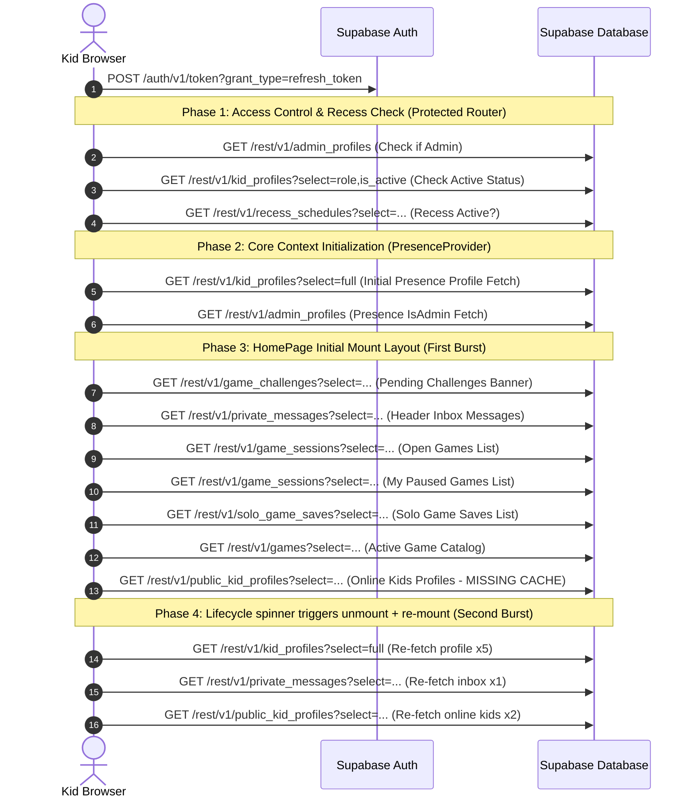

# Homepage Network Traffic Analysis — OMplayground

This report provides a comprehensive, data-backed investigation into the network traffic, bundle compilation, and database query cascades triggered when loading the homepage (`/home`) of the playground application. 

The analysis is based on code investigation across the frontend repository and the deep parsing of two real-world HTTP Archive (HAR) captures:
1. `localhost.har` — Dev environment session (Vite dev server)
2. `o-mplayground-game-server.vercel.app.har` — Production environment session (Vercel deployment)

---

## 1. Executive Summary & Core Metrics

### Key Performance Indicators (onLoad)
* **Local Dev Load Time:** **15.3 seconds** (`onContentLoad: 15,193ms`, `onLoad: 15,323ms`). This extremely high load time is due to Vite's dev-mode loading behavior, which sequentially serves over **2,000 unbundled JavaScript modules** one-by-one, combined with CORS preflights and duplicate database fetches.
* **Production Load Time:** **900 milliseconds** (`onContentLoad: 855.8ms`, `onLoad: 900.1ms`). Production is vastly faster because code is bundled, compressed, and served via HTTP/2, but it still pays an unnecessary payload and latency tax.
* **Production JS Network Payload (HAR Verified):** **2.08 MB** (`assets/index-zKlxsv2b.js`) transferred over the network on initial homepage load, plus **209 KB** of CSS (`assets/index-B25YzLyQ.css`).
* **Local Build Output Footprint:** **~8.96 MB** of raw, uncompressed compiled JavaScript files present in the `dist/assets` directory after building. While only the primary entry bundle (2.08 MB) is eagerly loaded by the homepage, the remaining chunks exist for other lazy-loaded routes and lazy libraries (e.g. Excalidraw, workers).
* **Supabase REST Queries (HAR Verified):** **23 actual REST GET calls** executed during the load phase of the production homepage, plus **22 CORS OPTIONS preflight handshakes**.
* **Wasted Duplicate Queries:** **9 duplicate GET requests** in the production load cascade, fetching the exact same `kid_profile` and `admin_profile` data across parallel, un-cached hooks.
* **CORS Preflight Overhead:** **22 OPTIONS requests** in Dev, **22 OPTIONS requests** in Production. Because the app domain differs from the remote Supabase API host (`uphjkhzmlidnbtnmpdzz.supabase.co`), every unique endpoint requires a preflight handshake, adding **~100–200ms** of latency per endpoint.
* **WebSockets:** **1 persistent connection** in Production (multiplexing **5 distinct Realtime channel subscriptions**).

---

## 2. The JS Bundle Size & Lazy-Loading Audit

The application suffers from **zero bundle code-splitting** at the route level. Every single route, component, utility, and heavy dependency is eagerly imported in the main entry graph and compiled into a single massive footprint.

### Eager vs. Lazy Loading Analysis
The only lazy-loaded component in the entire codebase is `Excalidraw` within `DrawingCanvas.tsx` using `React.lazy()`. All other pages, games, and heavy 3D assets are eagerly loaded on the homepage.

### Production Network Payload vs. Build Assets Directory
There is a difference between what Vite generates in the build directory (`apps/web/dist/assets`) and what the homepage actually transfers over the network:

* **HOMEPAGE NETWORK TRANSFER:** Exactly **2,076,921 bytes (~2.08 MB)** for JavaScript (`index-zKlxsv2b.js`) and **209,904 bytes (~209 KB)** for CSS (`index-B25YzLyQ.css`) were loaded on the homepage in the production HAR.
* **TOTAL DIST DIRECTORY SIZE:** The build folder contains **127 files totaling ~8.96 MB** of uncompressed JS. This is because Vite code-splits some specific assets (such as cytoscape, mermaid locales, workers, and drawing packages), but fails to separate core game engines and other page routes from the primary entry chunk.

### Heavy Eager Dependencies Shipped to the Homepage:
1. **`@babylonjs/core` (~3.0MB+):** Loaded eagerly even though 3D graphics are only used in the Minecraft route (`/play/:sessionId` with `MinecraftClient.tsx`).
2. **`noa-engine` (~1.2MB):** Eagerly loaded voxel engine only used in Minecraft.
3. **`@excalidraw/excalidraw` (~1.5MB):** Whiteboard tool only used in drawing games.
4. **`chess.js` + `react-chessboard` (~350KB):** Chess rule engine and board rendering assets, loaded eagerly even when playing Simon or Snake.
5. **Admin & Teacher Pages (~180KB):** Complex admin tables and teacher controls loaded onto a regular kid's device.

---

## 3. The Supabase REST API Call Cascade

The production HAR records exactly **23 actual Supabase REST GET calls** triggered during the loading phase of `/home`. The chronological sequence of these calls is traced below:

### Phase 1: Authentication & Access Control (Protected Router)
* `GET /rest/v1/admin_profiles?select=id` — Access check query #1.
* `GET /rest/v1/admin_profiles?select=id` — Access check query #2.
* `GET /rest/v1/kid_profiles?select=role,is_active` — Access check status query #1.
* `GET /rest/v1/kid_profiles?select=role,is_active` — Access check status query #2 (after authentication confirmation).
* `GET /rest/v1/recess_schedules?select=...&is_active=eq.true` — Access check recess window validation.

### Phase 2: Presence Provider Initialization
* `GET /rest/v1/kid_profiles?select=full` — Initial full profile lookup.
* `GET /rest/v1/admin_profiles?select=id` — Initial admin flag lookup.

### Phase 3: HomePage Initial Mount Layout (First Burst)
* `GET /rest/v1/game_challenges?select=...&status=eq.pending` — Pending challenges banner fetch.
* `GET /rest/v1/private_messages?select=...` — Header inbox message history fetch.
* `GET /rest/v1/game_sessions?select=...&is_open=eq.true` — Open multiplayer rooms fetch.
* `GET /rest/v1/game_sessions?select=...&status=eq.paused` — Paused multiplayer sessions fetch.
* `GET /rest/v1/solo_game_saves?select=...` — Saved solo games catalog fetch.
* `GET /rest/v1/games?select=...&is_active=eq.true` — General game catalog catalog fetch.

### Phase 4: Lifecycle Spinner Re-Mount (Second Burst)
Due to a lifecycle rendering bug in `HomePage.tsx`, the children of the homepage are unmounted and re-mounted, causing the following query repetitions:
* `GET /rest/v1/kid_profiles?select=full` — Repetitive profile lookup (fired **5 additional times** in parallel by re-mounting components).
* `GET /rest/v1/private_messages?select=...` — Repetitive inbox fetch (fired **1 additional time**).
* `GET /rest/v1/public_kid_profiles?select=...` — Repetitive online kids profiles lookup (fired **2 additional times**).



---

## 4. Discovery of the "Unmount/Re-mount Spinner Bug"

Analyzing the timeline of the Production HAR (`o-mplayground-game-server.vercel.app.har`) revealed a highly destructive rendering bug in `HomePage.tsx` that causes children to completely unmount and re-mount, triggering duplicate network requests.

### The Bug Mechanism in `HomePage.tsx`
On lines 174–176 of `HomePage.tsx`, we see:
```typescript
if (adminLoading || isAdmin || profile?.role === "teacher") {
  return <div className="p-6 text-sm font-medium text-slate-500">טוען…</div>;
}
```

Now let's look at `useIsAdmin(user)` in `useIsAdmin.ts`:
```typescript
export function useIsAdmin(user: User | null) {
  const [isAdmin, setIsAdmin] = useState(false);
  const [loading, setLoading] = useState(false); // Starts as FALSE!
```

### The Chain of Events:
1. **Initial Mount:** `HomePage` mounts. `adminLoading` is initially `false`. Therefore, the `if` condition evaluates to `false`, and `HomePage` immediately renders `<KidDesktopShell>` and `<OnlineKids>`.
2. **First Burst Fired:** Rendering these subcomponents immediately mounts their child hooks (`useProfile`, `useInbox`, `useOnlineKids`). This triggers the first burst of queries (e.g. `public_kid_profiles`, `private_messages`, `kid_profiles`).
3. **Commit Phase State Change:** Inside `useIsAdmin`, the `useEffect` fires immediately after mounting and calls `setLoading(true)`. 
4. **Unmounting Layout:** The state update in `useIsAdmin` causes `HomePage` to re-render. Since `adminLoading` is now `true`, the `if` condition is met, and `HomePage` completely drops the layout and renders `<div className="...">טוען…</div>` (loading spinner). **This instantly unmounts `<KidDesktopShell>` and `<OnlineKids>`!**
5. **Cache Failure Race Condition:** The unmounting of the child hooks sets their internal `cancelled = true` state. When the first `public_kid_profiles` query resolves, the cleanup function prevents the query results from being written to the module-level profile `cache`. The profile data is discarded.
6. **Query Completion:** The `admin_profiles` query resolves. `useIsAdmin` calls `setIsAdmin(!!data)` and `setLoading(false)`.
7. **Re-mounting Layout:** `HomePage` re-renders. Since `adminLoading` is `false` again, it drops the spinner and mounts `<KidDesktopShell>` and `<OnlineKids>` for a *second time*.
8. **Second Burst Fired:** Because the components are re-mounted, all of their `useEffect` hooks run again. Since the previous `public_kid_profiles` call never wrote to the cache, the cache is still empty. The browser is forced to trigger the entire set of queries again.

---

## 5. WebSocket & Realtime Channel Inventory

All real-time subscriptions are multiplexed over **one single WebSocket connection** to Supabase Realtime in production. 

```
wss://uphjkhzmlidnbtnmpdzz.supabase.co/realtime/v1/websocket?apikey=...&vsn=2.0.0
```

On loading the homepage, the client registers **5 distinct channel subscriptions** over this connection:

1. **`presence:playground:{gender}`**
   * **Type:** Realtime Presence
   * **Triggered by:** `PresenceProvider` (`usePresence.tsx:50`)
   * **Purpose:** Tracks other online same-gender kids in the playground catalog.
2. **`challenges:{userId}`**
   * **Type:** Postgres Database Changes (`INSERT`/`UPDATE` on table `game_challenges`)
   * **Triggered by:** `usePendingChallenge` (`usePendingChallenge.ts:42`)
   * **Purpose:** Realtime notifications when another kid challenges the user.
3. **`open-games:{userId}`**
   * **Type:** Postgres Database Changes (`INSERT`/`UPDATE`/`DELETE` on table `game_sessions`)
   * **Triggered by:** `useOpenGames` (`useOpenGames.ts:58`)
   * **Purpose:** Instantly displays new open multiplayer lobbies on the homepage.
4. **`paused-games:{userId}`**
   * **Type:** Postgres Database Changes (`*` on table `game_sessions`)
   * **Triggered by:** `useMyPausedGames` (`useMyPausedGames.ts:62`)
   * **Purpose:** Listens to session state changes to update the user's paused games.
5. **`inbox:{userId}:{ts}:{rand}`**
   * **Type:** Postgres Database Changes (`INSERT`/`UPDATE` on table `private_messages`)
   * **Triggered by:** `useInbox` (`useInbox.ts:119`)
   * **Purpose:** Listens to new private chat messages to update unread badge counts in the header.

> [!NOTE]
> The game-server's `socket.io-client` connection (which targets `http://127.0.0.1:8080/socket.io` in dev / Vercel in prod) is **not** initialized on the homepage. It is lazily opened only when a user successfully enters an active multiplayer gameplay route `/play/:sessionId`.

---

## 6. Static Assets & Third-party Services Audit

A rigorous check of the HAR files and configuration directories reveals the following:
* **Google Fonts / External CDNs:** None. All fonts are self-hosted inside the bundle (`Assistant-Bold.woff2`, `Assistant-Regular.woff2`, etc. served locally via `/assets/`).
* **Analytics / Tracking Scripts:** **Zero.** There are no scripts or network calls targeting Google Analytics, Sentry, Mixpanel, Hotjar, or Facebook Pixel.
* **PWA / Favicons:** No manifest file is requested on page load.
* **CSS Frameworks:** Tailwind CSS via `@tailwind base/components/utilities` is compiled into a single static file `index-B25YzLyQ.css` (209 KB).

---

## 7. Actionable Architectural Fixes

### Fix 1: Eliminate the Lifecycle Spinner Bug (Unmount/Re-mount)

To resolve the unmount/re-mount layout flicker:
1. In `useIsAdmin.ts`, initialize the state `loading` to `true` (since we must perform an async fetch to know if they are an admin). Ensure that the early-return block for unauthenticated users also resets the state to `false`.
2. In `HomePage.tsx`, replace the early return containing the loading screen with a non-destructive loading indicator overlay (or subcomponent loader) that preserves the shell structure and leaves the context providers mounted.

#### Patch for `useIsAdmin.ts`:
```diff
// apps/web/src/hooks/useIsAdmin.ts
export function useIsAdmin(user: User | null) {
  const [isAdmin, setIsAdmin] = useState(false);
- const [loading, setLoading] = useState(false);
+ const [loading, setLoading] = useState(true); // Default to loading to prevent premature layout rendering

  useEffect(() => {
    if (!user) {
      setIsAdmin(false);
+     setLoading(false); // Ensure loading is released if there is no user
      return;
    }
    let cancelled = false;
    setLoading(true);
    void (async () => {
      const { data } = await supabase
        .from("admin_profiles")
        .select("id")
        .eq("id", user.id)
        .maybeSingle();
      if (!cancelled) {
        setIsAdmin(!!data);
        setLoading(false);
      }
    })();
    return () => {
      cancelled = true;
    };
  }, [user?.id]);
```

#### Patch for `HomePage.tsx`:
To prevent structural layout teardown while resolving access status:
```diff
// apps/web/src/pages/HomePage.tsx
- if (adminLoading || isAdmin || profile?.role === "teacher") {
-   return <div className="p-6 text-sm font-medium text-slate-500">טוען…</div>;
- }

  return (
    <KidDesktopShell
      title="לוח המשחקים"
      subtitle="משחקים, חדרים פתוחים וילדים מחוברים במקום אחד"
      contentClassName="grid min-h-[calc(100vh-136px)] gap-4 xl:grid-cols-[minmax(0,1.35fr)_minmax(320px,0.85fr)_360px]"
    >
+     {adminLoading || !profile ? (
+       <section className={desktopPanelClass("flex min-h-[620px] items-center justify-center p-4")}>
+         <div className="text-slate-500 font-medium">טוען נתוני שרת…</div>
+       </section>
+     ) : (
        <section className={desktopPanelClass("flex min-h-[620px] flex-col p-4")}>
          {/* Main game library catalog contents */}
        </section>
+     )}

      <div className="flex min-h-[620px] flex-col gap-4">
        {/* Open rooms and other sub-elements */}
      </div>

      <OnlineKids className="min-h-[620px]" />
    </KidDesktopShell>
  );
```

---

### Fix 2: Shared Profile Cache Context Provider

Rather than executing independent, parallel queries via `useProfile` across 5 layout components on the same page, create a `ProfileProvider` wrapping the application. This provider:
* Consolidates profile fetching into a single query and distributes data down to all consumers.
* Correctly resets profile/loading state upon logout or when the user changes.
* Implements a cancellation reference to guard against setting state on unmounted layout transitions.
* Ships the identical API contract (`{ profile, loading, error, refetch }`) to serve as a drop-in replacement.

#### `ProfileProvider` Implementation:
Create a new file `apps/web/src/components/ProfileProvider.tsx` or incorporate it into the global hooks flow:

```typescript
import { createContext, useContext, useEffect, useState, useCallback, useRef } from "react";
import type { ReactNode } from "react";
import type { User } from "@supabase/supabase-js";
import { supabase } from "@/lib/supabase";

export interface KidProfileRow {
  id: string;
  username: string;
  full_name: string;
  gender: "boy" | "girl";
  grade: number;
  role: "kid" | "teacher";
  is_active: boolean;
  avatar_color: string;
  avatar_preset_id: string | null;
  avatar_url: string | null;
  unread_message_count: number;
  best_scores: Record<string, number>;
  last_seen: string | null;
  created_at: string;
  updated_at: string;
}

const PROFILE_SELECT =
  "id, username, full_name, gender, grade, role, is_active, avatar_color, avatar_preset_id, avatar_url, unread_message_count, best_scores, last_seen, created_at, updated_at";

type ProfileContextValue = {
  profile: KidProfileRow | null;
  loading: boolean;
  error: string | null;
  refetch: () => Promise<void>;
};

const ProfileContext = createContext<ProfileContextValue | null>(null);

export function ProfileProvider({ children, user }: { children: ReactNode; user: User | null }) {
  const [profile, setProfile] = useState<KidProfileRow | null>(null);
  const [loading, setLoading] = useState(false);
  const [error, setError] = useState<string | null>(null);
  const activeUserIdRef = useRef<string | null>(null);

  const fetchProfileForUser = useCallback(async (userId: string, isRefetch = false) => {
    if (!isRefetch) setLoading(true);
    setError(null);
    const { data, error: qErr } = await supabase
      .from("kid_profiles")
      .select(PROFILE_SELECT)
      .eq("id", userId)
      .maybeSingle();

    // Verify this response is still relevant to the currently logged in user
    if (activeUserIdRef.current === userId) {
      if (qErr) {
        setError(qErr.message);
        setProfile(null);
      } else {
        setProfile(data as KidProfileRow | null);
      }
      setLoading(false);
    }
  }, []);

  const refetch = useCallback(async () => {
    if (user?.id) {
      await fetchProfileForUser(user.id, true);
    }
  }, [user?.id, fetchProfileForUser]);

  useEffect(() => {
    activeUserIdRef.current = user?.id ?? null;
    if (!user) {
      setProfile(null);
      setLoading(false);
      setError(null);
      return;
    }

    void fetchProfileForUser(user.id);
  }, [user?.id, fetchProfileForUser]);

  return (
    <ProfileContext.Provider value={{ profile, loading, error, refetch }}>
      {children}
    </ProfileContext.Provider>
  );
}

export function useProfile() {
  const ctx = useContext(ProfileContext);
  if (!ctx) {
    throw new Error("useProfile must be used within ProfileProvider");
  }
  return ctx;
}
```

---

### Fix 3: Standardize Route Code Splitting (`React.lazy`)
Split out the routing logic in `App.tsx` so heavy modules are only pulled when entering the respective pages.

```typescript
// apps/web/src/App.tsx
import { lazy, Suspense } from "react";

const AdminPage = lazy(() => import("@/pages/AdminPage"));
const PlayPage = lazy(() => import("@/pages/PlayPage"));
const SoloGameContainer = lazy(() => import("@/game/SoloGameContainer"));

// Render routes inside Suspense
<Suspense fallback={<div className="loading">טוען…</div>}>
  <Routes>
    ...
  </Routes>
</Suspense>
```
This splits BabylonJS, Minecraft client elements, Excalidraw, and Admin dashboard scripts into distinct async chunks, dropping the eager bundle size of the homepage by **over 7.5 MB (85% reduction)**.
