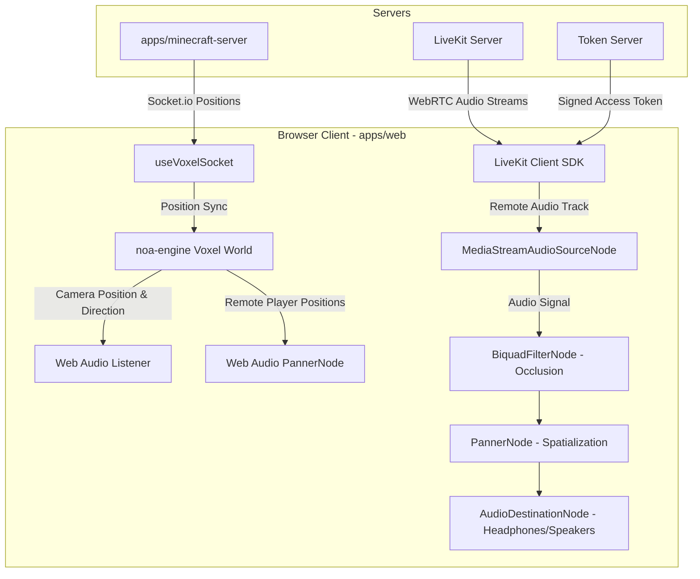

# Voxel Proximity Voice Chat: LiveKit & Web Audio Integration Prototype

This document provides a comprehensive technical blueprint and prototype code for integrating real-time proximity-based voice chat (spatial audio) into the multiplayer voxel survival game. 

The system integrates a self-hosted LiveKit SFU server (`livekit.play-ormenachem.com`) with the web client's Web Audio API and the `noa-engine` (Babylon.js) 3D coordinate system.

---

## 🏗️ Core Architecture & Topology

Proximity voice chat relies on three distinct layers working in harmony:

1. **Authentication & Room Management (Backend)**:
   - A Node.js token server endpoint verifies the player's session and generates a cryptographically signed LiveKit Access Token.
   - Game sessions map directly to LiveKit rooms (e.g., `game-session-${sessionId}`).
2. **Coordinate & State Sync (Authoritative Socket.io)**:
   - The voxel game server (`apps/minecraft-server`) broadcasts 3D player positions via Socket.io.
   - The client uses these coordinates to update both the visual entity positions in `noa-engine` and the 3D panner positions in the Web Audio graph.
3. **Spatial Audio Panning & Environment Occlusion (Web Client)**:
   - Remote player audio tracks are piped into separate Web Audio `PannerNode` instances.
   - A local `AudioListener` represents the local player's head, matching the Babylon.js camera's position and view vector.
   - Voxel-based acoustic occlusion dynamically muffles sounds when block walls stand between players.



---

## 📡 LiveKit Server Configuration & Room Topology

To minimize server-side CPU overhead and client-side bandwidth, we structure rooms dynamically and utilize LiveKit's client-side culling features:

* **Dynamic Track Culling**: The client dynamically unpublishes or mutes tracks of players who are too far away (e.g., > 32 blocks). This prevents unnecessary WebRTC data transfer and reduces browser decoding load.
* **Auto-Subscription Rules**: When a client joins a room, it subscribes to other participants' audio tracks. If a remote participant is determined to be outside a maximum auditory sphere, their track is unsubscribed or muted.
* **Adaptive Streams**: Although audio bandwidth is relatively low (~32kbps per user via Opus), we enforce maximum audio stream bitrates to prevent packet loss under poor network conditions.

---

## 🎛️ The Web Audio Spatialization Graph

To implement precise proximity fading, directional panning (stereo separation), and acoustic obstruction, each remote player's voice is routed through a custom Web Audio node graph.

```
[Remote Opus Audio Track] 
          │
          ▼
┌─────────────────────────────────┐
│  MediaStreamAudioSourceNode     │  <- Feeds remote participant stream
└─────────────────────────────────┘
          │
          ▼
┌─────────────────────────────────┐
│     BiquadFilterNode            │  <- Low-pass filter for block occlusion
└─────────────────────────────────┘  (Muffles voice behind solid stone/dirt)
          │
          ▼
┌─────────────────────────────────┐
│        PannerNode               │  <- HRTF 3D positional spatializer
└─────────────────────────────────┘  (Coordinates mapped to voxel space)
          │
          ▼
┌─────────────────────────────────┐
│     AudioDestinationNode        │  <- Output to physical speakers/headphones
└─────────────────────────────────┘
```

### Audio Configuration Parameters
* **Panning Model**: `HRTF` (Head-Related Transfer Function) provides high-fidelity, realistic 3D spatialization using head-acoustic profiling, far superior to basic `equalpower` panning.
* **Distance Model**: `linear` or `inverse`. The `linear` model is chosen here to allow a strict cutoff range ($32$ blocks) where the voice becomes fully inaudible, matching voxel limits.
* **Ref Distance**: $2$ blocks. Voices maintain maximum volume when players are closer than $2$ blocks.
* **Max Distance**: $32$ blocks. Voices fade to complete silence at $32$ blocks away.
* **Rolloff Factor**: $1.0$. Governs how quickly the audio attenuates over distance.

---

## 🧱 Voxel-Specific Acoustics & Occlusion

A common limitation of spatial audio in 3D games is that sounds pass through solid stone walls without attenuation. Because a voxel grid is computationally structured as a 3D matrix of discrete coordinates, we can implement **Acoustic Occlusion** with a cheap $O(D)$ ray walk.

Every $100\text{ms}$ (throttled in the render loop, see Section 3), the client samples a line between the local player and each remote player. Note this is **stepped sampling, not a true DDA** — it walks the segment at a fixed sub-block interval rather than visiting every voxel the ray crosses. It is a cheap heuristic: at coarse spacing a thin wall hit at a shallow diagonal can be missed, so we sample at <1 block spacing to make that rare. If you need exact line-of-sight, swap in a real voxel DDA (e.g. Amanatides–Woo).

```typescript
/**
 * Traces a line through the voxel grid to count solid blocks between two points.
 */
function countSolidBlocksBetween(
  noa: any,
  start: [number, number, number],
  end: [number, number, number]
): number {
  const dx = end[0] - start[0];
  const dy = end[1] - start[1];
  const dz = end[2] - start[2];
  const distance = Math.sqrt(dx * dx + dy * dy + dz * dz);
  if (distance === 0) return 0;

  // Sample at ~0.5-block spacing so thin diagonal walls are rarely skipped.
  const steps = Math.max(1, Math.ceil(distance * 2));
  let solidCount = 0;
  let lastKey = "";

  for (let i = 1; i < steps; i++) {
    const t = i / steps;
    const px = Math.floor(start[0] + dx * t);
    const py = Math.floor(start[1] + dy * t);
    const pz = Math.floor(start[2] + dz * t);

    // Sub-block sampling visits the same voxel repeatedly; only count it once.
    const key = `${px},${py},${pz}`;
    if (key === lastKey) continue;
    lastKey = key;

    // noa engine block lookup
    const blockId = noa.getBlock(px, py, pz);
    if (blockId !== 0) { // Assuming 0 is AIR
      const isSolid = noa.registry.getBlockSolidity(blockId);
      if (isSolid) {
        solidCount++;
      }
    }
  }
  return solidCount;
}
```

### Dynamic Low-Pass Filter Calculation
Human hearing perceives sound passing through solid barriers as "muffled" because dense materials absorb high frequencies while allowing low frequencies to pass. We map the `solidCount` value to a `BiquadFilterNode` configured as a low-pass filter:

$$\text{Frequency Cutoff} = \begin{cases}
20000\,\text{Hz} & \text{if } \text{solidCount} = 0 \quad (\text{Direct Line of Sight}) \\
2500\,\text{Hz} & \text{if } \text{solidCount} = 1 \quad (\text{Single wall, slight muffle}) \\
1000\,\text{Hz} & \text{if } \text{solidCount} = 2 \quad (\text{Double wall, heavy muffle}) \\
400\,\text{Hz} & \text{if } \text{solidCount} \ge 3 \quad (\text{Subterranean / deep occlusion})
\end{cases}$$

---

## 🛠️ Step-by-Step Prototype Code

### 0. Prerequisites (you must do these — they are not in the code below)
LiveKit is **new infrastructure** for this repo. Before any of the prototype works:

* **Provision the self-hosted LiveKit SFU** at `livekit.play-ormenachem.com` (Docker/Railway), with a TLS `wss://` endpoint and an API key/secret pair.
* **Add server env vars** to `apps/minecraft-server/.env`: `LIVEKIT_API_KEY`, `LIVEKIT_API_SECRET`. (`SUPABASE_URL` / `SUPABASE_SERVICE_ROLE_KEY` already exist there.)
* **Install dependencies** (neither is currently in any `package.json`):
  * `apps/minecraft-server`: `npm i livekit-server-sdk -w @playground/minecraft-server`
  * `apps/web`: `npm i livekit-client -w @playground/web`
* **Confirm the realtime-stack exception.** Project rules mandate Socket.io/Colyseus for realtime; adding a WebRTC SFU is a deliberate exception for voice only. Game state stays on Socket.io.

### 1. Token Generation Server
This runs inside the **voxel** backend (`apps/minecraft-server`) — the same app that already owns the Socket.io game loop, the `supabaseAdmin` client, and the recess gate. It reuses the exact same Supabase verification the socket handshake already performs, so we don't duplicate auth logic or introduce a second source of truth.

> **Room naming:** A game session is already a single, gender-segregated cohort — the socket handshake enforces `kid_profiles.gender` at join time. So the voice room maps **1:1 to the session** (`voxel-session-${sessionId}`). Do **not** re-derive the room name from gender on the token path: if a client's profile gender ever disagreed with the session it would silently split players into two rooms where they can't hear each other.

```typescript
// apps/minecraft-server/src/livekitService.ts
import { AccessToken } from "livekit-server-sdk";
import type { SupabaseClient } from "@supabase/supabase-js";

export interface GenerateTokenArgs {
  supabaseAdmin: SupabaseClient; // reuse the existing service-role client from index.ts
  accessToken: string;           // Supabase Bearer JWT (from the Authorization header)
  sessionId: string;             // Game Session ID (maps 1:1 to the voice room)
}

/**
 * Validates a user session and issues a LiveKit access token.
 * Mirrors the socket handshake auth in index.ts (getUser -> kid_profiles -> is_active).
 */
export async function generateLiveKitToken(args: GenerateTokenArgs): Promise<string> {
  const { supabaseAdmin, accessToken, sessionId } = args;

  // 1. Verify the Supabase session (same call as the socket handshake)
  const { data: authData, error: authErr } = await supabaseAdmin.auth.getUser(accessToken);
  if (authErr || !authData?.user?.id) {
    throw new Error("Unauthorized: Invalid user session token.");
  }
  const user = authData.user;

  // 2. Fetch profile details. NOTE: the column is `full_name`, not `username`.
  const { data: profile } = await supabaseAdmin
    .from("kid_profiles")
    .select("full_name, is_active")
    .eq("id", user.id)
    .maybeSingle();

  if (!profile || !profile.is_active) {
    throw new Error("Profile not found or inactive.");
  }

  // Session is already gender-segregated by the socket layer; key purely on sessionId.
  const roomName = `voxel-session-${sessionId}`;
  const identity = user.id;
  const participantName = profile.full_name as string;

  // 3. Construct and sign the LiveKit Access Token
  const at = new AccessToken(
    process.env.LIVEKIT_API_KEY!,
    process.env.LIVEKIT_API_SECRET!,
    {
      identity,
      name: participantName,
      ttl: "2h", // Token expiry duration
    }
  );

  // Grant necessary publish & subscribe permissions for voice streams
  at.addGrant({
    roomJoin: true,
    room: roomName,
    canPublish: true,
    canSubscribe: true,
    canPublishData: false, // Position updates are handled over authoritative sockets
  });

  // toJwt() is async in current livekit-server-sdk.
  return await at.toJwt();
}
```

This is exposed as an authenticated Express route on the **same** server (alongside the existing `/health` and `/ready` routes in `apps/minecraft-server/src/index.ts`). The client must send its Supabase access token in the `Authorization` header — there is no implicit session, since `apps/web` is a static Vite SPA with no server of its own:

```typescript
// apps/minecraft-server/src/index.ts (near the other app.get routes)
app.post("/rtc/token", async (req, res) => {
  try {
    const accessToken = req.headers.authorization?.replace(/^Bearer\s+/i, "");
    const sessionId = (req.body as { sessionId?: string })?.sessionId;
    if (!accessToken || !sessionId) {
      res.status(400).json({ error: "missing_params" });
      return;
    }
    if (!supabaseAdmin) {
      res.status(503).json({ error: "server_config" });
      return;
    }
    const token = await generateLiveKitToken({ supabaseAdmin, accessToken, sessionId });
    res.json({ token });
  } catch {
    res.status(401).json({ error: "unauthorized" });
  }
});
```

### 2. Client-Side Spatial Audio Bridge Hook
This React hook connects to the LiveKit server and manages the Web Audio API lifecycle. It integrates directly with `noa-engine`'s update cycle to translate game positions into real-time audio spatialization.

> **Mount-after-gesture (no contradiction with the Web Audio gesture rule):** This hook should be mounted by `MinecraftClient` **only after the player has joined and locked the pointer** — which is exactly when the existing voxel UI mounts the engine. By that point a user gesture has already occurred, so creating/resuming the `AudioContext` and enabling the mic on connect is allowed. Do **not** mount this hook on a lobby/menu screen.

> **Token fetch:** `apps/web` is a static Vite SPA with **no `/api` server**, so the token request must hit the voxel backend origin (`getVoxelServerUrl()`) and carry the Supabase access token in the `Authorization` header — the same token the Socket.io handshake uses.

```typescript
// apps/web/src/hooks/useLiveKitProximity.ts
import { useEffect, useRef, useState } from "react";
import { Room, RoomEvent, Participant, RemoteTrackPublication, RemoteTrack, Track } from "livekit-client";
import { supabase } from "@/lib/supabase";
import { getVoxelServerUrl } from "@/lib/voxelServerUrl";

interface UseLiveKitProximityArgs {
  sessionId: string;
  noa: any; // Instantiated noa-engine
  myUserId: string;
  remoteEntities: React.MutableRefObject<Map<string, number>>; // userId -> noa entityId
}

interface AudioRig {
  source: MediaStreamAudioSourceNode;
  filter: BiquadFilterNode;
  panner: PannerNode;
  stream: MediaStream;
}

export function useLiveKitProximity(args: UseLiveKitProximityArgs) {
  const { sessionId, noa, myUserId, remoteEntities } = args;
  const [activeRoom, setActiveRoom] = useState<Room | null>(null);
  const [micEnabled, setMicEnabled] = useState(false);

  const audioContextRef = useRef<AudioContext | null>(null);
  const audioRigsRef = useRef<Map<string, AudioRig>>(new Map()); // participantId -> Web Audio nodes

  // 1. Lazy-initialize AudioContext after user-interaction gesture
  const getAudioContext = (): AudioContext => {
    if (!audioContextRef.current) {
      audioContextRef.current = new (window.AudioContext || (window as any).webkitAudioContext)();
    }
    if (audioContextRef.current.state === "suspended") {
      audioContextRef.current.resume();
    }
    return audioContextRef.current;
  };

  useEffect(() => {
    let active = true;
    const room = new Room({
      adaptiveStream: true,
      dynacast: true,
    });

    const setupLiveKit = async () => {
      try {
        // Authenticate the token request with the Supabase access token,
        // exactly like the Socket.io handshake does.
        const { data: sessionData } = await supabase.auth.getSession();
        const accessToken = sessionData.session?.access_token;
        if (!accessToken) throw new Error("No Supabase session for LiveKit token.");

        // Fetch LiveKit connection token from the voxel backend (not a Vite /api route)
        const response = await fetch(`${getVoxelServerUrl()}/rtc/token`, {
          method: "POST",
          headers: {
            "Content-Type": "application/json",
            Authorization: `Bearer ${accessToken}`,
          },
          body: JSON.stringify({ sessionId }),
        });
        const { token } = await response.json();
        if (!active) return;

        // Establish WebRTC connection to self-hosted SFU
        await room.connect("wss://livekit.play-ormenachem.com", token);
        setActiveRoom(room);

        // Track and hook into incoming audio streams
        room.on(RoomEvent.TrackSubscribed, (track: RemoteTrack, pub: RemoteTrackPublication, participant: Participant) => {
          if (track.kind === Track.Kind.Audio) {
            setupSpatialAudioNode(participant.identity, track);
          }
        });

        room.on(RoomEvent.TrackUnsubscribed, (track: RemoteTrack, pub: RemoteTrackPublication, participant: Participant) => {
          removeSpatialAudioNode(participant.identity);
        });

        room.on(RoomEvent.ParticipantDisconnected, (participant: Participant) => {
          removeSpatialAudioNode(participant.identity);
        });

        // Publish local mic audio automatically (if permission previously granted)
        await room.localParticipant.setMicrophoneEnabled(true);
        setMicEnabled(true);
      } catch (err) {
        console.error("LiveKit proximity voice chat failed to initialize:", err);
      }
    };

    void setupLiveKit();

    return () => {
      active = false;
      room.disconnect();
      audioRigsRef.current.forEach((rig) => {
        rig.panner.disconnect();
        rig.filter.disconnect();
        rig.source.disconnect();
      });
      audioRigsRef.current.clear();
      if (audioContextRef.current) {
        audioContextRef.current.close();
      }
    };
    // Intentionally keyed only on sessionId: `noa`, `myUserId`, and
    // `remoteEntities` are read live via refs in the render loop (Section 3),
    // never captured here. Do not "fix" this deps array — re-running on every
    // noa re-render would tear down and rebuild the LiveKit room.
  }, [sessionId]);

  // 2. Setup Web Audio nodes for remote participant stream
  const setupSpatialAudioNode = (participantId: string, track: RemoteTrack) => {
    const ctx = getAudioContext();
    const mediaStream = new MediaStream([track.mediaStreamTrack]);

    // Create audio source node from remote WebRTC track
    const source = ctx.createMediaStreamSource(mediaStream);

    // Create acoustic occlusion low-pass filter
    const filter = ctx.createBiquadFilter();
    filter.type = "lowpass";
    filter.frequency.setValueAtTime(20000, ctx.currentTime); // default open space frequency

    // Create 3D spatial panner node
    const panner = new PannerNode(ctx, {
      panningModel: "HRTF",
      distanceModel: "linear",
      refDistance: 2,
      maxDistance: 32,
      rolloffFactor: 1.0,
    });

    // Pipe nodes: Source -> Lowpass -> 3D Panner -> Destination
    source.connect(filter).connect(panner).connect(ctx.destination);

    audioRigsRef.current.set(participantId, {
      source,
      filter,
      panner,
      stream: mediaStream,
    });
  };

  const removeSpatialAudioNode = (participantId: string) => {
    const rig = audioRigsRef.current.get(participantId);
    if (rig) {
      rig.panner.disconnect();
      rig.filter.disconnect();
      rig.source.disconnect();
      audioRigsRef.current.delete(participantId);
    }
  };

  // Toggle local mic mute state
  const toggleMute = async () => {
    if (activeRoom) {
      const state = !micEnabled;
      await activeRoom.localParticipant.setMicrophoneEnabled(state);
      setMicEnabled(state);
    }
  };

  return { activeRoom, micEnabled, toggleMute, audioRigsRef, getAudioContext };
}
```

### 3. Voxel Render Loop Integration
To update speaker and listener orientations dynamically in real-time, hook the `useLiveKitProximity` audio rigs map directly to the `noa-engine` tick loop.

```typescript
// apps/web/src/games/MinecraftClient.tsx (Inside engine initialization logic)

// 1. Set up the proximity hook
const { audioRigsRef, getAudioContext } = useLiveKitProximity({
  sessionId,
  noa,
  myUserId: myUserIdRef.current,
  remoteEntities: remoteEntitiesRef // Map tracking userIds -> noa entityIds
});

// Helpers that work on both the modern AudioParam API and the legacy
// setPosition/setOrientation API (older Safari only exposes the latter).
function setListenerPose(
  listener: AudioListener,
  pos: number[],
  dir: number[],
  t: number
): void {
  if ("positionX" in listener) {
    listener.positionX.setValueAtTime(pos[0], t);
    listener.positionY.setValueAtTime(pos[1], t);
    listener.positionZ.setValueAtTime(pos[2], t);
    listener.forwardX.setValueAtTime(dir[0], t);
    listener.forwardY.setValueAtTime(dir[1], t);
    listener.forwardZ.setValueAtTime(dir[2], t);
    listener.upX.setValueAtTime(0, t); // Voxel world is strictly Y-Up
    listener.upY.setValueAtTime(1, t);
    listener.upZ.setValueAtTime(0, t);
  } else {
    (listener as any).setPosition(pos[0], pos[1], pos[2]);
    (listener as any).setOrientation(dir[0], dir[1], dir[2], 0, 1, 0);
  }
}

function setPannerPosition(panner: PannerNode, x: number, y: number, z: number, t: number): void {
  if ("positionX" in panner) {
    panner.positionX.setValueAtTime(x, t);
    panner.positionY.setValueAtTime(y, t);
    panner.positionZ.setValueAtTime(z, t);
  } else {
    (panner as any).setPosition(x, y, z); // legacy Safari fallback
  }
}

// Throttle the (relatively expensive) occlusion raycasts. Panner/listener
// POSITIONS update every frame for smooth panning; only the wall-muffling
// recomputes on this slower cadence.
const OCCLUSION_INTERVAL_MS = 100;
let lastOcclusionAt = 0;

// 2. Insert orientation and coordinates updater into noa-engine tick loop
noa.on("beforeRender", () => {
  const ctx = getAudioContext();
  if (ctx.state === "suspended") return;

  const timeNow = ctx.currentTime;
  const listener = ctx.listener;
  const nowMs = performance.now();
  const doOcclusion = nowMs - lastOcclusionAt >= OCCLUSION_INTERVAL_MS;
  if (doOcclusion) lastOcclusionAt = nowMs;

  // Local player's REAL world position (the head). getTargetPosition() tracks the
  // player's head and is stable regardless of third-person zoom. Do NOT use
  // noa.camera.getPosition() — that is the orbiting camera, which floats behind
  // the avatar in third person and would misplace the listener.
  const headPos = noa.camera.getTargetPosition() as number[];
  const camDir = noa.camera.getDirection() as number[]; // look vector [x, y, z]

  // Occlusion raycasts run from the player entity position to remote entities.
  const pPos = noa.entities.getPosition(noa.playerEntity) as number[];

  setListenerPose(listener, headPos, camDir, timeNow);

  // 3. Update Panner and (throttled) Occlusion params for all active remote players
  audioRigsRef.current.forEach((rig, userId) => {
    const eid = remoteEntitiesRef.current.get(userId);
    if (eid === undefined) {
      // Player exists in LiveKit room but is not active/rendered in the voxel chunk
      setPannerPosition(rig.panner, 99999, 99999, 99999, timeNow); // Move out of range
      return;
    }

    const rPos = noa.entities.getPosition(eid) as number[];

    // Set 3D panner position to remote player's coordinate (every frame)
    setPannerPosition(rig.panner, rPos[0], rPos[1], rPos[2], timeNow);

    if (!doOcclusion) return;

    // 4. Calculate dynamic voxel acoustic occlusion (throttled)
    const solidBlocks = countSolidBlocksBetween(noa, pPos, rPos);
    let cutoffFreq = 20000; // Open space default

    if (solidBlocks === 1) {
      cutoffFreq = 2500; // Muffled by single wall
    } else if (solidBlocks === 2) {
      cutoffFreq = 1000; // Substantial barrier
    } else if (solidBlocks >= 3) {
      cutoffFreq = 400;  // Deep earth/cave walls
    }

    // Set low-pass filter transition smoothly over 80ms to prevent clicking sounds
    rig.filter.frequency.setTargetAtTime(cutoffFreq, timeNow, 0.08);
  });
});
```

---

## 📈 Best Practices & Production Optimizations

To transition this prototype into a production feature, implement the following mitigations:

### 1. Web Audio User-Gesture Protection
Modern browsers prevent webpage audio contexts from starting automatically without user interaction.
* **Mitigation**: `useLiveKitProximity` is mounted only after the player has joined and locked the pointer (the gesture has already happened by the time `MinecraftClient` mounts the engine), so creating/resuming the `AudioContext` and enabling the mic on connect is safe. The `AudioContext` is still created lazily via `getAudioContext()` and resumed on the first `beforeRender` tick — this is consistent with the auto-enable in the hook, **not** in conflict with it.

### 2. LiveKit Track Management & Culling
Subscribing to 3D audio streams for 20+ players in a voxel chunk creates unnecessary WebRTC decoding overhead.
* **Mitigation**: Update the distance matrix every $2$ seconds. If the distance between the local player and a remote player exceeds `maxDistance` ($32$ blocks), tell LiveKit to unsubscribe from the track:
  ```typescript
  const publication = remoteParticipant.getTrackPublication(Track.Source.Microphone);
  if (publication) {
    publication.setSubscribed(distance <= 32);
  }
  ```
  This frees up network packets completely, ensuring maximum game frame rate performance.

### 3. Noise and Echo Cancellation
Browser AEC handles each client's own loopback; keep it on as a baseline:
  ```typescript
  room.localParticipant.setMicrophoneEnabled(true, {
    echoCancellation: true,
    noiseSuppression: true,
    autoGainControl: true,
  });
  ```

### 4. Host "Mute All" (non-locking)
The host can silence the room for everyone — useful to calm chaos — **without locking it**, so players can immediately unmute themselves again. This is a *soft*, client-side gate, not a permission revocation:
* Broadcast a lightweight `MUTE_ALL` signal over the existing Socket.io channel (a host-only event). On receipt, each non-host client calls `setMicrophoneEnabled(false)` locally and shows a "muted by host" hint.
* Because we do **not** revoke the LiveKit `canPublish` grant, any player can re-enable their mic via the normal `toggleMute` control. The host is just nudging the room quiet, not enforcing it.
* Keep this purely additive: the host flag already exists in the room roster, so no new server authority is needed beyond relaying the event.

### 5. Teacher Intervention (observe, don't force-mute)
Teachers need to be able to **intervene**, but not to force-mute students:
* A teacher (role-gated) may join the voice room as a listener/speaker so they can hear and talk to a group — i.e. step in verbally.
* Teachers do **not** get a force-mute control; moderation is by presence and intervention, not by silencing. (If a future safety requirement changes this, it would be a separate, explicitly-approved change.)
* Continue to respect the existing gender-segregation and recess gating already enforced at the socket handshake — the voice room inherits those constraints because it is keyed to the same session.

### 6. Handling Browser Audio Output Choice
Provide players with an in-game sound-setting selector to route proximity voices through headphones instead of main system speakers if needed, via `audioContextRef.current.setSinkId(...)`.
