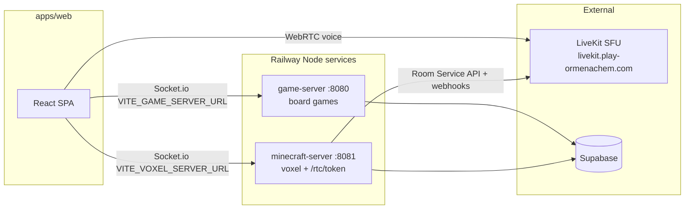
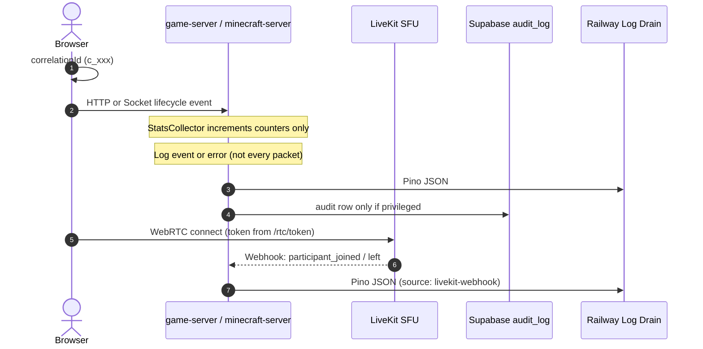

# Logging and Statistics Coverage — OMplayground

Technical specification for unified structured logging and live statistics across OMplayground. Covers client telemetry, both Node game servers, LiveKit voice, durable Supabase audit events, and an Admin stats view.

**Status:** design spec (not yet implemented). Last revised for dual-server + LiveKit topology.

---

## 1. Core Objectives and Architecture

### What we log (and what we do not)

| Category | Log? | Sink |
|----------|------|------|
| **Lifecycle events** — connect/disconnect, room create/destroy, join/leave, game start/stop/pause, token issued | ✅ Yes | Pino → Railway drain |
| **Errors** — handler failures, auth denials, validation errors, unhandled exceptions | ✅ Yes | Pino → Railway drain |
| **Aggregated stats** — connection counts, active rooms, intent throughput (counters only) | ✅ Yes | In-memory collector → `/api/admin/stats` |
| **Privileged product actions** — admin CRUD, moderation, imports, recess toggles | ✅ Yes | Supabase `audit_log` |
| **Client crashes** — React errors, unhandled rejections, LiveKit/Web Audio failures | ✅ Yes | Client buffer → server `/api/telemetry` → Pino |
| **Per-packet / per-tick socket traffic** — every `INPUT`, `SNAPSHOT`, `INTENT`, chat delta | ❌ No | Too high-volume; voxel alone emits ~15 Hz snapshots per room |
| **Raw socket payloads, chat bodies, game state blobs** | ❌ No | Security + noise |
| **Host CPU / memory** | ❌ No in-app | Use **Railway**, **Vercel**, **Supabase**, and **LiveKit** platform dashboards |

### Two-lane model (unchanged)

1. **Durable audit trail:** low-volume admin/teacher actions in Supabase `audit_log`.
2. **Operational observability:** structured Pino JSON on Railway stdout, forwarded by log drain. Client telemetry lands here via server ingest — never directly in Postgres.

### System topology

OMplayground is no longer a single game server. A session may touch several systems:



| Env var | Target |
|---------|--------|
| `VITE_GAME_SERVER_URL` | `apps/game-server` — tictactoe, chess, drawing, etc. |
| `VITE_VOXEL_SERVER_URL` | `apps/minecraft-server` — voxel survival + `POST /rtc/token` |
| `VITE_LIVEKIT_URL` | LiveKit SFU WebSocket URL (replace hardcoded client URL) |
| `LIVEKIT_API_KEY` / `LIVEKIT_API_SECRET` | `minecraft-server` token signing + Room Service API |

**Parallel room namespaces:**
- Socket.io: `voxel:${sessionId}` (minecraft), per-game rooms on game-server
- LiveKit: `voxel-session-${sessionId}` (voice only; positions stay on Socket.io)

### Core objectives

1. **End-to-end tracing:** `correlationId` from browser through HTTP, Socket.io, and (where useful) LiveKit `participant.identity` (= Supabase `user.id`).
2. **Structured JSON logs:** Pino in production for log-aggregator queries (Axiom, Datadog, Loki).
3. **Live stats (app-level):** connections, active rooms, intent/event rates — **not** host CPU/memory.
4. **Client crash telemetry:** buffered, batched, redacted.
5. **Secure audit trails:** privileged actions → `audit_log` with optional `correlation_id`.
6. **Admin stats tab:** platform-admin only (`admin_profiles`); federates both game servers + LiveKit voice summary.

### Data flow



---

## 2. Standardized Log Schema

Operational logs from servers and accepted client telemetry share one shape. Audit rows keep the existing relational `audit_log` shape; put extras in `metadata` or new optional columns.

```json
{
  "timestamp": "2026-06-10T13:20:00.000Z",
  "level": "info",
  "service": "minecraft-server",
  "environment": "production",
  "correlationId": "c-98765-abcde",
  "userId": "uuid-kid",
  "sessionId": "uuid-session",
  "protocol": "socket",
  "message": "Player joined room",
  "context": {
    "event": "JOIN_ROOM",
    "gameType": "voxel",
    "status": "success",
    "duration_ms": 12.4
  },
  "error": null
}
```

**`protocol` values:** `http` | `socket` | `webrtc` | `livekit-webhook` | `client`

**Fields to omit from routine logs:** raw payloads, chat text, board state, JWTs, LiveKit tokens.

---

## 3. Shared Observability Package

Avoid duplicating logger/middleware between servers. Create `packages/observability`:

```
packages/observability/
  src/
    logger.ts           # Pino factory (service name param)
    correlation.ts      # Express + Socket.io correlation ID middleware
    socketLifecycle.ts  # connect/disconnect + whitelisted event logging helpers
    statsCollector.ts   # in-memory counters (instantiate per service)
    adminAuth.ts        # admin_profiles gate for /api/admin/stats
    telemetryIngest.ts  # POST /api/telemetry + beacon handler
```

Both `apps/game-server` and `apps/minecraft-server` depend on `@playground/observability`. Replace `morgan` + scattered `console.*` with Pino.

### A. Logger (`packages/observability/src/logger.ts`)

```typescript
import pino from "pino";

export function createLogger(service: "game-server" | "minecraft-server") {
  const isProduction = process.env.NODE_ENV === "production";
  return pino({
    level: process.env.LOG_LEVEL || "info",
    base: { service, environment: process.env.NODE_ENV || "development" },
    timestamp: pino.stdTimeFunctions.isoTime,
    redact: {
      paths: [
        "req.headers.authorization",
        "req.headers.cookie",
        "body.password",
        "body.token",
        "context.token",
        "context.accessToken"
      ],
      censor: "[REDACTED]"
    },
    transport: !isProduction
      ? { target: "pino-pretty", options: { colorize: true, ignore: "pid,hostname" } }
      : undefined
  });
}
```

### B. Express — correlation ID + HTTP access (errors only in prod)

- Inject/propagate `x-correlation-id` on every HTTP request.
- Use `pino-http` for request completion logs.
- In production, default `pino-http` to **warn+** for successful health/ready probes; log all **4xx/5xx** at warn/error.

### C. Socket.io — lifecycle and whitelisted events only

**Do not** attach a per-packet `socket.use` logger. High-frequency events (`INPUT`, tick `SNAPSHOT` broadcasts, drawing deltas) must never emit log lines.

**Do log:**
- `connection` / `disconnect` (with `reason`, `socketId`, `userId` once auth completes)
- Whitelisted handler outcomes at **info** (success) or **warn/error** (failure):
  - **game-server:** `JOIN_ROOM`, `INTENT`, `STOP_GAME`, `REMATCH`, host disconnect sweep
  - **minecraft-server:** `JOIN_ROOM`, `LEAVE_ROOM`, `STOP_GAME`, `MUTE_ALL`, `BLOCK_PLACE`, `BLOCK_BREAK` (failures only for place/break if noisy)
- Handler duration via explicit `logSocketEvent()` call at the **end** of whitelisted handlers — not on every inbound packet.

**Security constraints (unchanged):**
- Never trust `socket.handshake.auth.userId`; derive `socket.data.userId` from verified Supabase JWT.
- Never log raw payloads. Log `event`, `sessionId`, `status`, `error.code`, `duration_ms` only.

```typescript
// packages/observability/src/socketLifecycle.ts
import type { Socket } from "socket.io";
import type { Logger } from "pino";
import type { StatsCollector } from "./statsCollector";

const GAME_SERVER_EVENTS = new Set([
  "JOIN_ROOM", "INTENT", "STOP_GAME", "REMATCH", "SPECTATE"
]);
const MINECRAFT_SERVER_EVENTS = new Set([
  "JOIN_ROOM", "LEAVE_ROOM", "STOP_GAME", "MUTE_ALL"
]);

export function logSocketEvent(
  logger: Logger,
  stats: StatsCollector,
  socket: Socket,
  event: string,
  outcome: { ok: boolean; code?: string; sessionId?: string; durationMs: number }
) {
  const whitelist =
    process.env.SERVICE_NAME === "minecraft-server"
      ? MINECRAFT_SERVER_EVENTS
      : GAME_SERVER_EVENTS;

  if (!whitelist.has(event)) return; // silently skip — stats counters may still increment

  const level = outcome.ok ? "info" : "warn";
  logger[level]({
    correlationId: socket.data.correlationId,
    userId: socket.data.userId,
    sessionId: outcome.sessionId,
    protocol: "socket",
    message: `Socket event ${event}`,
    context: {
      event,
      status: outcome.ok ? "success" : "failed",
      code: outcome.code,
      duration_ms: outcome.durationMs
    }
  });

  if (outcome.ok) stats.recordIntentProcessed(outcome.durationMs);
  else stats.recordIntentFailed();
}
```

**Stats counters** increment on whitelisted intents and connection lifecycle — not on every packet.

---

## 4. Live Statistics Collector

In-memory per-process accumulator. Counters reset on deploy/restart (acceptable for live ops view).

### What stats include

```typescript
export interface ServiceStats {
  service: "game-server" | "minecraft-server";
  activeConnections: number;
  activeRoomsCount: number;
  intentsPerSecond: number;       // whitelisted handler throughput, not raw packets
  averageIntentLatencyMs: number; // whitelisted handlers only
  intentFailuresLast5Min: number;
  rooms: RoomStat[];
}

export interface RoomStat {
  sessionId: string;
  gameType: string;
  playerCount: number;
  uptimeSeconds: number;
}
```

### What stats explicitly exclude

- `memoryUsageMb`, `cpuLoadPercent` — use Railway service metrics instead
- Per-room packet/message counts — misleading on voxel tick traffic
- LiveKit WebRTC quality metrics — use LiveKit dashboard / webhooks (§5)

Hook `statsCollector` from existing room lifecycle (`getOrCreateRoom`, `deleteRoom`, `assignPlayer`, `removePlayerFromRoom`) — do not instrument the tick loop.

### Admin stats API (per service)

Each server exposes:

```
GET /api/admin/stats
Authorization: Bearer <supabase access_token>
→ 401/403 if not admin_profiles
→ ServiceStats JSON
```

Admin UI fetches **both** endpoints and renders side-by-side (or merged) cards. Link out to Railway/LiveKit dashboards for infra metrics (see §6).

---

## 5. LiveKit Observability

Voice is a separate transport from Socket.io. Logging must cover token issuance, SFU lifecycle, and client connect failures — without logging audio data.

**References:**
- [Webhooks & events](https://docs.livekit.io/intro/basics/rooms-participants-tracks/webhooks-events/)
- [Room Service API](https://docs.livekit.io/reference/other/roomservice-api/)

### A. Token endpoint (`POST /rtc/token` on minecraft-server)

The endpoint is implemented in `livekitService.ts` and enforces robust security checks (gender partition matching, paused session roster restriction, completed session checks, and teacher bypasses).

Add structured logging:

| Outcome | Level | Fields |
|---------|-------|--------|
| Token issued | `info` | `sessionId`, `userId`, `livekitRoom`, `correlationId`, `protocol: http` |
| Auth/session denial | `warn` | `sessionId`, `reason` (gender_mismatch, paused_roster_block, session_completed, profile_inactive) — **no JWT** |
| Repeated denials (rate-limit hit) | `warn` + optional `audit_log` | security-sensitive |

Do **not** log the signed JWT. Return the server URL (from `LIVEKIT_URL` env variable) alongside the token: `{ token, serverUrl }`. The client hook `useLiveKitProximity` should consume this `serverUrl` instead of hardcoding `wss://livekit.play-ormenachem.com`.


### B. LiveKit webhooks (recommended)

Configure the self-hosted LiveKit server to POST webhooks to minecraft-server:

```
POST /webhooks/livekit
```

Verify webhook signature using the `WebhookReceiver` from `livekit-server-sdk` with `LIVEKIT_API_KEY` and `LIVEKIT_API_SECRET`. Map events to Pino logs + stats:

| Webhook event | Action |
|---------------|--------|
| `room_started` | `info` — `livekitRoom`, `protocol: livekit-webhook` |
| `room_finished` | `info` — room duration |
| `participant_joined` | `info` — `participantIdentity` (= `user.id`), `livekitRoom`; increment voice participant counter |
| `participant_left` | `info` — same fields; decrement counter |
| `track_published` / `track_unpublished` | `debug` in dev only — track kind (`audio`), no SDP/media |
| `egress_*` | `info` if egress used later |

Extract `sessionId` from room name: `voxel-session-${sessionId}`.


### C. Room Service API (on-demand, Admin UI)

For the Admin stats tab voice section, minecraft-server calls LiveKit Room Service API (server-side only):

- `ListRooms` — active voice rooms
- `ListParticipants` per room — headcount, identities

Expose aggregated result via `GET /api/admin/stats` → `voice: { activeRooms, totalParticipants }` or a dedicated `GET /api/admin/voice-stats`. Cache 10–15 s to avoid hammering LiveKit.

Do not expose LiveKit API keys to the browser.

### D. Client-side LiveKit / Web Audio errors

`useLiveKitProximity` should report via telemetry (not `console.error` only):

- Token fetch failure (`/rtc/token`)
- `room.connect` failure
- Mic permission denied
- `AudioContext` suspended/resume failures
- Output device routing changes/failures (`setSinkId` failures)

Include `protocol: "webrtc"`, `sessionId`, `livekitRoom` in context. Forward to **voxel server** telemetry ingest (`VITE_VOXEL_SERVER_URL`).


### E. Cross-protocol correlation

| System | Correlation key |
|--------|-----------------|
| Browser | `correlationId` header on HTTP + socket handshake |
| Socket.io | `socket.data.correlationId` |
| LiveKit | `participant.identity` = Supabase `user.id`; room name encodes `sessionId` |
| Audit | optional `correlation_id` column on `audit_log` rows |

---

## 6. Client-Side Telemetry (React / Vite)

Buffered in-memory, batched to the **correct** backend:

| App context | Telemetry target |
|-------------|------------------|
| Board games (`GameSessionContainer`) | `VITE_GAME_SERVER_URL/api/telemetry` |
| Voxel + voice (`MinecraftSessionContainer`) | `VITE_VOXEL_SERVER_URL/api/telemetry` |
| Global shell / auth | either server (prefer game-server); include `context.appArea` |

Server ingest (`packages/observability/src/telemetryIngest.ts`):
- Accept schema: `timestamp`, `level`, `correlationId`, `route`, `sessionId`, `message`, `context`, `stack`
- Require Supabase bearer when available; strict IP rate-limit for anonymous pre-auth crashes
- Redact tokens, chat bodies, game payloads
- Cap batch size (10) and payload size; truncate `stack` / `context`
- Re-emit through Pino with `source: "client"`, `protocol: "client"`

### ErrorBoundary

Wrap app shell in `apps/web/src/components/ErrorBoundary.tsx` (Hebrew fallback). Log via telemetry on `componentDidCatch`.

### LiveKit URL fix

Replace hardcoded `wss://livekit.play-ormenachem.com` in `useLiveKitProximity` with `serverUrl` returned from the `/rtc/token` endpoint (which maps to `process.env.LIVEKIT_URL` on the backend).


---

## 7. Admin Stats Dashboard

New `stats` section in `AdminPage.tsx` (platform-admin only).

### KPI cards (app metrics only)

| Card | Source |
|------|--------|
| Active socket connections | Sum of both servers' `activeConnections` |
| Active game rooms | Sum of `activeRoomsCount` |
| Intent rate (5s avg) | Per-server `intentsPerSecond` |
| Intent latency (avg) | Per-server `averageIntentLatencyMs` |
| Voice participants | minecraft-server LiveKit Room Service or webhook counters |
| Intent failures (5 min) | Per-server |

### Infra links (not polled into UI)

Show static links/buttons to platform dashboards — no in-app CPU/memory charts:

- Railway → game-server service metrics
- Railway → minecraft-server service metrics
- LiveKit project dashboard (participants, bandwidth, node health)
- Vercel → web deployment analytics
- Supabase → database health

Remove sparkline memory bar and CPU % from the original prototype.

### Active rooms table

Columns: `sessionId`, `gameType`, `server` (game / voxel), `players`, `uptime`, optional `voiceParticipants`.

---

## 8. Database Audit Trail

Extend existing `audit_log` — do not create a parallel table.

To link logs with database transactions, either:
1. **Add `correlation_id` to `metadata` JSONB (Recommended):** Stash correlation ID in the existing `metadata` column of `audit_log` to avoid database schema alterations.
2. **Alter Table Schema:**
   ```sql
   ALTER TABLE public.audit_log
     ADD COLUMN IF NOT EXISTS correlation_id text;

   CREATE INDEX IF NOT EXISTS audit_log_correlation_id
     ON public.audit_log (correlation_id)
     WHERE correlation_id IS NOT NULL;

   CREATE INDEX IF NOT EXISTS audit_log_action_created_at
     ON public.audit_log (action, created_at DESC);
   ```

Extend `append_audit_log(...)` with optional `p_correlation_id` (if selecting Option 2), or stash in `metadata` (Option 1) to avoid signature churn.

**Write paths:** SECURITY DEFINER RPCs, Edge Functions, server privileged actions. Browsers never insert directly.

**New audit candidates:**
- Repeated `/rtc/token` denials (abuse)
- Bulk kid import (already via Edge Function)
- Admin ops (existing)


---

## 9. Log Drainage & Platform Observability

### Application logs (Pino → Railway drain)

1. Both Node services emit JSON to stdout.
2. Railway log drain → Axiom / Datadog / BetterStack.
3. Query by `service`, `correlationId`, `level`, `event`, `protocol`.

### Platform dashboards (infra — not duplicated in app)

| Signal | Where |
|--------|-------|
| Node CPU, memory, restarts | Railway per-service metrics |
| HTTP 5xx, latency | Railway / Vercel |
| Postgres connections, slow queries | Supabase dashboard |
| WebRTC participants, bandwidth, SFU health | LiveKit dashboard |
| RLS violations | Supabase logs → alert |

### Alert conditions (log drain + platform)

| Condition | Threshold | Route |
|-----------|-----------|-------|
| Pino `error` | > 5 / minute per service | Dev Slack/Telegram |
| `intentFailuresLast5Min` spike | > 3× baseline | Dev alert |
| Socket disconnect burst | > 200% moving avg | Investigate network |
| Postgres RLS violation | any | Security alert |
| Client `error` telemetry | > 10 / 5 min | Dev alert |
| LiveKit `participant_left` mass exodus | room empties in < 30 s | Voice incident |
| Railway memory / CPU sustained high | platform alert | Ops (not app code) |

---

## 10. Implementation Phases

### Phase 1 — Shared package + Pino (both servers)
- [ ] Create `packages/observability`
- [ ] Replace `morgan` + `console.*` in `game-server` and `minecraft-server`
- [ ] Correlation ID middleware (HTTP + socket handshake)
- [ ] Socket connect/disconnect logging

### Phase 2 — Event-level socket logging + stats
- [ ] Whitelist-based `logSocketEvent()` in room handlers
- [ ] `StatsCollector` hooked to room lifecycle
- [ ] `GET /api/admin/stats` on both servers

### Phase 3 — Client telemetry + ErrorBoundary
- [ ] `apps/web/src/utils/telemetry.ts` with dual-server routing
- [ ] `/api/telemetry` + `/api/telemetry-beacon` on both servers
- [ ] ErrorBoundary on app shell
- [ ] LiveKit client errors via telemetry

### Phase 4 — LiveKit observability
- [ ] Structured `/rtc/token` logs
- [ ] `VITE_LIVEKIT_URL` + return URL from token endpoint
- [ ] Webhook receiver `/webhooks/livekit`
- [ ] Room Service API for Admin voice stats

### Phase 5 — Admin UI + audit migration
- [ ] `stats` tab in `AdminPage.tsx` (federated fetch)
- [ ] Platform dashboard links
- [ ] `audit_log.correlation_id` migration + `append_audit_log` extension
- [ ] Railway log drain configuration

---

## 11. Setup & Validation

### Dependencies (root + both servers + observability package)

```bash
npm install pino pino-http uuid livekit-server-sdk -w @playground/observability
npm install --save-dev pino-pretty @types/pino-http -w @playground/observability
```

Wire `@playground/observability` into both server `package.json` files.

### Smoke tests

**Correlation (game-server):**
```bash
curl -H "x-correlation-id: c_manual_test" http://localhost:8080/health
# Expect pino line with correlationId, no per-socket spam during gameplay
```

**Correlation (minecraft-server):**
```bash
curl -H "x-correlation-id: c_voxel_test" http://localhost:8081/health
```

**Stats (admin JWT):**
```bash
curl -H "Authorization: Bearer $ADMIN_JWT" http://localhost:8080/api/admin/stats
curl -H "Authorization: Bearer $ADMIN_JWT" http://localhost:8081/api/admin/stats
# Expect ServiceStats without memoryUsageMb / cpuLoadPercent
```

**Telemetry ingest:**
```bash
curl -X POST http://localhost:8080/api/telemetry \
  -H "Content-Type: application/json" \
  -H "x-correlation-id: c_client_test" \
  -d '{"logs":[{"timestamp":"2026-06-10T12:00:00Z","level":"error","correlationId":"c_client_test","message":"test","context":{}}]}'
```

**LiveKit webhook (after configured):**
```bash
# Send test webhook from LiveKit dashboard; verify participant_joined log line
```

### Validation checklist

- [ ] Playing voxel for 60 s produces **zero** log lines for `INPUT` / `SNAPSHOT`
- [ ] `JOIN_ROOM` success produces exactly **one** info log per join
- [ ] Failed `/rtc/token` produces warn log without JWT
- [ ] Admin stats shows both servers; no CPU/memory fields
- [ ] Client React error appears in Railway drain with `source: "client"`
- [ ] `audit_log` row for admin action includes `correlation_id` when passed
