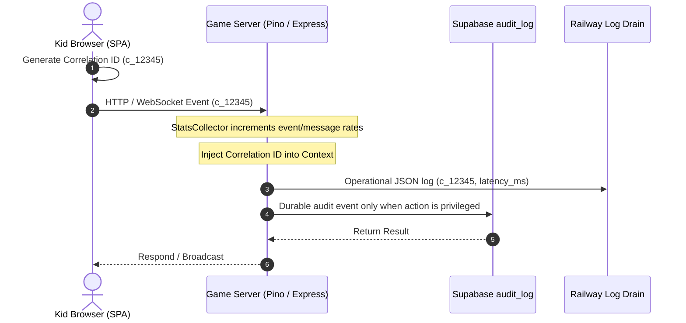

# Logging and Statistics Coverage Prototype — OMplayground

This document provides a technical specification and prototype implementation for a unified, structured logging and statistics tracking architecture across the OMplayground application. It addresses client-side telemetry, game-server socket and HTTP tracking, durable Supabase audit events, and live statistics (room usage, message traffic, system performance) integrated into the Admin view.

---

## 1. Core Objectives and Architecture

A robust logging and metrics system is critical for diagnosing multiplayer sync issues, tracking client-side React errors, auditing privileged actions, and monitoring live traffic load.

The architecture intentionally splits two different concerns:

1. **Durable audit trail:** low-volume admin/teacher actions remain in Supabase using the existing `audit_log` mechanism.
2. **Operational observability:** high-volume request, socket, crash, and performance logs are emitted by the game-server as structured Pino logs to Railway stdout and forwarded by a log drain.

### Core Objectives
1. **End-to-End Tracing:** Trace a single user action from the browser, through WebSockets or REST requests, to the game-server and Supabase database using a unique `correlationId`.
2. **Structured JSON Logs:** Employ structured JSON output in production to facilitate querying in log aggregators (e.g., Axiom, Datadog, or Grafana Loki).
3. **Live Telemetry & Statistics:** Track active connection counts, live rooms, message throughput (messages/sec), average event latencies, and server resource metrics.
4. **Client Crash Telemetry:** Intercept and buffer client-side React runtime errors and unhandled promise rejections, batch-forwarding them to a telemetry sink.
5. **Secure Audit Trails:** Ensure moderation commands, admin CRUD, imports, recess toggles, and privileged session operations are written to the existing append-only Supabase `audit_log`.
6. **Admin Dashboard**: Integrate a statistics tab within the Admin view to visualize current room usage and system traffic in real time. This view is platform-admin only (`admin_profiles`), not teacher-accessible.

### System Data Flow



---

## 2. Standardized Log Schema

To ensure consistency, operational logs emitted by the browser telemetry endpoint and game-server should match a standardized JSON schema. Supabase audit rows keep their existing `audit_log` relational shape and store extra structured detail in `metadata`.

```json
{
  "timestamp": "2026-05-31T13:20:00.000Z",
  "level": "info",
  "service": "game-server",
  "environment": "production",
  "correlationId": "req-98765-abcde",
  "userId": "usr-kid-456",
  "sessionId": "sess-room-101",
  "message": "Player joined room",
  "context": {
    "gender": "male",
    "roomType": "tictactoe",
    "connectionsInRoom": 2
  },
  "duration_ms": 12.4,
  "error": null
}
```

---

## 3. Node.js Game Server Logging & Telemetry (Pino & Express)

The game-server uses `pino` for low-overhead JSON logging, replacing generic `console` statements, and tracks socket events to aggregate statistics.

### A. Centralized Logger Module
Create a reusable logger class in `apps/game-server/src/utils/logger.ts`:

```typescript
import pino from 'pino';

const isProduction = process.env.NODE_ENV === 'production';

export const logger = pino({
  level: process.env.LOG_LEVEL || 'info',
  formatters: {
    level: (label) => {
      return { level: label };
    },
  },
  timestamp: pino.stdTimeFunctions.isoTime,
  redact: {
    paths: ['req.headers.authorization', 'req.headers.cookie', 'body.password', 'body.token'],
    censor: '[REDACTED]',
  },
  transport: !isProduction
    ? {
        target: 'pino-pretty',
        options: {
          colorize: true,
          ignore: 'pid,hostname',
          translateTime: 'SYS:standard',
        },
      }
    : undefined,
});
```

### B. Express Integration (Correlation ID and HTTP Logs)
Integrate standard request tracing in the main application setup inside `apps/game-server/src/index.ts`. This extracts or creates a `correlationId` for every incoming HTTP request:

```typescript
import express from 'express';
import { v4 as uuidv4 } from 'uuid';
import pinoHttp from 'pino-http';
import { logger } from './utils/logger';

const app = express();

// Middleware to inject/extract Correlation ID
app.use((req, res, next) => {
  const correlationId = req.header('x-correlation-id') || `req-${uuidv4()}`;
  req.headers['x-correlation-id'] = correlationId;
  res.setHeader('x-correlation-id', correlationId);
  next();
});

// Pino HTTP Middleware
app.use(
  pinoHttp({
    logger,
    genReqId: (req) => req.headers['x-correlation-id'] as string,
    customSuccessMessage: (req, res, responseTime) => {
      return `${req.method} ${req.url} completed in ${responseTime}ms`;
    },
    customErrorMessage: (req, res, err) => {
      return `${req.method} ${req.url} failed: ${err.message}`;
    },
    serializers: {
      req: (req) => ({
        method: req.method,
        url: req.url,
        query: req.query,
        id: req.id,
      }),
      res: (res) => ({
        statusCode: res.statusCode,
      }),
    },
  })
);
```

### C. Socket.io Event Logging Middleware
Track authorization, connection counts, event names, safe routing fields, and lifecycle execution times for WebSocket events.

Important constraints:
- Do not trust `socket.handshake.auth.userId`; the existing server must continue deriving `socket.data.userId` from the verified Supabase JWT.
- Do not log raw socket payloads. Log event names, payload byte size, `sessionId` when present, validation outcome, and selected safe fields only.
- Apply payload-size checks before logging derived payload facts where possible.

```typescript
import { Server, Socket } from 'socket.io';
import { logger } from './utils/logger';
import { statsCollector } from './statsCollector';

export function setupSocketLogging(io: Server) {
  io.use((socket: Socket, next) => {
    // Inject or inherit Correlation ID during Socket handshake.
    // User identity is set later by the existing Supabase auth middleware.
    const correlationId = socket.handshake.auth.correlationId || `ws-${uuidv4()}`;
    socket.data.correlationId = correlationId;
    next();
  });

  io.on('connection', (socket: Socket) => {
    const correlationId = socket.data.correlationId;
    const userId = socket.data.userId;

    statsCollector.recordConnection();

    logger.info({
      message: 'Socket connection established',
      correlationId,
      userId,
      socketId: socket.id,
      transport: socket.conn.transport.name,
    });

    // Custom packet middleware to profile user intents and messages without storing raw payloads.
    socket.use(([event, data], next) => {
      socket.data.startTime = performance.now();
      statsCollector.recordMessageReceived();
      const payloadSizeBytes = Buffer.byteLength(JSON.stringify(data ?? null));
      const sessionId =
        data && typeof data === 'object' && 'sessionId' in data
          ? String((data as { sessionId?: unknown }).sessionId ?? '')
          : undefined;
      
      logger.debug({
        message: `Received Socket event: ${event}`,
        correlationId,
        userId: socket.data.userId,
        event,
        sessionId,
        payloadSizeBytes,
      });
      next();
    });

    socket.on('disconnect', (reason) => {
      statsCollector.recordDisconnect();
      logger.info({
        message: 'Socket connection disconnected',
        correlationId,
        userId,
        socketId: socket.id,
        reason,
      });
    });
  });
}

// Utility to track inside custom game event listeners
export function logEventDuration(socket: Socket, event: string, isSuccess: boolean, extraContext = {}) {
  const startTime = socket.data.startTime || performance.now();
  const durationMs = performance.now() - startTime;

  statsCollector.recordLatency(durationMs);

  logger.info({
    message: `Socket event processing complete`,
    correlationId: socket.data.correlationId,
    userId: socket.data.userId,
    event,
    status: isSuccess ? 'success' : 'failed',
    duration_ms: parseFloat(durationMs.toFixed(3)),
    ...extraContext,
  });
}
```

---

## 4. Live Statistics Collector Module (Game Server Backend)

To monitor system load, live traffic, and room occupancy without scanning database records on every tick, we store active statistics in an in-memory accumulator.

### A. Stats Accumulator Implementation
Create `apps/game-server/src/utils/statsCollector.ts`:

```typescript
import os from 'os';

export interface RoomStat {
  roomId: string;
  gameType: string;
  playerCount: number;
  messageCount: number;
  uptimeSeconds: number;
}

export interface TelemetryStats {
  activeConnections: number;
  activeRoomsCount: number;
  totalMessagesReceived: number;
  messagesPerSecond: number;
  averageLatencyMs: number;
  memoryUsageMb: number;
  cpuLoadPercent: number;
  rooms: RoomStat[];
}

class StatsCollector {
  private activeConnections = 0;
  private totalMessagesReceived = 0;
  private recentMessagesReceived = 0;
  private messagesPerSecond = 0;
  
  private latencySum = 0;
  private latencyCount = 0;
  private averageLatencyMs = 0;
  
  // Track active rooms internally
  private activeRooms = new Map<string, {
    gameType: string;
    playerIds: Set<string>;
    messageCount: number;
    createdAt: number;
  }>();

  constructor() {
    // Periodically compute throughput (every 5 seconds)
    setInterval(() => {
      this.messagesPerSecond = parseFloat((this.recentMessagesReceived / 5).toFixed(2));
      this.recentMessagesReceived = 0;
      
      if (this.latencyCount > 0) {
        this.averageLatencyMs = parseFloat((this.latencySum / this.latencyCount).toFixed(2));
        this.latencySum = 0;
        this.latencyCount = 0;
      }
    }, 5000);
  }

  public recordConnection() {
    this.activeConnections++;
  }

  public recordDisconnect() {
    this.activeConnections = Math.max(0, this.activeConnections - 1);
  }

  public recordMessageReceived() {
    this.totalMessagesReceived++;
    this.recentMessagesReceived++;
  }

  public recordLatency(durationMs: number) {
    this.latencySum += durationMs;
    this.latencyCount++;
  }

  public roomCreated(roomId: string, gameType: string) {
    this.activeRooms.set(roomId, {
      gameType,
      playerIds: new Set(),
      messageCount: 0,
      createdAt: Date.now(),
    });
  }

  public roomDestroyed(roomId: string) {
    this.activeRooms.delete(roomId);
  }

  public playerJoinedRoom(roomId: string, playerId: string) {
    const room = this.activeRooms.get(roomId);
    if (room) {
      room.playerIds.add(playerId);
    }
  }

  public playerLeftRoom(roomId: string, playerId: string) {
    const room = this.activeRooms.get(roomId);
    if (room) {
      room.playerIds.delete(playerId);
    }
  }

  public recordRoomMessage(roomId: string) {
    const room = this.activeRooms.get(roomId);
    if (room) {
      room.messageCount++;
    }
    this.recordMessageReceived();
  }

  public getStats(): TelemetryStats {
    const roomsArray: RoomStat[] = [];
    this.activeRooms.forEach((data, roomId) => {
      roomsArray.push({
        roomId,
        gameType: data.gameType,
        playerCount: data.playerIds.size,
        messageCount: data.messageCount,
        uptimeSeconds: Math.floor((Date.now() - data.createdAt) / 1000),
      });
    });

    const totalMemory = os.totalmem();
    const freeMemory = os.freemem();
    const memoryUsageMb = parseFloat(((totalMemory - freeMemory) / 1024 / 1024).toFixed(2));

    return {
      activeConnections: this.activeConnections,
      activeRoomsCount: this.activeRooms.size,
      totalMessagesReceived: this.totalMessagesReceived,
      messagesPerSecond: this.messagesPerSecond,
      averageLatencyMs: this.averageLatencyMs,
      memoryUsageMb,
      cpuLoadPercent: parseFloat((os.loadavg()[0] * 100 / os.cpus().length).toFixed(1)),
      rooms: roomsArray,
    };
  }
}

export const statsCollector = new StatsCollector();
```

### B. Authenticated Stats Express Endpoint
Secure the live statistics endpoint to ensure only platform admins can query backend telemetry. Teachers can observe student activity through the existing teacher-facing product views, but operational server telemetry is restricted to `admin_profiles`.

```typescript
// apps/game-server/src/index.ts (Express Routing section)
import { createClient } from '@supabase/supabase-js';
import { statsCollector } from './utils/statsCollector';
import { logger } from './utils/logger';

const supabaseAdmin = createClient(
  process.env.SUPABASE_URL || '',
  process.env.SUPABASE_SERVICE_ROLE_KEY || ''
);

app.get('/api/admin/stats', async (req, res) => {
  const authHeader = req.headers.authorization;
  if (!authHeader || !authHeader.startsWith('Bearer ')) {
    return res.status(401).json({ error: 'Missing or malformed Authorization header' });
  }

  const token = authHeader.split(' ')[1];

  try {
    // 1. Authenticate JWT token via Supabase Auth
    const { data: { user }, error: authError } = await supabaseAdmin.auth.getUser(token);
    if (authError || !user) {
      return res.status(401).json({ error: 'Invalid authentication credentials' });
    }

    // 2. Query admin list to verify platform-admin access.
    const { data: adminProfile } = await supabaseAdmin
      .from('admin_profiles')
      .select('id')
      .eq('id', user.id)
      .maybeSingle();

    if (!adminProfile) {
      return res.status(403).json({ error: 'Access forbidden: Administrator permissions required' });
    }

    // 3. Serialize and emit the calculated stats payload
    res.json(statsCollector.getStats());
  } catch (error: any) {
    logger.error({ error: error.message }, 'Failed to fetch live statistics');
    res.status(500).json({ error: 'Internal system statistics gathering failed' });
  }
});
```

---

## 5. Client-Side SPA Logging & Stats (React / Vite)

To avoid synchronous network overhead on the client browser while still capturing issues, client logs are buffered in memory and batched to a telemetry route on the game-server. The game-server validates, redacts, rate-limits, and emits accepted telemetry to Pino/Railway. Client telemetry is not written directly to Supabase.

Required server-side controls for `/api/telemetry` and `/api/telemetry-beacon`:
- Accept only a small schema: timestamp, level, correlationId, route/session context, message, and sanitized stack/error fields.
- Require either a valid Supabase bearer token when available or apply strict anonymous rate limits for pre-auth crashes.
- Redact tokens, cookies, Authorization headers, passwords, Supabase keys, chat message bodies, and raw game payloads.
- Cap batch size and payload size; reject or truncate oversized `context` and `stack` fields.
- Emit accepted entries through the server logger with `source: "client"` so the Railway log drain handles persistence/search.

### A. Centralized Telemetry Class
Create `apps/web/src/utils/telemetry.ts` to manage local logs:

```typescript
import { v4 as uuidv4 } from 'uuid';

type LogLevel = 'debug' | 'info' | 'warn' | 'error';

interface LogPayload {
  timestamp: string;
  level: LogLevel;
  correlationId: string;
  userId: string | null;
  sessionId: string | null;
  message: string;
  context: Record<string, any>;
  stack?: string;
}

class TelemetryLogger {
  private logBuffer: LogPayload[] = [];
  private batchSize = 10;
  private flushIntervalMs = 5000;
  private flushTimer: number | null = null;
  private currentCorrelationId = `c-${uuidv4()}`;
  private userId: string | null = null;
  private sessionId: string | null = null;

  constructor() {
    this.setupWindowListeners();
    this.startInterval();
  }

  public setContext(userId: string | null, sessionId: string | null) {
    this.userId = userId;
    this.sessionId = sessionId;
  }

  public getCorrelationId(): string {
    return this.currentCorrelationId;
  }

  public rotateCorrelationId() {
    this.currentCorrelationId = `c-${uuidv4()}`;
  }

  public log(level: LogLevel, message: string, context: Record<string, any> = {}, error?: Error) {
    const logEntry: LogPayload = {
      timestamp: new Date().toISOString(),
      level,
      correlationId: this.currentCorrelationId,
      userId: this.userId,
      sessionId: this.sessionId,
      message,
      context,
      stack: error?.stack,
    };

    if (import.meta.env.DEV) {
      console[level](`[${level.toUpperCase()}] ${message}`, context, error || '');
    }

    this.logBuffer.push(logEntry);

    if (this.logBuffer.length >= this.batchSize || level === 'error') {
      this.flush();
    }
  }

  public info(message: string, context?: Record<string, any>) {
    this.log('info', message, context);
  }

  public warn(message: string, context?: Record<string, any>, error?: Error) {
    this.log('warn', message, context, error);
  }

  public error(message: string, context?: Record<string, any>, error?: Error) {
    this.log('error', message, context, error);
  }

  private startInterval() {
    if (typeof window !== 'undefined') {
      this.flushTimer = window.setInterval(() => this.flush(), this.flushIntervalMs);
    }
  }

  private setupWindowListeners() {
    if (typeof window === 'undefined') return;

    window.addEventListener('error', (event) => {
      this.error('Unhandled runtime exception', {
        filename: event.filename,
        lineno: event.lineno,
        colno: event.colno,
      }, event.error);
    });

    window.addEventListener('unhandledrejection', (event) => {
      this.error('Unhandled promise rejection', {
        reason: String(event.reason),
      }, event.reason instanceof Error ? event.reason : undefined);
    });

    window.addEventListener('beforeunload', () => {
      this.flushSync();
    });
  }

  private async flush() {
    if (this.logBuffer.length === 0) return;

    const logsToSend = [...this.logBuffer];
    this.logBuffer = [];

    try {
      await fetch(`${import.meta.env.VITE_GAME_SERVER_URL}/api/telemetry`, {
        method: 'POST',
        headers: {
          'Content-Type': 'application/json',
          'x-correlation-id': this.currentCorrelationId,
        },
        body: JSON.stringify({ logs: logsToSend }),
      });
    } catch (e) {
      this.logBuffer = [...logsToSend, ...this.logBuffer].slice(0, 100);
    }
  }

  private flushSync() {
    if (this.logBuffer.length === 0) return;
    const body = JSON.stringify({ logs: this.logBuffer });
    this.logBuffer = [];

    if (navigator.sendBeacon) {
      navigator.sendBeacon(`${import.meta.env.VITE_GAME_SERVER_URL}/api/telemetry-beacon`, body);
    }
  }
}

export const telemetry = new TelemetryLogger();
```

### B. React Error Boundary Component
Create a modern React component to render a fallback layout and log rendering failures using `telemetry`:

```tsx
// apps/web/src/components/ErrorBoundary.tsx
import React, { Component, ErrorInfo, ReactNode } from 'react';
import { telemetry } from '../utils/telemetry';

interface Props {
  children: ReactNode;
  fallback?: ReactNode;
}

interface State {
  hasError: boolean;
}

export class ErrorBoundary extends Component<Props, State> {
  public state: State = {
    hasError: false
  };

  public static getDerivedStateFromError(_: Error): State {
    return { hasError: true };
  }

  public componentDidCatch(error: Error, errorInfo: ErrorInfo) {
    telemetry.error('React component tree crash caught by boundary', {
      componentStack: errorInfo.componentStack,
    }, error);
  }

  public render() {
    if (this.state.hasError) {
      return this.props.fallback || (
        <div className="flex flex-col items-center justify-center p-8 bg-rose-50 text-rose-900 border border-rose-200 rounded-lg m-4">
          <h2 className="text-lg font-bold mb-2">אירעה שגיאה בטעינת הרכיב</h2>
          <p className="text-sm">אנא נסה לרענן את העמוד או לפנות למדריך.</p>
          <button 
            onClick={() => window.location.reload()} 
            className="mt-4 px-4 py-2 bg-rose-600 text-white rounded hover:bg-rose-700 text-sm font-medium transition"
          >
            רענן עמוד
          </button>
        </div>
      );
    }

    return this.props.children;
  }
}
```

---

## 6. Admin Stats Dashboard UI Component (Frontend React Tab)

This component will be embedded within `AdminPage.tsx` under the new `stats` navigation section, displaying system load, live connections, and active rooms list.

### A. Integrated React Stats Tab Section
Integrating this UI code adds an interactive dashboard:

```tsx
// Place within the activeSection switcher in apps/web/src/pages/AdminPage.tsx

import React, { useState, useEffect } from 'react';
import { supabase } from '@/lib/supabase';

interface TelemetryStats {
  activeConnections: number;
  activeRoomsCount: number;
  totalMessagesReceived: number;
  messagesPerSecond: number;
  averageLatencyMs: number;
  memoryUsageMb: number;
  cpuLoadPercent: number;
  rooms: {
    roomId: string;
    gameType: string;
    playerCount: number;
    messageCount: number;
    uptimeSeconds: number;
  }[];
}

export function AdminStatsTab() {
  const [stats, setStats] = useState<TelemetryStats | null>(null);
  const [loading, setLoading] = useState(true);
  const [error, setError] = useState<string | null>(null);
  const [autoRefresh, setAutoRefresh] = useState(true);
  const [recentThroughput, setRecentThroughput] = useState<number[]>(Array(10).fill(0));

  const loadStats = async () => {
    try {
      const { data: { session } } = await supabase.auth.getSession();
      if (!session) throw new Error('No user session present');

      const res = await fetch(`${import.meta.env.VITE_GAME_SERVER_URL}/api/admin/stats`, {
        headers: {
          'Authorization': `Bearer ${session.access_token}`,
        }
      });

      if (!res.ok) {
        throw new Error(`Failed to load server statistics: Status ${res.status}`);
      }

      const data: TelemetryStats = await res.json();
      setStats(data);
      setError(null);
      
      // Update sparkline metrics
      setRecentThroughput(prev => [...prev.slice(1), data.messagesPerSecond]);
    } catch (err: any) {
      setError(err.message || 'Unknown network telemetry error occurred');
    } finally {
      setLoading(false);
    }
  };

  useEffect(() => {
    loadStats();
    if (!autoRefresh) return;
    const interval = setInterval(loadStats, 5000);
    return () => clearInterval(interval);
  }, [autoRefresh]);

  if (loading && !stats) {
    return <div className="p-6 text-sm font-medium text-slate-500">טוען נתוני שרת וסטטיסטיקה...</div>;
  }

  if (error) {
    return (
      <div className="rounded-2xl border border-rose-200 bg-rose-50 p-4 text-sm text-rose-800">
        שגיאה בחיבור לשרת הסטטיסטיקה: {error}
      </div>
    );
  }

  return (
    <div className="space-y-6 text-right" dir="rtl">
      <div className="flex items-center justify-between border-b border-slate-200 pb-3">
        <h2 className="text-xl font-bold text-slate-800">סטטיסטיקה ויומני פעילות בזמן אמת</h2>
        <div className="flex items-center gap-4">
          <label className="flex items-center gap-2 text-sm text-slate-600">
            <input 
              type="checkbox" 
              checked={autoRefresh} 
              onChange={(e) => setAutoRefresh(e.target.checked)} 
              className="rounded text-indigo-600 focus:ring-indigo-500" 
            />
            רענון אוטומטי (5 שניות)
          </label>
          <button 
            onClick={loadStats} 
            className="rounded-lg bg-indigo-50 px-3 py-1.5 text-xs font-semibold text-indigo-700 hover:bg-indigo-100 transition"
          >
            רענן כעת
          </button>
        </div>
      </div>

      {/* KPI Cards */}
      {stats && (
        <div className="grid grid-cols-2 gap-4 md:grid-cols-5">
          <div className="rounded-2xl border border-slate-100 bg-white p-4 shadow-sm">
            <span className="text-xs font-medium text-slate-400">חיבורים פעילים</span>
            <div className="text-2xl font-bold text-slate-800 mt-1">{stats.activeConnections}</div>
          </div>
          <div className="rounded-2xl border border-slate-100 bg-white p-4 shadow-sm">
            <span className="text-xs font-medium text-slate-400">חדרים פעילים</span>
            <div className="text-2xl font-bold text-slate-800 mt-1">{stats.activeRoomsCount}</div>
          </div>
          <div className="rounded-2xl border border-slate-100 bg-white p-4 shadow-sm">
            <span className="text-xs font-medium text-slate-400">הודעות לשניה</span>
            <div className="text-2xl font-bold text-indigo-600 mt-1">{stats.messagesPerSecond} req/s</div>
          </div>
          <div className="rounded-2xl border border-slate-100 bg-white p-4 shadow-sm">
            <span className="text-xs font-medium text-slate-400">זמן תגובה ממוצע</span>
            <div className="text-2xl font-bold text-emerald-600 mt-1">{stats.averageLatencyMs} ms</div>
          </div>
          <div className="rounded-2xl border border-slate-100 bg-white p-4 shadow-sm">
            <span className="text-xs font-medium text-slate-400">עומס מעבד ומכונה</span>
            <div className="text-2xl font-bold text-slate-800 mt-1">{stats.cpuLoadPercent}%</div>
          </div>
        </div>
      )}

      {/* Sparkline / Resource Visualization */}
      <div className="grid gap-6 md:grid-cols-3">
        <div className="md:col-span-2 rounded-2xl border border-slate-200 bg-white p-5 shadow-sm">
          <h3 className="text-sm font-semibold text-slate-700 mb-4">קצב תעבורה שוטף (הודעות לשנייה)</h3>
          
          {/* Custom SVG sparkline line chart */}
          <div className="h-32 w-full flex items-end">
            <svg viewBox="0 0 100 30" className="h-full w-full overflow-visible" preserveAspectRatio="none">
              <path
                d={`M ${recentThroughput.map((val, idx) => `${idx * 11},${30 - Math.min(30, (val * 1.5))}`).join(' L ')}`}
                fill="none"
                stroke="#6366f1"
                strokeWidth="1.5"
                strokeLinecap="round"
                strokeLinejoin="round"
              />
              <path
                d={`M 0,30 L ${recentThroughput.map((val, idx) => `${idx * 11},${30 - Math.min(30, (val * 1.5))}`).join(' L ')} L 99,30 Z`}
                fill="url(#sparkline-grad)"
                opacity="0.1"
              />
              <defs>
                <linearGradient id="sparkline-grad" x1="0" y1="0" x2="0" y2="1">
                  <stop offset="0%" stopColor="#6366f1" />
                  <stop offset="100%" stopColor="#6366f1" stopOpacity="0" />
                </linearGradient>
              </defs>
            </svg>
          </div>
          <div className="flex justify-between text-[10px] text-slate-400 mt-2">
            <span>לפני 45 שניות</span>
            <span>בזמן אמת</span>
          </div>
        </div>

        <div className="rounded-2xl border border-slate-200 bg-white p-5 shadow-sm flex flex-col justify-between">
          <div>
            <h3 className="text-sm font-semibold text-slate-700 mb-4">שימוש בזיכרון המערכת</h3>
            {stats && (
              <div className="space-y-3">
                <div className="flex justify-between text-xs font-semibold text-slate-600">
                  <span>בשימוש: {stats.memoryUsageMb} MB</span>
                </div>
                <div className="h-3 w-full bg-slate-100 rounded-full overflow-hidden">
                  <div 
                    className="h-full bg-indigo-500 rounded-full transition-all duration-500" 
                    style={{ width: `${Math.min(100, (stats.memoryUsageMb / 1024) * 10)}%` }}
                  />
                </div>
                <span className="text-[10px] text-slate-400 block">מדד זה משקף את הזיכרון הכולל המוקצה לתהליך NodeJS על השרת.</span>
              </div>
            )}
          </div>
        </div>
      </div>

      {/* Active Rooms Grid */}
      <div className="rounded-2xl border border-slate-200 bg-white shadow-sm overflow-hidden">
        <div className="bg-slate-50 px-5 py-4 border-b border-slate-200">
          <h3 className="text-sm font-semibold text-slate-700">חדרי משחק ורשת פעילים בשרת</h3>
        </div>
        <div className="overflow-x-auto">
          <table className="w-full text-right text-sm">
            <thead className="bg-slate-100/50 text-slate-500 text-xs">
              <tr>
                <th className="p-3">מזהה חדר / Session ID</th>
                <th className="p-3">סוג משחק</th>
                <th className="p-3">שחקנים מחוברים</th>
                <th className="p-3">סה"כ פאקטים</th>
                <th className="p-3">משך פעילות (Uptime)</th>
              </tr>
            </thead>
            <tbody className="divide-y divide-slate-100">
              {stats?.rooms.map((room) => (
                <tr key={room.roomId} className="hover:bg-slate-50/50">
                  <td className="p-3 font-mono text-xs">{room.roomId}</td>
                  <td className="p-3 font-semibold text-slate-700">{room.gameType}</td>
                  <td className="p-3">
                    <span className="inline-flex items-center gap-1.5 px-2.5 py-0.5 rounded-full text-xs font-semibold bg-emerald-50 text-emerald-800">
                      <span className="size-1.5 rounded-full bg-emerald-500" />
                      {room.playerCount} שחקנים
                    </span>
                  </td>
                  <td className="p-3">{room.messageCount} הודעות</td>
                  <td className="p-3">{Math.floor(room.uptimeSeconds / 60)} דקות, {room.uptimeSeconds % 60} שניות</td>
                </tr>
              ))}
              {(!stats || stats.rooms.length === 0) && (
                <tr>
                  <td colSpan={5} className="p-8 text-center text-sm text-slate-400">אין חדרים פעילים ברשת ברגע זה.</td>
                </tr>
              )}
            </tbody>
          </table>
        </div>
      </div>
    </div>
  );
}
```

---

## 7. Database Audit Trail & Security

Critical operations performed by administrators or teachers must be persisted securely and permanently in Supabase. OMplayground already has `public.audit_log` plus `public.append_audit_log(...)`; this prototype extends that mechanism instead of creating a parallel table. Operational logs, socket packet traces, and client crash telemetry stay out of Supabase and flow through Pino/Railway.

### Migration Shape: Extend Existing `audit_log`

```sql
-- Existing table from 20260422000000_teacher_admin_audit.sql:
-- public.audit_log(id, actor_id, actor_kind, action, entity_type, entity_id, metadata, created_at)

ALTER TABLE public.audit_log
  ADD COLUMN IF NOT EXISTS correlation_id text,
  ADD COLUMN IF NOT EXISTS request_id text;

CREATE INDEX IF NOT EXISTS audit_log_correlation_id
  ON public.audit_log (correlation_id)
  WHERE correlation_id IS NOT NULL;

CREATE INDEX IF NOT EXISTS audit_log_action_created_at
  ON public.audit_log (action, created_at DESC);

-- Keep RLS admin-only for reads. Do not add a permissive FOR ALL policy.
-- Keep inserts behind SECURITY DEFINER RPCs or service-role backend code paths.
```

### Audit Write Pattern

Audit rows should be produced only by trusted server/database paths:

1. Existing database functions call `public.append_audit_log(...)`.
2. Edge Functions and game-server privileged actions can insert with the service role after validating the actor.
3. Browser clients do not insert audit rows directly.

When adding correlation support, prefer extending `append_audit_log` with optional `p_correlation_id` / `p_request_id` parameters, or include them in `metadata` if avoiding function signature churn. Keep the table name singular (`audit_log`) because the Admin view already reads it.

---

## 8. Log Drainage & Observability Setup

Once structured JSON logs are outputted by Pino, they can be securely directed to external observability backends.

### A. Production Drainage Pipeline
1. **Pino Output:** The game-server writes JSON directly to `stdout`.
2. **Railway Log Drain:** Configure Railway's Log Drain integration to read from standard out and direct to:
   - **Axiom / Datadog / BetterStack:** Via syslog or custom HTTP collectors.
3. **Supabase Audit Trail:** Keep only durable product/security audit rows in `public.audit_log`; do not store routine request/socket/client telemetry in Supabase tables.
4. **Supabase Platform Logs:** Use the Supabase dashboard or project log export for database platform diagnostics when needed, separate from the app audit log.

### B. Standard Metrics & Monitors
Set up proactive alert conditions in the monitoring dashboard to catch critical faults:

| Alarm Condition | Threshold | Action / Alert Route |
| :--- | :--- | :--- |
| **Pino Level is 'error'** | > 5 occurrences / 1 minute | Slack / Telegram alert to development channel |
| **Socket Connection Disconnects** | Spikes > 200% over the moving average | PagerDuty alerting (possible game server network disruption) |
| **Postgres RLS Violations** | Any occurrence | Security alert (possible compromise attempt) |
| **React Component Crashes** | > 10 captured logs in a 5-minute interval | Sentry or direct logging alarm |

---

## 9. Setup & Validation Steps

To roll out and verify the logging and stats prototype, complete these key verification stages:

### Step 1: Install Dependencies
Run the following within the game server package to install logging utilities:
```bash
npm install pino pino-http
npm install --save-dev @types/pino-http pino-pretty
```

### Step 2: Implement Test Endpoints
Add a test endpoint on the game-server to verify correlation flow:
```typescript
app.get('/api/log-test', (req, res) => {
  const cid = req.headers['x-correlation-id'];
  req.log.info({ testContext: true }, 'Manual log test endpoint hit');
  res.json({ success: true, correlationId: cid });
});
```

### Step 3: Run Validation Command
Send a request using curl containing a custom header and observe the structured terminal output:
```bash
curl -H "x-correlation-id: c_manual_test_123" http://localhost:8080/api/log-test
```
*Expected Log output:*
```json
{"level":"info","time":"2026-05-31T13:22:00.000Z","reqId":"c_manual_test_123","testContext":true,"msg":"Manual log test endpoint hit"}
```
