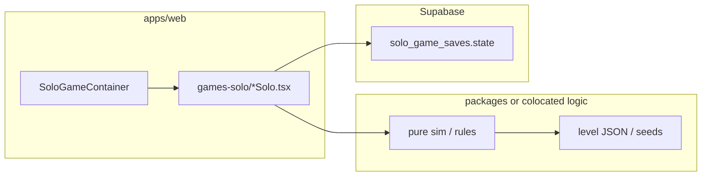

# Solo Games Prototype Catalog

**The Playground — creative prototypes for `/solo/:gameKey`**

> Generated: 2026-06-11 (rev. 3 — content-safe + OSS embed audit)  
> Scope: concept + prototype design only (not implementation estimates).  
> Stack assumption: React 18 + TypeScript, Tailwind/shadcn UI, `SoloGameContainer` + `solo_game_saves`.

---

## Content guidelines (non-negotiable)

All prototypes in this catalog must be:

| Rule | Meaning |
|---|---|
| **No violence** | No combat, weapons, harm to characters, defeat/kill/win-by-destroying framing, militaristic themes, or scary chase mechanics |
| **No ghosts** | No spirits, haunted settings, supernatural entities, or “ghost”/“phantom”/“spectral undead” language — including replay clones shown as apparitions |
| **Kid-safe tone** | Curiosity, craft, music, nature, science, story, and puzzle-solving — conflict is logical or environmental, never physical harm |
| **Optional:** | Gentle stakes (timers, scores, wilting plants) are fine; failure is “try again,” never punishment |

Replay mechanics use neutral terms: **recording**, **replay**, **loop**, **branch timeline**, **preview trail**.

---

## Context: what we already ship

| Existing solo key | Genre |
|---|---|
| `drawing` | Freeform canvas |
| `snake`, `simon`, `whackamole`, `balloonpop` | Arcade reflex |
| `breakout` / `breakout-solo` | Brick breaker (iframe legacy) |
| `chess-solo` | Chess vs Stockfish WASM |
| `hexgl` | WebGL racing (iframe legacy) |
| `alges-escapade` | Math platformer (iframe legacy) |

The prototypes below are **net-new directions** — ambitious enough for multi-week builds, but each has a **playable vertical slice** achievable in a first prototype sprint.

### Shared integration pattern

Every solo game follows the same shell:

```tsx
export function SomeGameSolo({ save }: { save: SoloGameSaveControls }) {
  // load save.savedState on mount
  // save.saveState(json, { saveKind: "checkpoint" | "snapshot" })
  // save.mergeBestScores({ level: 12, timeMs: 84000 }, ["timeMs"])
}
```

**Rule:** game logic lives in pure TS modules (`packages/` or `apps/web/src/games-solo/<game>/logic/`). React components are render + input only.

---

## Prototype index

| # | Working title | `game_url` | Core fantasy | Primary render |
|---|---|---|---|---|
| 1 | Replay Garden | `replay-garden` | Record past runs to solve cooperative-style puzzles alone | Canvas 2D |
| 2 | Constellation Forge | `constellation-forge` | Build orbital factories from starlight | Canvas/WebGL |
| 3 | Inkbound Atelier | `inkbound-atelier` | Trace glyphs to restore illuminated manuscripts | Canvas 2D |
| 4 | Fracture Lab | `fracture-lab` | Cut, shatter, and weld Matter.js contraptions | Canvas + Matter.js |
| 5 | Signal Detective | `signal-detective` | Visual-programming science mystery decoder | DOM + SVG |
| 6 | Terrarium Architect | `terrarium` | Ecosystem sandbox with emergent food webs | Canvas 2D (tile CA) |
| 7 | Rhythm Cartographer | `rhythm-cartographer` | Compose melodies → playable rhythm maps | Web Audio + Canvas |
| 8 | Prism Circuit | `prism-circuit` | Route light beams through a chip floorplan | Canvas 2D |
| 9 | Mythic Loom | `mythic-loom` | Weave procedurally generated fables | DOM + CSS |
| 10 | Astromancer | `astromancer` | Slingshot through gravity wells | Canvas 2D |
| 11 | Cipher Garden | `cipher-garden` | Cryptography puzzles grow a living garden | DOM + Canvas |
| 12 | Temporal Atelier | `temporal-atelier` | Rewind time to craft impossible machines | Canvas 2D + state stack |

---

## 1. Replay Garden

**Elevator pitch:** A puzzle platformer where your *past runs* become helpful replays. Record up to 3 **tape loops**, then press Play — all loops replay simultaneously while you control a live character. Switches, pressure plates, and doors require **timing choreography**, not reflex combat.

### Core loop

1. Enter chamber → scout layout (pure puzzle — no opponents).
2. **Record loop slot** (5–30 s cap): movement + interact only.
3. Repeat for other slots; loops are deterministic replays.
4. Control live character; solve gate that needs 2+ bodies at once.
5. Star rating: par time, loop count, optional “no rewind.”

### Why it’s sophisticated

- Deterministic replay buffer (fixed timestep input log, not video).
- Collision layering: replay avatars interact with world tiles but pass through each other.
- Level editor DSL: `tile`, `door(id)`, `plate(id)`, `spawn(slot)`.
- “Ordering rooms” later: loops can trigger doors that change paths — careful sequencing puzzles.

### Prototype slice (week 1–2 playable)

- 5 hand-authored chambers in a JSON level format.
- 2 loop slots + live player.
- Save: `{ worldId, chamberIndex, stars, loopTapes: Record<slot, InputFrame[]> }`.

### Tech

| Layer | Choice |
|---|---|
| Sim | Fixed 60 Hz; input ring buffer per loop |
| Render | Canvas 2D tilemap + sprite sheets (solid-color replay silhouettes, not translucent apparitions) |
| Audio | Howler.js — subtle tick when loops desync |
| OSS | [melonJS](https://github.com/melonjs/melonJS) tile helpers, or roll minimal AABB platformer |

### Save schema sketch

```json
{
  "campaign": "tutorial",
  "chamberId": "03-bridge",
  "stars": { "time": 2, "loops": 3 },
  "tapes": { "A": ["..."], "B": ["..."] },
  "stateVersion": 1
}
```

---

## 2. Constellation Forge

**Elevator pitch:** Factorio-meets-Stellaris in a **single-screen star map** — entirely peaceful industry. Harvest spectral energy from procedurally placed stars, route it along orbital lanes, craft modules (refineries, lenses, relays), and fulfill “constellation contracts” — e.g. deliver 500 µW to the binary pair before the nova timer.

### Core loop

- Pan/zoom node graph (stars = nodes, lanes = edges with capacity).
- Place extractors, buffers, assemblers; recipes are **color-mixing** (RGB star types).
- Events: solar flare (lane shutdown), comet (one-time resource burst).
- Contracts unlock tech tree; economy and logistics only.

### Why it’s sophisticated

- Graph simulation with discrete ticks + continuous visual flow particles.
- Procedural galaxy seed → reproducible contracts.
- Bottleneck analysis UI (throughput heatmap on edges).
- Late game: Dyson segment placement as spatial mini-puzzle on star surface.

### Prototype slice

- One 40-star seeded map.
- 6 building types, 10 recipes, 3 contracts.
- Save entire factory graph + inventory.

### Tech

| Layer | Choice |
|---|---|
| Sim | Pure TS tick (`packages/constellation-forge-sim`) |
| Render | PixiJS or raw WebGL instanced quads for particles |
| Layout | d3-force or custom orbital mechanics for lane routing |
| OSS | Inspired by [shapez.io](https://github.com/tobspr/shapez.io) data-driven recipes |

---

## 3. Inkbound Atelier

**Elevator pitch:** A **manuscript restoration** game where magic is calligraphy, not combat. Trace glyphs on a scribe’s tablet; stroke shape + timing + ink flow unlock colors on faded pages, repair torn margins, and reveal hidden illustrations. Build a personal **grimoire of techniques** that persists between sessions.

### Core loop

- Map of scriptorium rooms (library nodes): **folio** (puzzle) / inkwell (upgrade nib) / archive (practice mode).
- Each folio shows a damaged page; **trace** the target glyph (with tolerance) to restore ink.
- Perfect traces → gold leaf accents; sloppy traces → readable but plain restoration.
- Meta: unlock ink colors (visual themes), paper grain, ruling guides for accessibility.

### Why it’s sophisticated

- Gesture recognition: `$1 Unistroke` or custom Fourier descriptor matcher.
- Procedural glyph generation from folio hash (consistent per page id).
- Page state machine: torn → lined → illuminated → animated marginalia.
- Accessibility mode: tap-sequence fallback without losing the scribe fantasy.

### Prototype slice

- 1 wing of the scriptorium, 12 folios, 3 “master page” showcases.
- Gesture matcher with debug overlay showing stroke fit score.
- Save: `{ folioIndex, techniquesUnlocked, grimoirePages[], stateVersion }`.

### Tech

| Layer | Choice |
|---|---|
| Gesture | [Wobbly](https://github.com/GoldenTao/wobbly) or `@playground/ink-gesture` wrapper |
| Page logic | Pure TS in shared package (testable) |
| Render | Canvas overlay on shadcn folio UI |
| OSS | Historical manuscript SVG assets (public domain scans as texture refs) |

---

## 4. Fracture Lab

**Elevator pitch:** Physics R&D sandbox: **slice** objects along drawn lines, **weld** fragments, attach motors, and deliver a payload to the green zone. Think Cut the Rope meets Incredibots, with material properties (brittle glass, rubber, conductive copper).

### Core loop

- Blueprint phase (pause): place anchors, draw cut polylines, assign motor curves.
- Sim phase: Matter.js world runs; score = payload position + energy budget.
- Campaign levels + free sandbox.
- Optional: heat zones, electricity (copper paths close circuits).

### Why it’s sophisticated

- Dynamic fracture: pre-compute Voronoi shatter OR slice existing bodies via `matter-js` composite splitting.
- Constraint graph validation (over-constrained welds snap).
- Replay scrubber: store keyframes for shareable replays.
- Level verifier: simulate 10 seeds to ensure solution exists.

### Prototype slice

- 8 campaign levels, sandbox unlocked after level 3.
- 3 materials, cut + weld + single motor type.
- Save: `{ levelId, stars, sandboxBlueprint }`.

### Tech

| Layer | Choice |
|---|---|
| Physics | [liabru/matter-js](https://github.com/liabru/matter-js) |
| Cut algo | Clipper.js polygon boolean ops |
| Render | matter-js debug renderer → custom Canvas skin |
| OSS | Reference cut-the-rope-style matter.js patterns |

---

## 5. Signal Detective

**Elevator pitch:** **Science-museum flavored** visual programming mystery. Decode archived audio/image “signals” from old radios and telescopes — wire nodes (FFT peak picker → Caesar shift → bitmap blitter) and extract codewords that unlock exhibit files. Each case is a self-contained pipeline puzzle with a narrative punchline.

### Core loop

- Case board: evidence tiles (wav snippet, photo, hex dump).
- Node canvas: drag operators, connect typed ports (`AudioBuffer`, `number[]`, `string`).
- Run pipeline → output matched against expected hash.
- Wrong output gives **partial feedback** (entropy score, spectrogram diff heatmap).

### Why it’s sophisticated

- Typed DAG executor with cycle detection + lazy eval.
- Real Web Audio FFT + Canvas spectrogram; steganography lite (LSB decode node).
- Case DSL in JSON; community cases later.
- Educational tone — cryptography as puzzle craft, not espionage.

### Prototype slice

- Tutorial case + 2 story cases (3–6 nodes each).
- 8 node types: `LoadWav`, `FFT`, `BandPass`, `Caesar`, `Vigenere`, `Concat`, `RegexExtract`, `Submit`.
- Save: `{ caseId, unlockedNodes, pipelineSnapshot }`.

### Tech

| Layer | Choice |
|---|---|
| Graph UI | [React Flow](https://github.com/xyflow/xyflow) |
| Audio | Web Audio API + `fft.js` |
| Exec | Pure TS topological runner |
| OSS | Node ideas from open cryptography exercise repos |

---

## 6. Terrarium Architect

**Elevator pitch:** Glass-box **ecosystem toy**. Drop soil, water, seeds, and critters into a sealed terrarium; watch cellular-automata soil chemistry + agent-based critters produce emergent food webs. No win condition — goals are player-set (“sustain 10 butterflies for 5 minutes”).

### Core loop

- Paint terrain layers (sand, loam, rock); humidity + sunlight sliders per day/night cycle.
- Introduce species from almanac; each has genome knobs (metabolism, hue camouflage).
- Events: mold bloom, overgrowth, drought (natural cycles only — no hunting framing).
- Snapshot timelapse export (canvas capture) for sharing.

### Why it’s sophisticated

- Multi-layer CA: water diffusion, nutrient NPK, pH simplified model.
- Critter FSM + scent trails (grid BFS) — herbivores, pollinators, decomposers only.
- Stable perf on 128×128 tile world at 30 Hz sim / 60 Hz render.
- “Almanac” unlocks via milestones (first sprout, first pollination chain, first compost cycle).

### Prototype slice

- 96×64 world, 6 plant species, 4 critters (bee, worm, snail, butterfly).
- 3 biomes preset seeds.
- Save: `{ worldGrid: RLE, speciesCounts, day, almanacUnlocks }` — compress with pako.

### Tech

| Layer | Choice |
|---|---|
| Sim | Double-buffered typed arrays (`Uint8Array`) |
| Render | Canvas 2D chunk dirty rects |
| OSS | CA inspo: [sandspiel](https://github.com/maxbittker/sandspiel) (respect license, reimplement core) |

---

## 7. Rhythm Cartographer

**Elevator pitch:** **Compose → play** rhythm game. Layer loops on a sequencer, then the game **auto-generates** a note highway from your melody + drum pattern. Difficulty scales from your own harmonic complexity — you literally chart your own **finale section**.

### Core loop

- 16-step sequencer (melody, bass, drums) with pentatonic lock option.
- “Cartograph” analyzes MIDI-like events → spawn timing windows, hold notes, doubles.
- Play mode: scrolling lane judgment (Perfect/Good/Miss).
- Share `seed + pattern JSON` for friends to play same map (async leaderboard via `mergeBestScores`).

### Why it’s sophisticated

- Auto-chart algorithm: onset detection + beat grid quantization + difficulty knobs.
- Web Audio scheduled ahead (look-ahead 25 ms).
- Judgment engine with latency calibration stored per device.
- Optional import: hum-to-MIDI via pitch tracker (stretch goal).

### Prototype slice

- 1 kit, 1 synth, 8 bars max loop.
- Auto-chart + play same session.
- Save: `{ pattern, bestCombo, latencyMs }`.

### Tech

| Layer | Choice |
|---|---|
| Audio | Tone.js or raw Web Audio |
| Chart gen | Pure TS on note event list |
| Render | Canvas lanes + shadcn transport bar |
| OSS | [Magenta.js](https://github.com/magenta/magenta-js) ideas for pitch (optional) |

---

## 8. Prism Circuit

**Elevator pitch:** Top-down **optics puzzle** on a printed circuit board. You are a photon pathfinder: place mirrors, splitters, and filters so colored light reaches sensor pads. No chase mechanics — pure routing, gates, and color-mixing logic.

### Core loop

- Turn-based or real-time (toggle): place / rotate optical tiles.
- Raycast light from emitters through specular/mirror tiles.
- Combine RGB at mixers to open frequency-locked doors.
- Optional collectibles: datasheet snippets with real fiber-optics trivia.

### Why it’s sophisticated

- 2D ray marching with bounce limit on mirrored tiles.
- Emitter pulse schedules from polyline paths + state machine.
- Dual mode shares same level JSON.
- Level editor for kids: paint tile types, test instantly.

### Prototype slice

- 10 levels, 3 emitter patterns, 6 tile types (mirror, splitter, filter, mixer, gate, sensor).
- Turn-based default (lower scope), real-time flag behind dev toggle.
- Save: `{ levelIndex, stars, mode }`.

### Tech

| Layer | Choice |
|---|---|
| Optics | Custom ray-grid; reference [rot.js FOV](https://ondras.github.io/rot.js/FOV/) for grid traversal |
| Map | Tiled JSON export |
| Render | Canvas with glow post-process (simple blur) |
| OSS | Open laser-puzzle clones for routing patterns (reimplement art) |

---

## 9. Mythic Loom

**Elevator pitch:** **Weave stories**, not cloth. Three parallel threads — Hero, Challenge, World — slide on looms; where they intersect you pick a story bead (proc-gen option or curated). At the end, export a readable fable + generated illustration panel (static art from preset SVG layers).

### Core loop

- Each “chapter” presents 3 bead choices per thread; intersections unlock **knot events** (revelation, twist, new friend).
- Consistency engine scores motif coherence (tags: `#sea`, `#surprise`, `#comedy`).
- Final read-aloud view with page turns; optional Hebrew + English toggle.
- “Remix seed” for same structure, different names.

### Why it’s sophisticated

- Tag-graph narrative planner ensures setups pay off (Chekhov tags).
- Procedural name/genre tables seeded per player.
- Illustration: layered SVG compositing (hero silhouette + palette swap).
- Accessible: full keyboard path, dyslexia-friendly font toggle.

### Prototype slice

- 5 chapters × 3 knots = 15 decisions.
- 1 genre pack (“Desert fable”).
- Save: `{ seed, choices[], motifScore, stateVersion }`.

### Tech

| Layer | Choice |
|---|---|
| Narrative | Pure TS story engine in package |
| UI | shadcn cards + CSS grid loom metaphor |
| Art | SVG layers (Inkscape source assets) |
| OSS | Tracery-like grammar optional ([tracery](https://github.com/galaxykate/tracery)) |

---

## 10. Astromancer

**Elevator pitch:** **Orbital mechanics puzzler**. Aim impulse burns with finite Δv; gravity wells from planets, moons, and a gentle red giant pull your probe. Reach capture orbit around targets, deploy science satellites, glide before periapsis gets too low.

### Core loop

- Plan phase: queue burns on timeline (vector + duration).
- Sim phase: 2-body patched conics or numeric integration (player chooses fidelity setting).
- Collect science at waypoints; tight Δv budgets for gold stars.
- “Fog of gravity” mode reveals wells only after ping.

### Why it’s sophisticated

- Stable integrator (RK4 / Verlet) with time warp.
- Mission generator from seed: N-body lite (probe mass → 0).
- Trajectory preview trail (dotted path, not a second entity).
- Educational overlays: apoapsis markers, effective potential curves (toggle).

### Prototype slice

- Solar system with 1 star, 3 planets, 1 moon.
- 12 missions + free flight.
- Save: `{ missionId, completed, bestDeltaV }`.

### Tech

| Layer | Choice |
|---|---|
| Physics | Pure TS `gravitySim.ts` |
| Render | Canvas trails + SVG HUD |
| OSS | Concepts from open orbital-mechanics JS demos |

---

## 11. Cipher Garden

**Elevator pitch:** Each solved cipher **plants** something unique. Classical puzzles (Caesar, rail fence, logic grid) feed a garden state machine — roses for substitution, vines for transposition. Withering mechanic if you skip daily “watering” (one micro-puzzle); gentle, not punitive.

### Core loop

- Daily puzzle (5 min) + archive garden tour.
- Puzzle → `{ speciesId, dna }` hash determines flower variant.
- Garden isometric view; click plant → see puzzle history + cipher tutorial tip.
- Collection book tracks 50+ species.

### Why it’s sophisticated

- Puzzle generator with difficulty tiers; verify unique solution.
- Procedural flower L-system rendering from `dna`.
- Spaced repetition for weak cipher types.
- Teacher mode: assign puzzle packs (future Admin hook).

### Prototype slice

- 4 cipher families, 20 puzzles hand-authored.
- 10 flower archetypes.
- Save: `{ garden: PlantInstance[], streak, solvedIds[] }`.

### Tech

| Layer | Choice |
|---|---|
| Puzzles | Pure TS generators + validator |
| Render | Canvas isometric or DOM CSS 3D lite |
| OSS | Crypto puzzle libs: [cryptii](https://github.com/cryptii/cryptii) patterns (reimplement) |

---

## 12. Temporal Atelier

**Elevator pitch:** **Time-layer crafting workshop**. You assemble contraptions (gears, belts, alchemical flasks) while a global timeline runs. Rewind **forks a branch timeline** that keeps crafting — merge branches to combine outputs, but overlapping claims on the same slot cancel (soft paradox, no destruction animation).

### Core loop

- Workshop grid; place machines with input/output ports.
- Global clock 0→T; press Rewind: fork **branch timeline** at T−Δ.
- Branch machines show as muted past-layer copies; on merge, outputs stack if compatible.
- Levels ask for potion quality ≥ threshold with limited rewinds.

### Why it’s sophisticated

- Immutable timeline stack (persistent data structure — structural sharing).
- Merge rules + overlap detection (same output slot claimed twice → retry hint).
- Deterministic machine sim (no float drift — use fixed point).
- Visual language: sepia past layer vs full-color present.

### Prototype slice

- 6 machines, 10 levels, rewind depth max 3.
- Save: `{ levelId, timelines[], inventory }`.

### Tech

| Layer | Choice |
|---|---|
| Sim | Pure TS tick; state snapshots on branch |
| Render | Canvas + React HUD for inventory |
| OSS | Time-puzzle design refs (Braid GDC talks — mechanics only, original theme) |

---

## Cross-cutting architecture recommendations



| Concern | Recommendation |
|---|---|
| Determinism | Fixed timestep + seeded RNG (`seedrandom`) for replays |
| Testing | Pure logic in `packages/*` with Jest (see `playground-backend-qa` skill) |
| Perf | Offload heavy sim to Web Worker; postMessage state snapshots |
| Saves | Version every schema (`stateVersion`); migrate on load |
| Mobile | Touch-first controls; prefer Canvas hit regions ≥ 44 px |
| a11y | Every Canvas game ships keyboard + reduced-motion path in prototype |
| i18n | Hebrew UI strings externalized; in-game lore EN/he toggle where narrative-heavy |
| Content | Review new art/audio for scary or violent motifs before catalog `is_active=true` |

---

## Suggested build order (if picking 3 first)

1. **Replay Garden** — smallest content pipeline, teaches replay determinism used elsewhere.
2. **Signal Detective** — React Flow UI fits shadcn stack; minimal art burden.
3. **Fracture Lab** — high wow-factor; Matter.js ecosystem mature in browser.

---

## Catalog SQL template (per game)

Run manually in Supabase when promoting prototype → catalog entry:

```sql
insert into public.games (name, game_url, is_multiplayer, is_active, min_players, max_players)
values ('Replay Garden', 'replay-garden', false, false, 1, 1);
-- is_active=false until prototype graduates
```

Register loader in `apps/web/src/game/SoloGameContainer.tsx`:

```ts
"replay-garden": () =>
  import("@/games-solo/ReplayGardenSolo").then((m) => ({ default: m.ReplayGardenSolo })),
```

---

## Open-source & reference matrix

| Game | Useful OSS / references | License note |
|---|---|---|
| Replay Garden | melonJS, excalibur.js | MIT — engine only, original levels |
| Constellation Forge | shapez.io (design), PixiJS | GPL-3 — see embed audit below |
| Inkbound Atelier | Wobbly gesture, Tracery | MIT |
| Fracture Lab | matter-js, clipper-lib | MIT / Boost |
| Signal Detective | React Flow, fft.js | MIT |
| Terrarium | **Sandspiel** (embed candidate) | MIT — see embed audit below |
| Rhythm Cartographer | Tone.js | MIT |
| Prism Circuit | LightMaze, laser-simulator | MIT — see embed audit below |
| Mythic Loom | Tracery grammar | MIT |
| Astromancer | Homeward Bound, orbital-velocity | MIT — see embed audit below |
| Cipher Garden | cryptii patterns | reimplement |
| Temporal Atelier | time-emit (js13k demo only) | tiny demo; has lasers — skip |

---

## Open-source embed audit (legacy iframe path)

This section answers: **which ideas already exist as OSS games we can embed like `hexgl`, `breakout`, and `alges-escapade`?**

### What “embed as-is” means in Playground

Existing legacy solo games use this pattern:

1. Static bundle under `apps/web/public/legacy/<game>/`
2. Thin React wrapper in `apps/web/src/games-solo/*Solo.tsx` with an `<iframe>`
3. Optional `postMessage` bridge for saves/scores (`playground-legacy-game` ↔ `playground-board`)

Example (Breakout):

```tsx
const src = "/legacy/breakout/index.html";
// iframe listens for: solo-ready, fullSnapshot, checkpoint, scoreUpdate
// parent sends: restore-snapshot
```

**“As-is” in practice** = clone/build the OSS repo → copy output to `public/legacy/` → add a small postMessage patch (Breakout needed this too). No Railway socket, no Supabase calls inside the iframe.

### Catalog prototypes vs real embeddable OSS

| # | Catalog prototype | Ready OSS match? | Best candidate | Embed effort | Notes |
|---|---|---|---|---|---|
| 1 | Replay Garden | ❌ No good fit | — | — | Closest: [Time Echo](https://github.com/AymanHaidry/Kosmosic-TimeEcho-Platformer) — **ghost clones, enemies, closed license** → skip |
| 2 | Constellation Forge | ⚠️ Partial | [shapez.io](https://github.com/tobspr-games/shapez.io) | **High** | Real game, peaceful. **GPL-3** (compliance burden). Heavy build (Node 16, Yarn, Java, ffmpeg). [Community Edition](https://github.com/tobspr-games/shapez-community-edition) dropped web |
| 3 | Inkbound Atelier | ❌ | — | — | Gesture libs exist; no full manuscript-restoration game |
| 4 | Fracture Lab | ❌ | matter-js demos only | Medium+ | Demos ≠ product; still need levels/UI |
| 5 | Signal Detective | ❌ | React Flow + custom | High | No turnkey “mystery pipeline” game |
| 6 | Terrarium Architect | ✅ **Best match** | [Sandspiel](https://github.com/MaxBittker/sandspiel) | **Medium** | **MIT**, mature, kid-friendly sandbox. Needs Rust/WASM build; strip Firebase gallery for offline |
| 7 | Rhythm Cartographer | ❌ | Tone.js / Magenta snippets | High | No complete compose→play OSS game found |
| 8 | Prism Circuit | ⚠️ Partial | [LightMaze](https://github.com/msakuta/LightMaze), [laser-simulator](https://github.com/MaximilianBuegler/laser-simulator) | **Low–Medium** | Small puzzle prototypes, not full campaigns |
| 9 | Mythic Loom | ❌ | Tracery grammar only | High | Story engine ≠ game |
| 10 | Astromancer | ⚠️ Partial | [Homeward Bound](https://github.com/mthelm85/homeward-bound-game), [orbital-velocity](https://github.com/SharpCoder/orbital-velocity) | Medium | Peaceful orbit puzzles; smaller scope than vision |
| 11 | Cipher Garden | ⚠️ Partial | [cryptii](https://github.com/cryptii/cryptii) patterns | Medium | Crypto **tool**, not a garden game — needs wrapper |
| 12 | Temporal Atelier | ❌ | [time-emit](https://github.com/danieldjohnson/time-emit) (js13k) | Low | Tiny demo; **lasers/death** — violates content rules |

**Summary:** Only **Sandspiel** (Terrarium) is a strong “real game, MIT, self-host, iframe” match. **Prism Circuit** and **Astromancer** have small OSS starting points. The rest are **build-from-scratch** concepts, not embeddable products.

---

### Additional embed candidates (not on the catalog list)

These fit the legacy iframe model better than most catalog entries — peaceful, permissive license, static web.

#### Tier A — drop in quickly (hours–1 day each)

| Game | Repo | License | `game_url` suggestion | Why it fits |
|---|---|---|---|---|
| **2048** | [gabrielecirulli/2048](https://github.com/gabrielecirulli/2048) | MIT | `2048` | Single static site; score via postMessage |
| **Sokoban** | [DoctorLai/sokoban-web](https://github.com/DoctorLai/sokoban-web) | MIT | `sokoban` | Vite/TS; level JSON; built-in solver |
| **Nonogram / Picross** | [timonkobusch/nonogram](https://github.com/timonkobusch/nonogram) | MIT | `nonogram` | Pure logic puzzle; browser-ready |
| **Nonogram (React, 72 levels)** | [jokude/react-nonogram](https://github.com/jokude/react-nonogram) | MIT | `picross` | Built-in campaign; localStorage progress |
| **Sliding puzzle (n-puzzle)** | [alfredang/openclaw-puzzle-game](https://github.com/alfredang/openclaw-puzzle-game) | MIT | `slide-puzzle` | Zero deps; localStorage already |
| **Sudoku** | [baruchel/sudoku-js](https://github.com/baruchel/sudoku-js) | Check repo | `sudoku` | Classic logic; mobile-friendly |
| **Hextris** | [Hextris/hextris](https://github.com/Hextris/hextris) | Check repo | `hextris` | Tetris-like reflex; same tier as `snake`/`simon` |
| **Parity** | [abejfehr/parity](https://github.com/abejfehr/parity) | Check repo | `parity` | Numbers puzzle; minimal UI |
| **Hex 2048** | [jeffhou/hex-2048](https://github.com/jeffhou/hex-2048) | Check repo | `hex-2048` | Hex-grid 2048 variant |
| **Cube Composer** | [sharkdp/cube-composer](https://github.com/sharkdp/cube-composer) | Check repo | `cube-composer` | Functional-programming-inspired 3D puzzle |

#### Tier B — worth it, more integration work (1–3 days)

| Game | Repo | License | `game_url` suggestion | Caveat |
|---|---|---|---|---|
| **Sandspiel** | [MaxBittker/sandspiel](https://github.com/MaxBittker/sandspiel) | MIT | `sandspiel` | Rust/WASM build; remove optional Firebase social backend |
| **Sandspiel (lighter JS predecessor)** | [MaxBittker/dust](https://github.com/MaxBittker/dust) | Check repo | `dust` | Older falling-sand; simpler than Sandspiel |
| **Homeward Bound** | [mthelm85/homeward-bound-game](https://github.com/mthelm85/homeward-bound-game) | Check repo | `homeward-bound` | Vue app; peaceful orbital puzzles |
| **Orbital Velocity** | [SharpCoder/orbital-velocity](https://github.com/SharpCoder/orbital-velocity) | MIT | `orbital-velocity` | WebGL orbit puzzle; depends on local webgl-engine |
| **Orbital Order (science puzzle)** | [aftongauntlett/js13k-demo](https://github.com/aftongauntlett/js13k-demo) | MIT | `orbital-order` | Single HTML file; Aufbau/electron puzzle; no combat |
| **LightMaze** | [msakuta/LightMaze](https://github.com/msakuta/LightMaze) | Check repo | `light-maze` | Mirror/laser routing; touch-friendly |
| **Laser simulator** | [MaximilianBuegler/laser-simulator](https://github.com/MaximilianBuegler/laser-simulator) | MIT | `laser-lab` | Sandbox optics; drag/rotate mirrors |
| **Laser Lights (sandbox)** | [aidangadberry/laser-lights](https://github.com/aidangadberry/laser-lights) | Check repo | `laser-lights` | Creative optics toy, not campaign |
| **shapez.io** | [tobspr-games/shapez.io](https://github.com/tobspr-games/shapez.io) | **GPL-3** | `shapez` | Full factory game; heavy build; GPL compliance required |
| **A Dark Room** | [doubleSpeakGames/adarkroom](https://github.com/doublespeakgames/adarkroom) | MPL-2.0 | `dark-room` | Text adventure; tone gets darker — review before kids |
| **EduLadder** | [Piyushiitk24/EduLadder](https://github.com/Piyushiitk24/EduLadder) | MIT | `edu-ladder` | Snakes & ladders + quiz; teacher/admin UI may be overkill |
| **Educational escape rooms** | [alfredang/escaperooms](https://github.com/alfredang/escaperooms) | MIT | `ai-vault` | Puzzle rooms; optional external AI hints — disable for kids |

#### Tier C — avoid for “as-is embed”

| Game | Repo | Why skip |
|---|---|---|
| **Sandboxels** | [R74nCom/sandboxels](https://github.com/R74nCom/sandboxels) | Custom [R74n Content License](https://sandboxels.wiki.gg/wiki/R74n_Content_License) — not MIT; revocable; commercial restrictions |
| **Time Echo** | [Kosmosic-TimeEcho-Platformer](https://github.com/AymanHaidry/Kosmosic-TimeEcho-Platformer) | Ghost clones + enemies; closed/redistribution-unfriendly license |
| **Orbit (vibe jam)** | [kioku/orbit](https://github.com/kioku/orbit) | Enemies, explosions — conflicts with no-violence rule |
| **electricg/laser-game-canvas** | [electricg/laser-game-canvas](https://github.com/electricg/laser-game-canvas) | Author disclaims Lazors IP ownership |
| **Scribble.rs** | (self-hosted) | Multiplayer pictionary — needs backend, not solo iframe |
| **time-emit** | [danieldjohnson/time-emit](https://github.com/danieldjohnson/time-emit) | Lasers, deadly hazards; js13k-sized demo only |
| **Ending (roguelike puzzle)** | [st33d/Ending](https://github.com/st33d/Ending) | Combat framing — check content before kids |

---

### Recommended embed picks for Playground

Priority order if the goal is **fast legacy wins** (not custom builds):

| Priority | Game | Maps to catalog idea | Effort | Why first |
|---|---|---|---|---|
| 1 | **Sandspiel** | Terrarium Architect | Medium | Highest wow-factor; MIT; peaceful science sandbox |
| 2 | **DoctorLai/sokoban-web** | (new — logic puzzle) | Low | TS/Vite; level JSON; solver; easy save bridge |
| 3 | **timonkobusch/nonogram** or **react-nonogram** | (new — picross) | Low | Deep solo content; peaceful |
| 4 | **Homeward Bound** or **Orbital Order** | Astromancer | Medium | Orbit puzzles without building physics engine |
| 5 | **2048** | (new — arcade puzzle) | Very low | Fastest path to a live `/solo/2048` this week |
| 6 | **LightMaze** / **laser-simulator** | Prism Circuit | Low–Medium | Optics prototype before custom PCB art |

---

### Legacy integration sketch (new iframe game)

**Step 1 — vendor the build**

```bash
# Example: clone, build, copy static output
git clone https://github.com/MaxBittker/sandspiel.git
cd sandspiel && npm install && npm run build
cp -r dist/* ../../apps/web/public/legacy/sandspiel/
```

**Step 2 — patch iframe game (once)**

```js
// Inside legacy game bootstrap (after load):
window.parent.postMessage({
  source: "playground-legacy-game",
  gameKey: "sandspiel",
  type: "solo-ready"
}, window.location.origin);

// On checkpoint / score:
window.parent.postMessage({
  source: "playground-legacy-game",
  gameKey: "sandspiel",
  type: "checkpoint",
  state: { /* serializable */ }
}, window.location.origin);
```

**Step 3 — React wrapper** (`SandspielSolo.tsx`)

```tsx
export function SandspielSolo({ save }: { save: SoloGameSaveControls }) {
  useEffect(() => {
    const onMessage = (event: MessageEvent) => {
      if (event.origin !== window.location.origin) return;
      const data = event.data;
      if (data?.source !== "playground-legacy-game" || data.gameKey !== "sandspiel") return;
      if (data.type === "checkpoint") void save.saveState(data.state, { saveKind: "checkpoint" });
      if (data.type === "scoreUpdate") void save.mergeBestScores({ "sandspiel:best": data.score });
    };
    window.addEventListener("message", onMessage);
    return () => window.removeEventListener("message", onMessage);
  }, [save]);
  return <iframe src="/legacy/sandspiel/index.html" className="h-full w-full" />;
}
```

**Step 4 — register + catalog**

```ts
// SoloGameContainer.tsx SOLO_LOADERS
sandspiel: () => import("@/games-solo/SandspielSolo").then((m) => ({ default: m.SandspielSolo })),
```

```sql
insert into public.games (name, game_url, is_multiplayer, is_active, min_players, max_players)
values ('Sandspiel', 'sandspiel', false, false, 1, 1);
```

---

### Curated discovery lists (for future audits)

| List | URL | Use |
|---|---|---|
| awesome-open-source-games | [michelpereira/awesome-open-source-games](https://github.com/michelpereira/awesome-open-source-games) | Browser-based OSS games by genre |
| awesome-jsgames | [proyecto26/awesome-jsgames](https://github.com/proyecto26/awesome-jsgames) | JS game engines + jam entries |
| awesome-selfhosted (Games tag) | [awesome-selfhosted.net/tags/games.html](https://awesome-selfhosted.net/tags/games.html) | Self-hostable games (many need servers) |
| leereilly/games on GitHub | [leereilly/games](https://github.com/leereilly/games) | Popular OSS games with source on GitHub |

---

### Iframe embed checklist (legacy path)

- [ ] License verified (MIT/BSD/Apache preferred; GPL only if team accepts compliance)
- [ ] Content review: no violence, no ghosts (per catalog content guidelines)
- [ ] Static build copied to `apps/web/public/legacy/<game>/`
- [ ] `postMessage` bridge: `solo-ready`, `checkpoint` and/or `fullSnapshot`, optional `scoreUpdate`
- [ ] Parent validates `event.origin === window.location.origin`
- [ ] `*Solo.tsx` wrapper + `SOLO_LOADERS` entry
- [ ] Catalog SQL row (`is_active=false` until QA)
- [ ] Mobile + keyboard smoke test inside iframe
- [ ] Fullscreen button (match Breakout/HexGL pattern)

---

## Prototype deliverable checklist (each game)

- [ ] `logic/` pure module + ≥5 unit tests on core transition
- [ ] Playable slice ≥10 minutes
- [ ] `save.saveState` on checkpoint + resume from `save.savedState`
- [ ] `mergeBestScores` for ≥1 metric
- [ ] Mobile-safe input
- [ ] Content review: no violence, no ghosts/supernatural horror
- [ ] README snippet in game folder (dev only, not user docs)
- [ ] Catalog row drafted (`is_active=false`)

---

*End of catalog — 12 original prototypes (non-violent, ghost-free) + OSS embed audit with 20+ iframe-ready candidates. Pick custom builds or legacy embeds to graduate from `tmp/` to implementation.*
